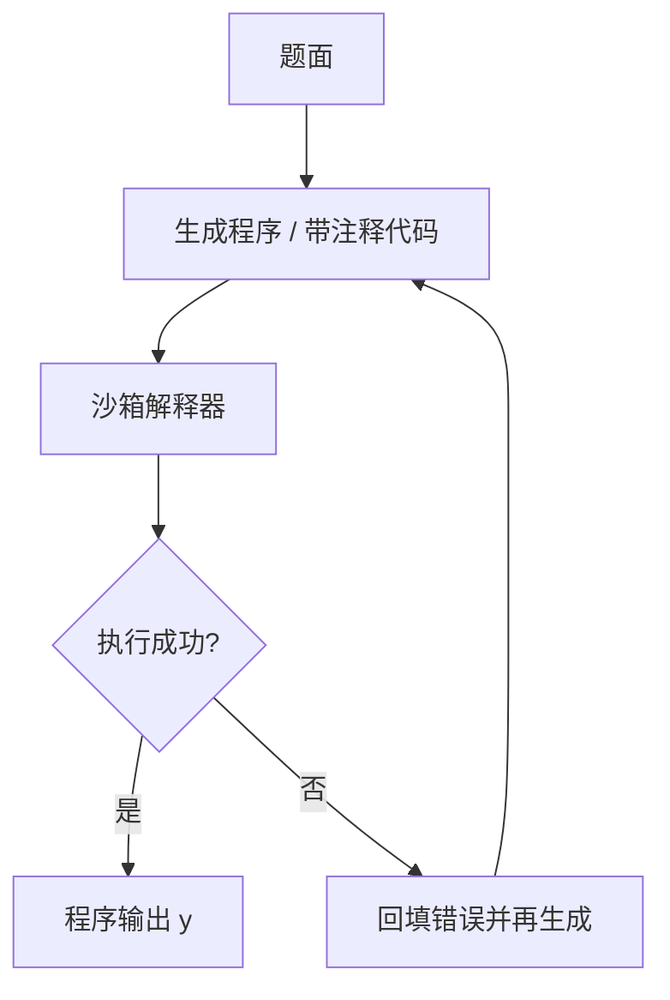

# PAL / Program-of-Thoughts

把求解步骤写成可执行程序，交给语言运行时去算；模型负责把问题翻译成代码，算术与循环不再走下一 token 的近似。

<footer>—— Gao et al., PAL: Program-aided Language Models, ICML 2023；Chen et al., Program of Thoughts Prompting, TMLR 2023</footer>

自然语言思维链用下一 token 做加法、计数、日期换算，错误率随位数和循环次数上升。Gao 等人的 PAL（Program-aided Language Models）让模型生成程序，由 Python 一类解释器执行，把执行结果当答案。Chen 等人的 Program of Thoughts（PoT）同一方向，更强调在代码里用注释与中间变量把推理写清楚，再执行得到数值。两者都是「语言模型做形式化，机器做计算」。本篇把它当作一种提示形态：示范从 $(x,z_{\text{text}},y)$ 换成 $(x,\text{code},y)$，而不是一篇语言运行时教程。

## 问题

CoT 把中间量写进文本，但文本里的「37×48」仍要模型自己算。大模型对中等算术有一定准确率，对长循环、精确比较、日历与货币换算并不稳定，还会在 $z$ 里写出看起来正确的错式。自洽可以投票，却不能把 $6\times7=43$ 投成对的。需要一种中间表示，其语义由外部系统精确定义：程序。

PAL/PoT 要回答的是：哪些推理应留在自然语言（实体消歧、题意理解），哪些应卸给解释器（算术、聚合、分支）。全部写成代码会在题意含糊时失败；全部留在文本则浪费了确定性执行。接口是生成一段完整、可运行、其最后一个表达式或打印值等于 $y$ 的程序。

### 下一 token 不是计算器

自回归对多位数乘法没有算法保证：它拟合的是训练语料里算术的表面分布。进位链一长，局部流畅的数字仍会错。程序把算法交给解释器的实现，正确性条件变成「翻译对了没有」，而不是「临时做对了没有」。翻译仍会错——用错变量、漏了边界、把「便宜 20%」写成减 20——但那是语义错误，可以用单测、断言、或对照题面检查，比核对一段散文算术更容易。

PAL 与 Toolformer / function calling 都把工作送出模型外。差别是 PAL 的「工具」通常是一次提交的通用解释器，而不是按步交错的多个 API。一次生成一张完整脚本，中途没有观察，除非宿主再包一层 REPL。

## 方法

少样本示范里，每道题对应一段代码：读入题面中的量、用变量命名中间概念、打印或返回答案。在线时模型只生成代码，宿主做沙箱执行（超时、无网络、受限导入），把 stdout 或返回值解析为 $y$。PoT 的示范更常在代码中穿插注释，相当于把 $z$ 留在 `#` 后面，可执行语句只负责计算。两种写法可以共存：注释给人看与给模型续写看，语句给解释器看。

沙箱是方法的一部分，不是运维细节。未隔离的 `eval` 会把提示注入升级成宿主机执行。应禁用文件系统与出站网络，限制 CPU 时间与内存，对输出长度截断。执行失败（语法错误、异常）应把 traceback 截断后回填，允许一次修复生成，而不是把失败当最终答案。修复次数要有上限，避免在同一语法错误上循环。

### 程序是中间表示，不是最终文风

评测应执行后比对 $y$，不要对源代码做字符串匹配。风格多样、算法等价的程序应判对。抽取约定要明确：以最后的 `print` 为准，还是以名为 `answer` 的变量为准。示范必须遵守同一约定。对选择题，程序应输出选项字母或规范化后的值，再由宿主映射。对开放数值，注意浮点比较与单位：程序输出 `0.5` 而标准答案是 `1/2` 时，等价检查属于评测器，不要强迫模型打印特定格式——那会把计算问题变回格式问题。

与约束解码的关系：可用语法约束保证程序可解析，见[约束解码](/llm/constrained-decoding)，但不能保证算法对。JSON schema 对 PAL 通常不是正确层；函数调用若只包一个 `run_python(code)`，本质上仍是 PAL，只是信封不同。

## 机制

分工改变误差来源。理解误差仍在模型：看错题、选错公式。计算误差在解释器侧接近零（忽略溢出与浮点约定）。对「主要难在算」的题，收益大；对「难在读应用题」的题，收益来自代码强迫变量命名，从而把实体对齐写显式，这与 CoT 写中间句类似，只是中间句必须能跑。PoT 的注释提供一条平行的自然语言链，有助于模型在写语句之前先对齐题意，但注释不经解释器检查，里面的错算不会被执行器抓住——真正的数必须出现在语句里。

相对 CoT：中间量有类型与作用域，循环是真循环。相对 Least-to-Most：子计算不必拆成多次自然语言问答，一次脚本里的函数调用就能表达。相对 ToT：默认不搜索程序空间；要搜索应在多份脚本上执行核对，相当于用测试当评估器的 Best-of-N。自洽应发生在 *输出值* 上：对多次采样的程序分别执行再投票，不要对 AST 投票。

「能写代码」不等于「该用 PAL」。分类、摘要、无精确计算的常识题，程序是空载，还引入沙箱成本。先问答案是否可用确定性过程核对。

### 执行器监督替代多数票里的算术部分

自洽假设错误分散。算术上模型可能稳定地算错同一类乘法，投票无效。执行器给出的是同一脚本的确定性结果：脚本对则 $y$ 对。多样性应花在生成不同脚本（不同公式假说）上，再用执行结果对齐题面约束（取值范围、整数性）做过滤。这比在错误算术上加 $N$ 更划算。若所有候选脚本都翻译错题意，执行器只会精确地给出错题的正确答案，于事无补——语义核对仍要对照题面或单元测试。

## 边界与工程取舍

PAL/PoT 适合数学应用题、表格聚合、需要精确计数与日期运算的任务。不适合无法形式化的价值判断，也不适合必须边执行边看外部世界的任务——后者应走 [ReAct](/llm/react) 或带 REPL 观察的循环。代码许可与安全：用户题面可能诱导生成恶意脚本，沙箱策略是产品责任。不要在无隔离的笔记本内核里跑模型写的代码。

Gao 与 Chen 两篇应分开引用：PAL 强调程序辅助的 LM 接口与基准；PoT 强调代码即思维链的提示写法与数值推理实验。工程实现上二者常合流。示范语言应与沙箱一致（都是 Python 3，或都是同一子集）；提示里出现 `pandas` 而沙箱没有，等于示范了不可执行的动作空间。与[代码评测](/llm/code-bench)不同，这里的程序是解题中间件，不是被测对象。

把 CoT 的自然语言算式「翻译成代码再执行」是后处理，不是 PAL。PAL 要求模型 *直接* 以程序为生成目标。先写错的 $z$ 再翻译，只会把错式精确执行一遍。

## 小结

- PAL/PoT 让模型生成程序，由解释器执行得到答案，把计算从下一 token 里卸出。
- 示范与抽取约定必须与沙箱一致；评测看执行结果，不看代码字符串。
- 理解错误仍在模型侧；计算错误被压到翻译是否正确。
- 执行失败可回填修复，但必须有沙箱与次数上限。
- 无精确核对的任务不要用；需要交错观察时应走 ReAct，而不是一次交脚本。
- 出处：Gao et al., *PAL: Program-aided Language Models*, ICML 2023；Chen et al., *Program of Thoughts Prompting*, TMLR 2023。
