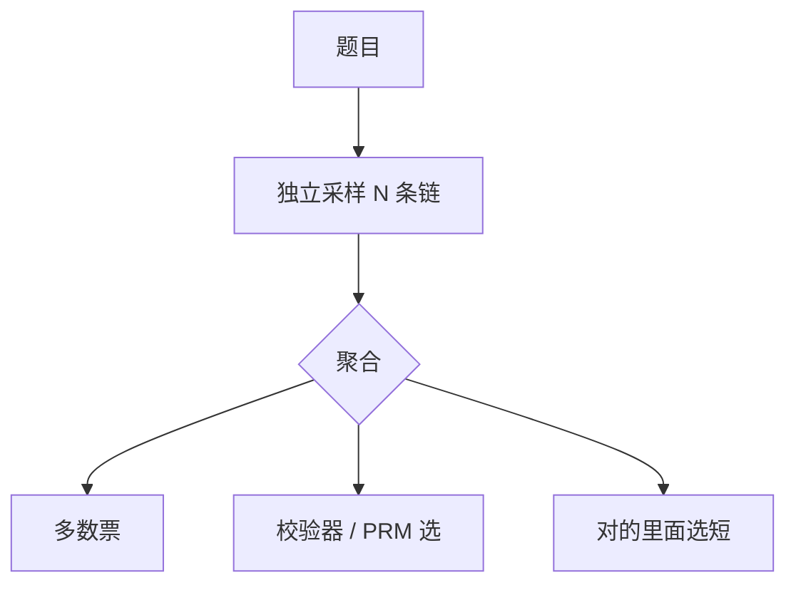

# 并行思考与聚合

同一题采多条链再投票或再验证，用宽度换串行深度；聚合规则决定是多数票还是最强验证器。

<footer>—— Wang 等 Self-Consistency；Best-of-N + PRM；o1/o3 类系统的测试时采样</footer>

[上一课](/llm/self-verification-backtrack)用一条链上的回溯做串行搜索。缺口是：**一条链陷在错误前缀里，回溯也出不来；独立重采样可以换前缀。** Self-consistency 对算术题多数票；推理模型把 $N$ 加大，用 PRM 或校验器选。本课写并行思考，对照 [思考预算](/llm/thinking-budget-adaptive) 的串行 FLOPs。

## 问题

测试时计算两条轴：加长一条链；$N$ 条短链再聚合。Snell 等讨论过最优分配。可验证域聚合简单：任一对则对，或多数票。开放域多数票会强化共同偏见。PRM / RM 选 Best-of-N 会过优化验证器（Gao 曲线的 BoN 版）。

训练与推理的 $N$ 不要混：[GRPO](/llm/grpo) 的 $G$ 只在训练；服务上的并行是另一笔钱。用户 SLA 往往只能 $N=1$，并行留给离线或贵档位。

### 聚合器是第二套策略

投票、最长思维、最高 RM、校验器、再由模型总结 $N$ 条，结果不同。总结器会引入新幻觉。有校验器时禁止总结器改答案。

相关采样（同种子、低温度）让 $N$ 条几乎相同，并行费钱无增益。要温度与独立 RNG。

## 方法

协议：$\tau$、$N$、是否工具、聚合函数。可验证：先过校验器的子集，再在对的里面选最短（长度控制）。无校验器：self-consistency 或 PRM。训练：一般不把服务 $N$ 写进 GRPO；可用 BoN 蒸馏把并行行为教给 $N=1$ 学生（后课蒸馏）。

与混合模式：简单题 $N=1$ 短模式；难题才并行。路由错误同样贵。

## 机制

独立样本近似对解空间做蒙特卡洛。错误前缀不共享时，覆盖优于单链回溯。样本不独立（都抄同一错误模板）时，多数票更错。多样性来自温度、提示扰动、工具。熵塌的模型并行也没用。

并行 + 超长预算是费用平方。帕累托上应先加更有效的那一轴。

## 边界与工程取舍

产品默认 $N=1$。评测 avg@32 不是用户体验。墙钟上 $N$ 条并行仍受 KV 与批调度限制，标称 $N$ 倍算力不等于 $N$ 倍延迟。下一课蒸馏：把高 $N$ 或长链教师压进小模型单样本。aha 与语言混杂仍是单链现象，并行只是外层。

服务 N 与训练 G 不是同一个数。低多样时并行浪费；有校验器时禁止总结器改写已经核对过的答案。

## 小结

- 并行思考用 $N$ 条独立链换覆盖；聚合规则必须声明。
- 可验证域用校验器再选短；开放域 BoN 会过优化 RM/PRM。
- 训练 $G$ ≠ 服务 $N$。
- 低多样时并行浪费；先保证熵与温度。
- 出处：Wang 等 Self-Consistency；Lightman PRM BoN；Snell 测试时计算；Gao BoN 过优化。
