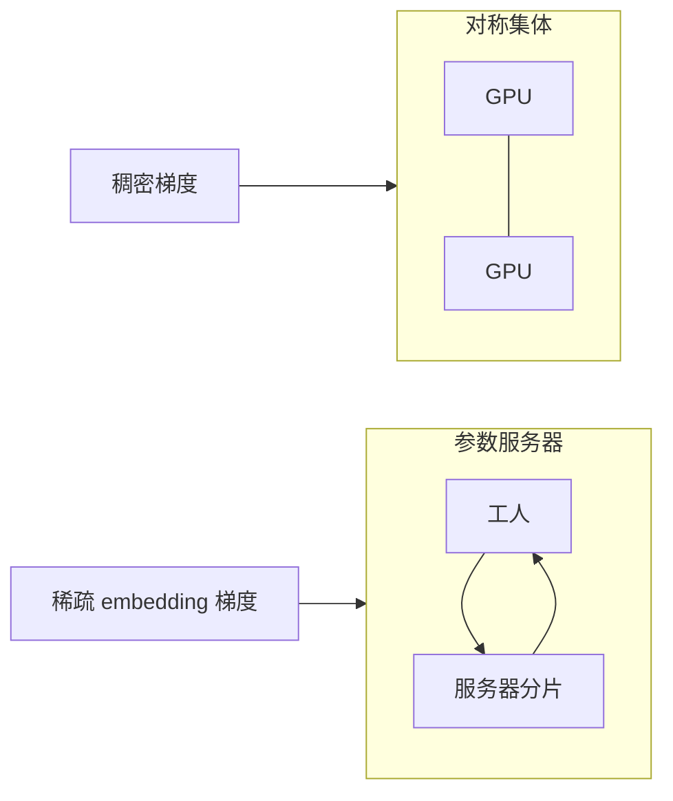

# 参数服务器对照

All-Reduce 是对称的：每卡既是工人也是归约器。参数服务器把状态放到一组专用进程上，工人只推梯度、拉参数。稀疏更新喜欢后者，稠密 LLM 预训练几乎全体站在前者。

<footer>—— Li 等 Parameter Server（OSDI 2014）；对照 DistBelief 与当代 DDP / ZeRO</footer>

[上一课](/llm/gradient-compression) 在对称集体上减 $n$。本课对照另一条历史线：**参数服务器（PS）**。缺口是：为何 LLM 预训练默认 NCCL All-Reduce，而推荐、广告、部分 embedding 很大的系统仍在用 PS；以及把 PS 当「过时」会漏掉它仍然成立的通信形状。[数据并行与 ZeRO](/llm/data-parallel-zero) 已经说明对称分片；本课只补不对称一侧，不重讲 ZeRO 档位。

## 问题

PS 架构：工人持数据与激活，服务器持分片参数。工人算完梯度，按键把非零项 push 到对应服务器，服务器更新后再 pull 新参数。通信是多对多的推拉，不是一次全局同步屏障。优点：天然稀疏——embedding 行只碰被命中的；服务器可以异步，工人不必等最慢的那个 All-Reduce。缺点：服务器带宽与 CPU/GPU 成为中心热点；稠密层每步几乎全量推拉，体积不比 All-Reduce 小，还多了中心化瓶颈；异步造成梯度陈旧，大模型不稳定。

LLM 预训练的主体是稠密矩阵，每步几乎所有参数都有梯度，稀疏度为零。此时 PS 的稀疏优势用不上，All-Reduce 的对称带宽（每卡 $\frac{N-1}{N}n$）反而更好，且 [轨优化](/llm/rail-optimized-topology) 就是为这种同步集体建的。问题是划清：**哪一类张量该留在 PS 语义里**。

DistBelief 与早期 Parameter Server 论文面对的是万亿稀疏特征，不是 70B 稠密 Transformer。把 2014 年的扩展数字直接写成 LLM 集群能力，是时代错位。

## 方法

当代折中常见三种。

纯 All-Reduce / ZeRO：稠密 LLM 默认。集体库成熟，与 [NVLink](/llm/nvlink) 层次化匹配。

混合：巨大词表或推荐 embedding 走 PS 或按键分片的异步更新，Transformer 主干走 DDP。两套进度要对齐到「同一 step 的语义」还是允许陈旧，是产品选择。

伪 PS：ZeRO-3 / FSDP 把参数片放在各 rank 上，需要时 all-gather——状态是分片的，通信仍是集体，没有专用服务器进程。它吃的是 All-Reduce 课的原语，不是 OSDI 那套 push/pull RPC。

若坚持在稠密 LLM 上用 PS，至少把服务器也放在 GPU 上并走 RDMA，否则 PCIe 与 CPU 归约会成为墙。即便如此，同步屏障往往仍要加回来以保证收敛，那时你付了 PS 的中心化成本，又付了集体的等待，两头不讨好。

## 机制

All-Reduce 的一致性强：一步之后各副本权重一致（数值顺序差异除外）。PS 异步的一致性弱：工人用的参数可能差若干步。大 batch、大模型对陈旧梯度更敏感，这是 LLM 预训练弃异步 PS 的优化原因，不只是工程潮流。同步 PS（工人全部 push 完再更新再 pull）在通信量上不低于 All-Reduce，还把归约算力集中在服务器，扩展性更差。

稀疏梯度与 [梯度压缩](/llm/gradient-compression) 的 Top-k 表面像，归属不同：Top-k 仍在对称集体上对齐索引；PS 按键路由，不需要全局对齐一张密张量。极度稀疏时，PS 的「只发非零」比先物化密梯度再压缩更省。稠密时相反。

推理服务的 KV 与权重加载不是 PS。不要把「参数在远端、算在本地」的任何系统都叫参数服务器。本课 PS 特指训练期的分片状态与推拉更新。

## 边界与工程取舍

本课不把 PS 写成必须淘汰。推荐系统、部分多模态的巨大词表、跨数据中心的联邦式更新，仍可能以 PS 为主。LLM 主干预训练、以及依赖 NCCL 的 Megatron 类网格，默认集体。不要在以太网集群上用 PS 去「避开」All-Reduce 的拥塞——你会换成服务器网卡拥塞，更难用轨优化建模。

集合通信课序到此收束算法与拓扑。下一课序转向集群运行：检查点 I/O 开始和集体抢同一张网。

## 小结

- PS 不对称、善稀疏与异步；All-Reduce 对称、善稠密同步。
- LLM 预训练主体稠密，默认集体 + ZeRO，而不是 OSDI 式 PS。
- 混合架构只把真正稀疏的表放在 PS 语义里。
- 同步 PS 并不比 All-Reduce 更省带宽，还多中心瓶颈。
- 出处：Li 等 Parameter Server；DistBelief；对照当代 DDP / FSDP。
