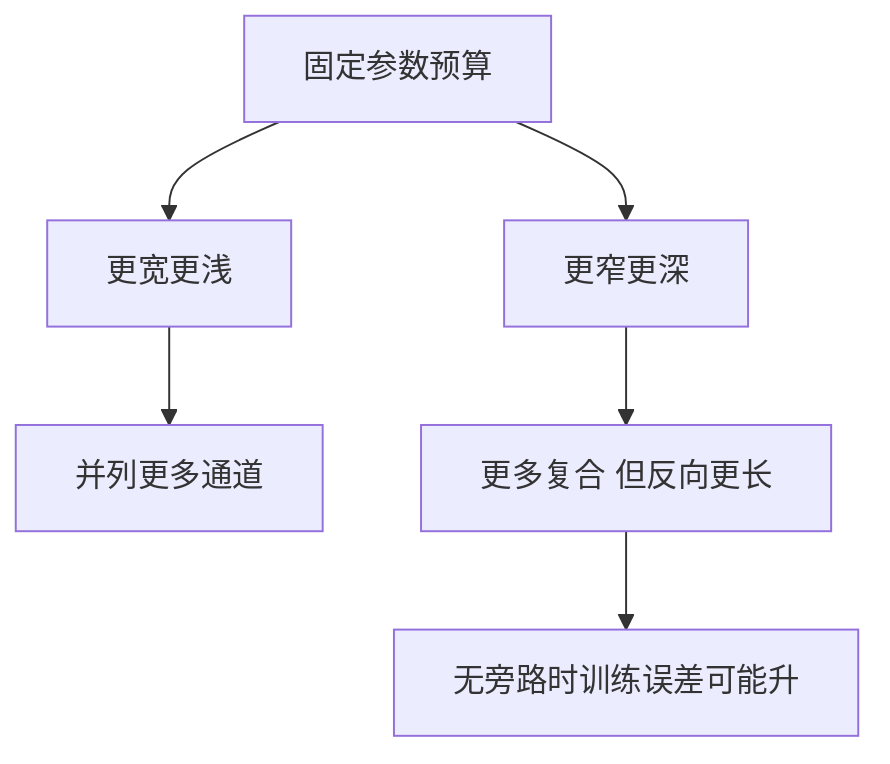

# 参数量：深度与宽度

同一参数预算可以铺成很宽的浅网，或很窄的深网；表达力与可训练性对这两种花法并不对称。

<footer>—— 据 Goodfellow, Bengio &amp; Courville, Deep Learning, 2016；He et al., Deep Residual Learning for Image Recognition, CVPR 2016 整理</footer>

[初始化为何需要](/llm/why-init)让深栈在起点上信号不灭。本课不重推 $1/d_{\mathrm{in}}$。缺口是：仿射层参数量 $d_{\mathrm{in}}d_{\mathrm{out}}$，总预算 $P$ 可以用来加宽某一层，或用来多叠几层。后课残差正是因为「只加深度」在普通栈上失败才出现。本课先把账与几何分开：参数量不是层数，也不是宽度。

## 问题

一层 $d\times d$ 的方阵有 $d^2$ 个参数（加 $d$ 个偏置）。$L$ 层同宽 MLP 大约 $L d^2$。把 $L$ 减半、$d$ 乘 $\sqrt{2}$，参数量相近，但函数类不同：宽浅网是一次高维分段线性，深窄网是多次复合。缺口不是「参数越多越好」的口号，而是同一 $P$ 下深度与宽度不可互换，且可训练性随深度恶化更快——上一单元的 $\rho^L$ 只惩罚 $L$，不直接惩罚 $d$。

宽度增加主要增加每一段仿射的秩与通道数，优化更接近「多一些并列的特征」。深度增加折点的组合次数，理论上用较少参数拟合某些高变函数，但反向路径变长。经验上，没有旁路时，加层很快遇到训练误差反而升高——He 等人观察到的「退化」，不是过拟合（训练误差也变差），而是优化失败。那是下一课残差的动机，本课先把退化与「参数不够」区分开。

### 参数量不是 FLOPs，也不是容量的唯一度量

一次前向的计算量还随序列长度、批大小变；嵌入表 $|V|\times d$ 可以占掉很大一块 $P$，却几乎不增加深度。两模型 $P$ 相同，一个把预算花在词表，一个花在层，行为完全不同。本课谈 MLP 栈时，默认 $P$ 指隐藏层的 $W$，不含词表。把「十亿参数」当成唯一容量数字，后课嵌入与注意力的账会对不上。

同宽 MLP 里，中间层 $d_{\mathrm{ff}}$ 往往比模型宽度 $d$ 大几倍，参数量由 $2Ld\,d_{\mathrm{ff}}$ 一类式子主导。宽一层与深一层的交换率是 $d_{\mathrm{ff}}$ 对 $L$，不是对 $d$ 单独看。

## 方法

记账：列出每张 $W$ 的 $d_{\mathrm{in}}d_{\mathrm{out}}$，加偏置，加嵌入表。比较结构时固定 $P$ 再变 $L$ 与 $d$，否则「更深更好」可能只是「更大更好」。观察训练误差（不是验证误差）是否随 $L$ 上升：若上升，是退化 / 优化问题；若训练误差下降而验证上升，是上一单元的过拟合。两条曲线要同时看。

## 机制

表达力定理说：深度对某些函数可以指数地节省宽度。定理不管可训练性。实践中的有效容量是「优化器能走到的那部分函数类」。过深的普通栈把有效容量用没了，尽管 $P$ 很大。加宽则让每层更好拟合残差目标，但单层仍是一次仿射+$\sigma$，复合次数少。残差将允许「深」而不付满 $\rho^L$ 的代价；本课只准备好：看到训练误差随深度变差，不要先加参数，先问路径结构。

宽度也不是免费： $d$ 加倍，一层参数乘四（方阵），激活内存与注意力将来的 $n^2 d$ 都会涨。只报 $P$ 不报 $d$ 与 $n$，无法判断是算力墙还是容量墙。嵌入表 $|V|\times d$ 随 $d$ 线性涨，随 $|V|$ 线性涨，与层数无关——三本账要分开才能决定下一课该加旁路还是该加宽。

## 边界

本课不引入残差公式，不比较 Transformer 与 MLP 的参数分配。下一课[残差的动机](/llm/why-residual)专门对付退化。后课默认：报模型大小时分开深度、宽度、词表；比较结构时尽量固定 $P$ 或固定 FLOPs 之一并声明。

## 小结

- 同参数预算下，深度与宽度不可互换；$\rho^L$ 主要惩罚深度。
- 更深导致训练误差升高是退化，不是过拟合。
- 参数量、FLOPs、词表大小是三本账。
- 有效容量受可训练性约束，不是 $P$ 的同义词。
- 出处：Goodfellow et al., Deep Learning, 2016；He et al., CVPR 2016。
