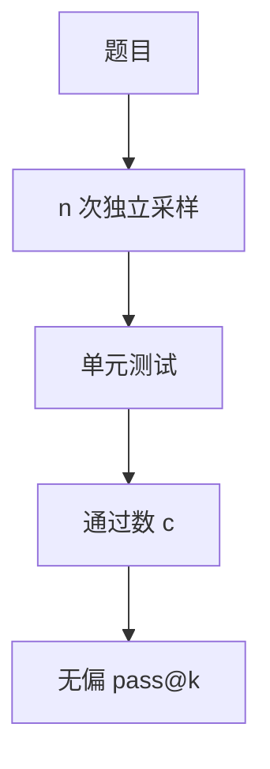

# pass@k

从 n 个样本里估计「k 次提交至少对一次」的概率。报 pass@1 与 pass@100 而不写 n 和温度，等于没报编码能力。

<footer>—— Chen 等 Codex / HumanEval 的无偏估计量</footer>

[上一课](/llm/answer-extraction)把「对」定义成抽取或执行之后的布尔。代码评测的布尔来自单元测试，而且通常允许多样本。[HumanEval](/llm/code-bench) 把这个数字写成 pass@$k$。缺口是：它不是准确率的别名，而是**带预算的覆盖概率**。后课校准默认你会：pass@$k$ 测的是「会不会抽到对的」，不测「知不知道自己对」。

## 问题

一次生成（pass@1）惩罚探索：温度 0 的贪婪解码可能卡在一种错解。产品里用户会重试，竞赛里选手会交多次。需要一个随 $k$ 变化的曲线，而不是单点。朴素算法「采 $k$ 次看有没有对的」方差大，且 $k$ 一变就要重跑。Chen 等人给出无偏估计：先采 $n\ge k$ 个独立样本，计 $c$ 个通过测试，再算组合比。

温度与 $n$ 是协议的一部分。高温抬 pass@$k$、打压 pass@1，这是多样性，不是「更大的模型」。把 pass@100 拿去和别人的 pass@1 比，是在比较计算预算。

pass@$k$ 假设样本独立同分布。束搜索或带记忆的重试会破坏假设，估计量偏高。产品重试若看上一次报错，应另报「带反馈的修复率」，不要冒充 pass@$k$。

## 方法

无偏估计（Chen 等）：

$$
\mathrm{pass@}k=\mathbb{E}\left[1-\frac{\binom{n-c}{k}}{\binom{n}{k}}\right],
$$

$c$ 为 $n$ 次中通过数；$n-c<k$ 时分子为零，pass@$k=1$。实现用稳定递推避免大组合数溢出。报告必须写 $n,k,$ 温度, top-$p,$ 是否过滤语法失败。功能正确性以隐藏测试为准；表面相似（BLEU）不是 pass。

## 机制

生成分布 $p_\theta(y\mid x)$ 在正确程序集合上的质量若为 $p_{\mathrm{ok}}$，则独立 $k$ 次至少一次成功的概率是 $1-(1-p_{\mathrm{ok}})^k$。pass@$k$ 是对这个量的估计。它奖励「分布里有正确质量」的模型，即使众数是错的。这与似然评测相反：似然看众数附近，pass@$k$ 看支撑集。RL 若只优化 pass@1，可能把分布压成单一模式，pass@100 反而掉——要分列。

## 边界

测试覆盖不足时，pass 会把错程序标对。隐藏测试与对抗用例属于基准质量，不是估计量的问题。下一课校准处理的是另一件事：模型给出的置信是否等于 $p_{\mathrm{ok}}$。

## 小结

- pass@$k$ 是带提交预算的覆盖率，必须锁 $n$、温度与独立采样。
- 用 Chen 等的组合无偏估计，不要只跑 $k$ 次。
- 它测支撑集里有没有对的，不测校准，也不等于贪婪准确率。
- 出处：Chen 等，Evaluating Large Language Models Trained on Code（HumanEval / Codex）。
