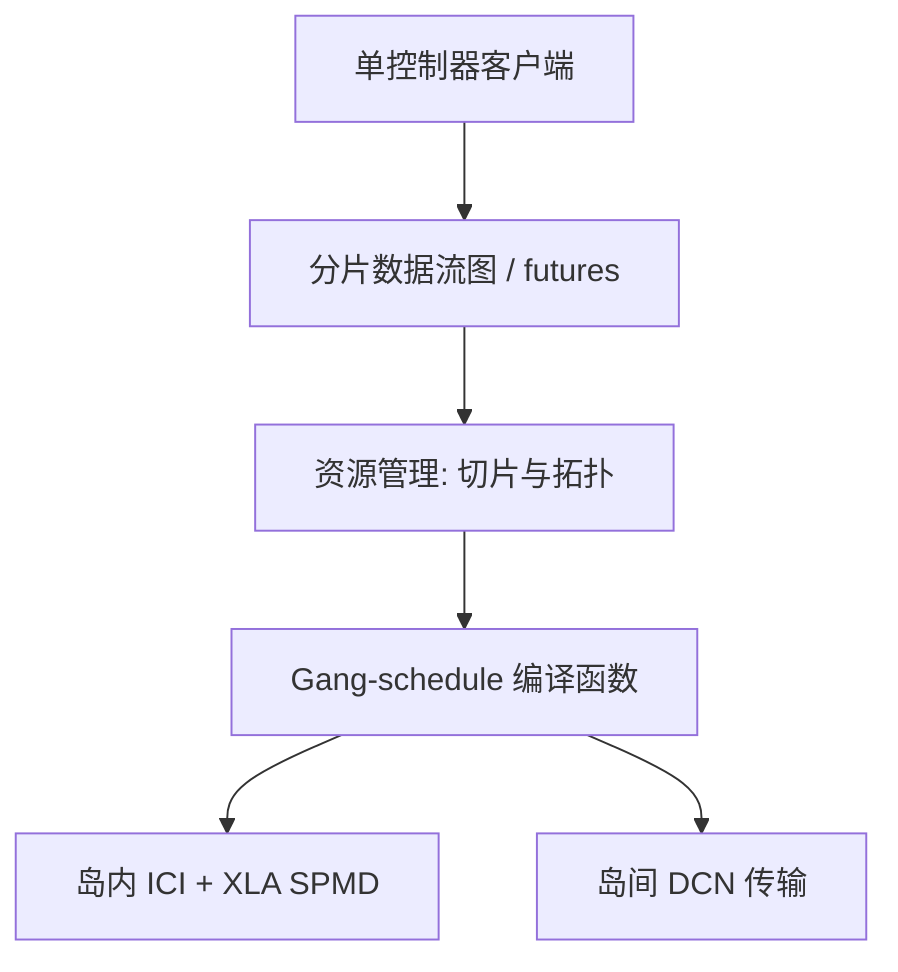

# Pathways

控制面可以在数据面的依赖之上异步往前跑：单控制器编排上千加速器，同时仍让 SPMD 计算打满专用互连。

<footer>—— Barham 等，Pathways: Asynchronous Distributed Dataflow for ML, MLSys 2022</footer>

XLA 与 GSPMD 解决「一次编译、一块静态网格上如何切张量」。集群还要回答另一问：如何在**成千上万块加速器**上编排异构、多任务、跨 Pod 的计算，而不把每台主机都变成一个对等的控制器。Barham、Chowdhery、Dean、Ghemawat、Isard 等人的 Pathways 是加速器上的大规模编排层：分片数据流图、异步算子消费与产生 future、对异构并行计算做 gang-schedule，并在专用互连上协调搬运。论文报告：2048 个 TPU 上的 SPMD 可达到与当时最优系统大致持平的加速器利用率（约 100% 这一档的对照写法）；16 段流水线、或两座经数据中心网络相连的加速器岛，吞吐仍可与纯 SPMD 相近。本篇写单控制器与异步数据流，不重讲 [GSPMD 如何插集合通信](/llm/gspmd)。

## 问题

当时的 JAX 多控制器模式里，每个主机跑同一份 Python，集体通信走 XLA，而 TPU 上这些集体主要挂在 **ICI**（芯片间专用互连）上。于是程序很难跨出单个 TPU Pod：Pod 之间是数据中心网络（DCN），不是 ICI。要写流水线、多岛、多任务共享同一组底层权重，用户得在 SPMD 里硬拧，或回到每设备不同程序的 MPMD，控制流复杂。

多控制器的另一痛是表达力：每个进程都要执行完整的客户端逻辑，条件、动态图、异构阶段（有的阶段只要 8 核，有的要整 Pod）会变成「所有人一起做 if」。单控制器更像经典数据流：一份客户端看见全部设备，把图发给运行时。历史教训是单控制器容易变成调度瓶颈——控制消息的延迟会让加速器空转。Pathways 的设计问题因此是：怎样做单控制器，却让控制面不卡在数据面的每条边上？

### 异步数据流：边是 future，不是阻塞 RPC

Pathways 的图是分片的。每个算子对应一段已编译、资源可估的函数（JAX 里 `jit` 出来的、形状已知、控制流有界的 XLA 计算）。算子消费 future、产生 future。数据面的真实依赖仍在：没有输入就没有输出。控制面却可以在结果尚未物化时就把后续调度决策做掉——因为依赖被 future 隔开，协调器不必轮询每一块 TPU 上的同步屏障才能发下一条。论文把这称为：尽管数据面有依赖，控制面仍可并行执行。

「约 100% 加速器利用率」是论文对 SPMD 对照实验的表述，对象是当时的先进系统、2048 TPU 这一档，不是承诺任意异构图都打满。读数字时看实验设置：SPMD 基线、16 段流水、两岛 DCN，三套都要分别理解。

## 方法

客户端仍写 JAX 或 TensorFlow。JAX 把 Python 片段编成 compiled functions，每个函数变成 Pathways 图上的一个（可分片的）计算节点。Pathways 作为 JAX 后端的替换插件：同一份代码看见的设备，不再只是本机连着的 TPU，而是系统里供给的全部核心。跨 ICI 与 DCN 的搬运由运行时协调，于是 JAX 程序第一次可以按论文的说法扩到多个 TPU Pod、数千核以上。

资源管理器按请求的拓扑分配物理切片：一块矩形 ICI 域、或两块经 DCN 相连的岛。调度是 gang-scheduling：一次并行计算的参与者同时获得加速器，避免部分 rank 已跑、其余还在排队导致的死锁与碎片。数据搬运走加速器专用互连，而不是默认绕到主机内存再走以太网——ICI 上的集合仍应由 XLA 内核吃掉；DCN 上的边是运行时显式插入的传输。

### 为地基模型准备的复用，而不是只为一条 SPMD

论文动机写得很清楚：大模型会被许多下游任务微调、推理，固定底层、只训头或适配器时，加速器上可以驻留一份共享层，多任务向量化成更大的 batch。多租户、弹性、不规则并行（流水、条件专家、跨岛）是 Pathways 相对「每作业一份静态 mesh」想打开的研究与部署空间。它保留 SPMD 性能，是为了不在日常大模型训练上退步；多出来的表达力给新的并行式样。Google 后来把 Pathways 用于 PaLM 等大规模训练的公开叙述，以及 Cloud 上的 Pathways on GKE（单 JAX 客户端跨多 slice），属于同一架构的产品化，细节以当时 Cloud 文档为准：IFRT 代理、资源管理器 / worker 容器、数据加载要考虑客户端在 CPU VM 上而不是每台 TPU VM 上的多控制器假设。

## 机制

单控制器能扩到上千 TPU，靠的不是把 Python 循环写得更快，而是把「发图、分配切片、启动 compiled function」与「TPU 上执行微秒到毫秒级的内核」解耦。Future 让协调器可以在数据未就绪时就把后续节点的放置定下来；真正的等待发生在数据面的边，由运行时在加速器或 DMA 上阻塞，而不是在客户端的 Python 里 `result()` 打满一轮。这与 MapReduce 式「控制面等所有 mapper 结束」不同，也与每主机一个 JAX 进程、用 `pjit` 同步 SPMD 不同。

TPU 适合这套设计的原因，论文写得很直：XLA 能把带集合通信的复杂计算融进长时间运行的设备内核；GPU 上许多控制流与通信要回到主机驱动。Pathways 的低层决策因此绑 TPU；作者认为高层的单控制器、数据流、gang-schedule 对大规模 GPU 同样有意义，但那不是论文的评测对象。不要把 Pathways 论文里的利用率抄到 NCCL 多机 GPU 上当对照。

ICI 与 DCN 的带宽、延迟差一个数量级以上是公开常识，具体 Tb/s 以当时芯片文档为准，本篇不填未核对的单通道数。mesh 轴选择仍应由用户保证：通信最密的维留在 ICI 岛内，DCN 只承担岛间边。

### 插件后端改变的是设备宇宙，不是数值核

对已有 SPMD 模型，Pathways 的承诺是性能持平、设备更多。对流水线，16 段不再需要用户在多控制器里手写跨主机的发送接收循环，而由数据流边表达阶段之间的激活传递。对两岛，逻辑上仍是一张图，物理上跨 DCN。失败模式是把本该在 ICI 上的张量并行维画到 DCN 轴上：运行时会执行，只是吞吐掉回「普通分布式」。Cloud 文档后来强调大规模训练应把数据加载放到 TPU 主机侧的 colocated Python，以免单控制器所在的 CPU VM 成为输入墙——这是产品化后的工程注脚，与 2022 年论文的核心机制一致：控制集中、数据就近。

## 边界与工程取舍

不要把 Pathways 理解成替代 GSPMD。切分仍在 XLA 编译的函数内部完成；Pathways 管函数之间的编排、放置与跨岛传输。不要在动态到无法估计资源的 Python 循环上期望 gang-schedule：论文依赖 compiled functions 的资源可预测。不要假设开源 JAX 默认就是 Pathways：默认仍是多控制器；Cloud 上要显式选 Pathways 平台与代理。

单控制器的客户端故障半径更大：客户端死了，图的提交面没了。多控制器则是每主机一份客户端。生产上要用文档中的高可用与作业 API（如 PathwaysJob）来补，而不是论文示意图里的单进程。多租户隔离、配额、抢占属于编排层，论文给的是机制，不是一份 SLO 合同。

出处：Barham 等，*Pathways: Asynchronous Distributed Dataflow for ML*，MLSys 2022，arXiv:2203.12533。Cloud 产品见 Google Cloud *Introduction to Pathways on Cloud*。内部如何跑 Gemini 等模型，只引用 Google 已公开的「Pathways 用于大规模训练」陈述，不编造未公开的集群规模或调度参数。

## 小结

- Pathways 是加速器编排层：分片异步数据流 + 单控制器 + gang-schedule，目标是复杂并行与多任务，同时保住 SPMD 性能。
- 控制面用 future 与数据面解耦，避免单控制器被每条同步边卡住。
- JAX 可把它当作后端插件，使计算跨出单 Pod 的 ICI，走到多岛 DCN。
- 论文对照：2048 TPU 上 SPMD 利用率与先进系统持平；16 段流水与两岛配置吞吐可接近 SPMD。
- 它不替代 XLA 分区；切分在 compiled function 内，编排在函数间。
- 出处：Barham 等，MLSys 2022；栈的其余层见 [TPU 训练栈](/llm/tpu-training)。
