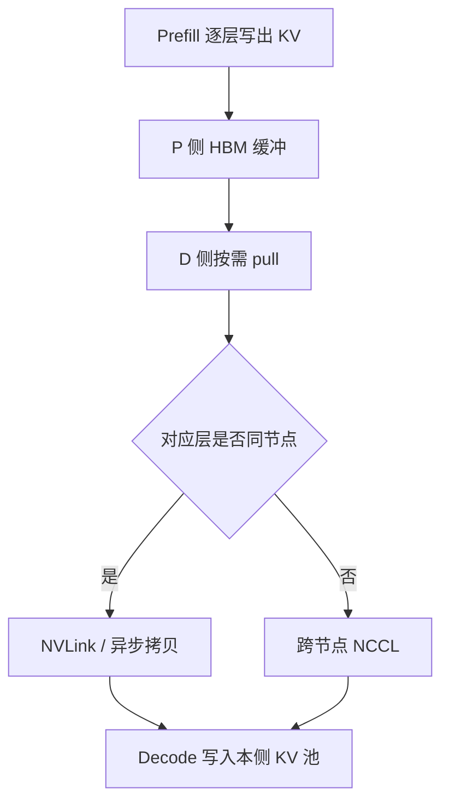

# PD 分离的 KV 传输

    
拆开 prefill 与 decode 之后，中间状态必须搬家：体积按层数 × 提示长度线性涨，传输要么被互连藏住，要么把 TTFT 吃回去。

    <footer>—— Zhong et al., DistServe 中的 KV 体积、带宽与分层放置；Patel et al., Splitwise 中的机间状态传输</footer>

[PD 分离](/llm/pd-disaggregation) 把计算拆到两池，正确性要求 decode 看见与 prefill 同一套 KV。传输对象主要是每层的键值缓存，外加首 token 与少量元数据。DistServe 给过一个具体量级：OPT-66B、512 token 的 KV 约 1.13GB；若平均 10 请求/秒，需要约 11.3GB/s（约 90Gbps）才能让传输在流水线里「看不见」。现代训练集群常有数百 Gbps 级 InfiniBand 或节点内 NVLink（文中 A100 卡间峰值 600GB/s 量级），数字上够用，但**只有放置对了才够用**。跨节点带宽差时，必须把对应层段放进同一节点。Splitwise 同样把请求状态经 GPU 集群高速背板与优化过的网络库搬走。本篇写体积公式、同步还是分层重叠、pull 与突发，不把分离动机再写一遍。

## 问题

KV 体积粗算为

$$
\mathrm{bytes}\approx L_{\mathrm{layers}}\times s_{\mathrm{prompt}}\times n_{\mathrm{kv}}\times d_h\times 2\times s_{\mathrm{elem}},
$$

因子 2 是 K 与 V。MHA 的 $n_{\mathrm{kv}}$ 等于查询头数；GQA 缩小它；[MLA](/llm/mla) 吸收后变成短潜向量加小 RoPE 旁路，体积再降一档。未压缩的 66B 级、中等提示，已经是 GB 级；长文档摘要负载上 $s_{\mathrm{prompt}}$ 再乘数倍。传输时间 $\approx$ 体积 / 有效带宽。若它与 prefill 执行同量级，TTFT SLO 里就会出现一项 colocate 没有的税，分离的 goodput 优势被抹平。

第二问题是与计算重叠。整包 KV 在 prefill 全部结束后再拷，延迟全加在首 token 之后、decode 开始之前。按层传输可以让浅层在深层还在算时就出发，但要求 P/D 的层到设备映射一致，且接收侧有缓冲。

### 90Gbps 是例子不是门槛

1.13GB × 10 rps 说明的是：**请求率 × 单请求 KV** 必须低于链路上的有效带宽。换模型、换精度、换提示长度，门槛线性变。FP16 与 FP8 KV、GQA、MLA，都会改同一公式里的因子。不要把 90Gbps 写成「PD 分离需要 90Gbps」；要写成「用公式代你的负载，再和 NVLink / IB 的有效带宽比」。DistServe 在 InfiniBand 充足时允许跨节点任意放置；不足时改用节点内算法。

有效带宽远小于标称峰值。PCIe 拷、NCCL 协议开销、双向流量、与计算争用，都会把 600GB/s 变成一小截。规划用实测拷贝带宽，不用宣传页。

## 方法

DistServe 的跨节点路径用 NCCL；节点内用异步 CudaMemcpy，避免拷贝阻塞 GPU 计算。传输采用 pull：decode 实例需要时再来取，prefill 实例把 KV 留在自己的 GPU 内存里当队列。这样 P 侧可以继续接下一个 prefill，不必等 D 侧立刻收完；突发时压力表现为 P 侧缓冲涨，而不是 D 侧 OOM。层与层之间 KV 独立：只在对应层之间搬。于是可以按 inter-op 分段，把 P 与 D 的同一阶段塞进同一节点，KV 强制走 NVLink。节点 GPU 数有限（常见 8），可枚举段内并行配置，用模拟器挑 goodput。

### Splitwise 的机间状态

Splitwise 把 prompt 机器上算完的 KV 发给 generation 机器，走集群背板。异构池上 P 卡与 D 卡可能不同代，传输库必须处理设备差异与拓扑。Mixed 池存在时，有的请求根本不搬家（两阶段在同一台），传输量为零——这是突发阀，也是对照实验里「分离税」的下界。无论哪篇，状态移动都发生在高速 GPU 互连上，而不是绕道主机内存再上以太网，除非实现有意做了降级。

### 与并行度的接口

P 与 D 的 TP/PP/EP 可以不同，但传输层要会重排。PP 度不同：层到卡的映射表必须显式，不能假设「阶段 $i$ 对阶段 $i$」。TP 度不同：按头切的 KV 要 gather 或重新切片后再发。EP 不切 KV（专家在 FFN），注意力侧布局才影响 KV 分片。MLA 潜向量更小，同样 rps 下带宽门槛按比例下降，长上下文分离更可行。投机解码的草稿 KV 一般只在 D 侧生存，不必从 P 传来。

## 机制

分离把「干扰时间」换成「拷贝时间」。拷贝可以与下一请求的 prefill 重叠，也可以与本请求深层计算重叠，唯独不能与「decode 已经需要这一层 KV」重叠。Pull 模型把耦合从推送握手改成消费者驱动，P 与 D 的好put 各自闭环：P 满了就反压准入，D 满了就少 pull。这比两侧锁步更稳，代价是 P 侧要为未取走的 KV 留 HBM，挤占下一个 prefill 的 batch。

带宽感知放置的机制是缩小「KV 必须走的最慢一跳」。同节点 NVLink 把 1.13GB 变成毫秒级以下（按峰值算更短），相对数百毫秒的 TTFT 可忽略。跨弱网把同一份数据变成几十毫秒到数秒，TTFT 直接破 SLO。因此算法先问拓扑，再问并行，而不是先搜出最优 $T,P$ 再发现搬不动。

TTFT 应包含「直到 decode 侧具备生成第二个 token 所需的 KV」。只测 P 侧算完会低估延迟，分离看起来毫无传输税。评测探针要打在用户可见的首包之后的稳定 TPOT 起点。

### 压缩与量化是传输旋钮

GQA、MLA、KV 量化同时减小 HBM 与传输体积，是分离的盟友。它们也减小 colocate 的显存压力，所以不是分离专属。分离场景下，传输路径上的量化必须在 D 侧可反量化或与 D 侧计算精度一致，否则数值漂。DistServe / Splitwise 正文不依赖某一种 KV 量化方案；工程上多出来的格式转换时间要计入传输税。

## 边界与工程取舍

互连弱、KV 大、rps 高，三者叠在一起时不要分离，或只在节点内分离（P/D 共节点不同卡）。超长上下文先考虑压缩 KV，再考虑拆池。失败恢复：P 侧算完但 D 侧没收到，要重传或重计算；不能假设 NCCL 一次成功。安全上 KV 含提示信息，传输通道与落盘缓冲按机密数据管理，这与算法无关但属于部署清单。

不要把 PagedAttention 的页表原样 RDMA 到另一台：页在源设备虚拟地址里，目标要按自己的块池重建。实现上通常是按层、按块打包，而不是搬页表指针。不要给 KV 传输伪造独立 arXiv；体积与 90Gbps 例子、NCCL / CudaMemcpy、pull、同阶段共节点，都写在 DistServe（arXiv:2401.09670）里。Splitwise（arXiv:2311.18677）给出背板传输与异构机的对照。后续缓存中心架构是别的系统，本篇不把它们的数字安到这两篇上。

调试「分离后 TTFT 变差」先画三张时间线：P 执行、拷贝、D 首步。哪一段涨就对哪一段：执行涨是并行搜错了，拷贝涨是放置或体积，D 首步涨是 pull 排队或 D 侧 batch 策略。

## 小结

- PD 分离的中间状态以 KV 为主，体积随层数、提示长、KV 头数、精度线性涨。
- DistServe 用 OPT-66B、512 token ≈1.13GB 与 10 rps ≈90Gbps 说明带宽量级；门槛要按自己的负载重算。
- 节点内异步拷贝、跨节点 NCCL；按层对应传输；pull 用 P 侧 HBM 当队列。
- 弱跨节点带宽时，把同一 PP 阶段的 P/D 段放进同一节点，强制走 NVLink。
- TP/PP 不同要对 KV 做重切片；MLA/GQA/量化降低传输税。
- 出处：Zhong et al., *DistServe*，arXiv:2401.09670；Patel et al., *Splitwise*，arXiv:2311.18677。
