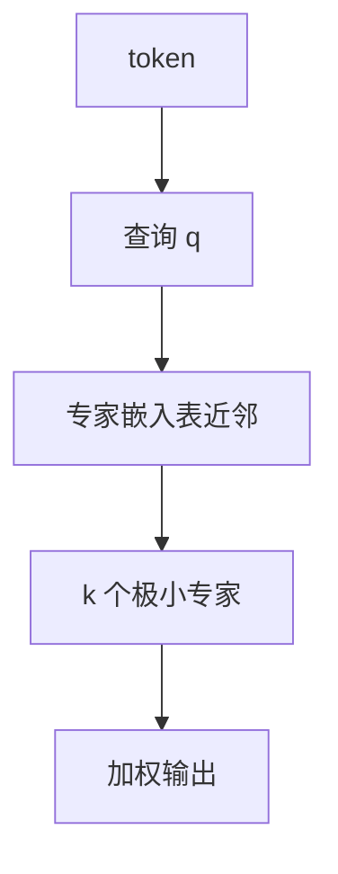

# PEER 百万专家

专家数可以到百万，每个专家极小；路由变成从嵌入表里检索若干近邻，而不是对 $N$ 维 softmax。

<footer>—— He, Mixture of A Million Experts, 2024</footer>

[上一课](/llm/expert-pruning-merging)在几十到几百专家上做减法。PEER（Parameter Efficient Expert Retrieval）走加法：$N$ 极大、单专家极窄，门不再对全部专家打 logits——那是 $\Theta(N)$ 的不可行。本课补检索式路由：query 向量在专家嵌入表上做近邻，只激活取出的几个。后课层次 MoE 用树降低检索难度；本课先给平坦百万表。

## 问题

[Switch](/llm/switch-transformer) 的门是 $d\times N$ 矩阵，$N=10^6$ 时门比专家还大，且 softmax 不可用。[哈希路由](/llm/hash-routing) 能分派但无内容近邻。缺口是 **sublinear 检索**：专家各有一个短嵌入，token 用 $q=Wx$ 去表里找 top-$k$ 近邻，只加载那些极小 MLP。均衡靠嵌入空间的覆盖，而不是 $N$ 维辅助损失。

He 的 PEER 把专家做成单神经元或极窄层，用乘积量化一类结构让检索可扩展。课序抓住「路由即检索」，不把量化索引展开成向量数据库课。

这不是序列召回瓶颈那一课的 KV 检索。专家表是模型参数，跨序列共享；KV 是当前上下文。二者都叫检索，对象不同。

## 方法

每个专家 $i$ 存 $e_i\in\mathbb{R}^{d_e}$ 与极小权重。路由：$q=W_q x$，取 $\mathrm{top}k_i\,\langle q,e_i\rangle$，输出 $\sum_{i\in\mathcal{K}} \pi_i E_i(x)$。$\pi$ 可由内积 softmax 在 $k$ 内归一。训练要对取出的 $e_i$ 与 $W_q$ 做梯度；对未取出的专家无梯度——百万里绝大多数永不更新的风险，要用随机负样本或周期性探索，否则表塌成少数热点嵌入。

实现上专家表分片到各机，近邻搜索用 IVF / PQ 近似。近似邻居与精确 top-$k$ 的不一致是训练噪声，类似MoE 的 drop。

### 与普通 top-$k$ 门

普通门对每个专家一个独立 logit 轴，专家之间只通过 softmax 竞争。PEER 的竞争发生在嵌入空间的几何上：相近 $e_i$ 会被相似 $q$ 一起取出，自然形成专家簇。上一课的「相关簇」在这里是空间上的球，合并变成合并近邻专家。

## 机制

容量来自组合：每次 $k$ 个极小专家，组合数 $\binom{N}{k}$ 巨大，表达力可以很大，单次 FLOPs 仍小。这是稀疏 MoE 故事推到极限。代价是优化与系统：大多数专家长期零梯度，专精分析几乎无法对单个专家做干预——必须对空间区域做。

负载均衡：热点 query 方向会打热球。无辅助损失偏置可加在取出的内积上，或对过热嵌入做范数惩罚。哈希可做粗分桶再精确检索，等价于层次化的第一层，下一课正式写树。百万表的初始化不能随机到互为正交：随机高维近邻没有语义团，早期路由等于噪声哈希，叶子吃不到连贯数据。嵌入常从词向量或上一层表示蒸馏冷启动。

微调 PEER 时 LoRA 打在 $W_q$ 会整体重绘检索；打在单个专家几乎无意义。应 LoRA 查询投影加少量热专家。

## 边界

近似近邻使训推一致性变难。单专家过窄，数值与通信启动开销可能压过 GEMM。不要在尚未解决几十专家负载的代码库上「先上百万」。粒度律课会问极窄专家是否总是更优；PEER 是该问题的极端点，不是自动最优。层次 MoE 用显式树替代平坦 PQ，往往更可控。

## 小结

- PEER 用检索代替 $N$ 维 softmax，使百万极小专家可行。
- 未取出专家无梯度，必须探索或负采样，否则表塌缩。
- 专精单位是嵌入空间中的区域，不是单个专家名。
- 系统与近似邻居一致性是主风险；不是默认部署形态。
- 出处：He, 2024。
