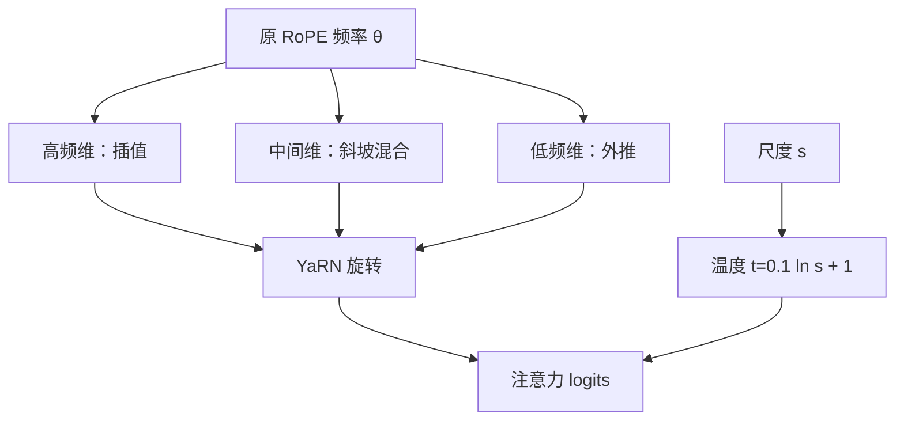

# YaRN 原文

    
把位置插值、NTK 式频率缩放与注意力温度放在同一套旋转变换里，已训好的 RoPE 模型可以高效延长上下文窗口。

    <footer>—— Peng, Quesnelle, Fan & Shippole, YaRN: Efficient Context Window Extension of Large Language Models，arXiv:2309.00071，2023</footer>

Chen 等人的位置插值把下标按比例压回原窗口；bloc97 的 NTK-aware 方案改 RoPE 基数以保住高频。Peng、Quesnelle、Fan 与 Shippole 2023 年的 YaRN 把这两条线索收成可实现的方法：按波长分段处理频率，再给注意力 logits 乘一个与尺度有关的温度，并用极少步数在目标长度上续训。本篇按原文把 NTK-by-parts、温度公式、以及「高效」在实验里等于多少步写完。导读见 [YaRN](/llm/yarn)；社区 NTK 方案见 [NTK-aware 插值](/llm/ntk-aware-interpolation)。它针对的是已经用 RoPE 训好、现在要把窗口从 $L$ 拉到 $sL$ 的模型，不是从零改位置编码。

## 问题

设原训练长度 $L$，目标 $L'=sL$，$s>1$。朴素外推仍用原来的 $\theta_i$ 去旋转 $L$ 到 $L'-1$：高频角度增量本就大，再乘更大下标，相邻相对相位像噪声。线性位置插值令 $p\leftarrow p/s$，所有频率一起被压慢：低频的全局结构还在慢变区，高频的「差一个 token」被抹平。NTK-aware 提高基数，高频少受压缩，又让部分低频承担过多外推。单独用任何一种，都会在某一频段留下缺口。

原文要解决的就是这个频段冲突，外加第三件事：尺度变大后，参与 softmax 的键变多，logits 的熵会系统性变尖或变平，即使相位被校正，注意力形状仍可能塌。目标是工程上的「高效延长」——相对从头按 $L'$ 预训练，续训步数少几个数量级，并能接到 LLaMA / LLaMA 2 一类公开权重上。

### 按维分类，而不是再选一个全局系数

RoPE 每一维对应一个频率。插值与外推不能对所有维做同一件事：高频负责邻域，低频负责长程。YaRN 的判断是按维分类处理。这不是第三种位置编码，而是规定何时用 PI、何时用 NTK 式外推。温度则单独管熵，不管相位。把三件事绑成一套变换，是为了实现时只改 $\theta$ 表与一个缩放，而不改网络结构。

YaRN 是 RoPE 的续训与推理补丁。没有旋转频谱的 ALiBi 或绝对嵌入，分段无的放矢。已经用 ALiBi 训练的模型应走 ALiBi 自己的外推协议，不要叠 YaRN。

## 方法

记第 $d$ 维波长 $\lambda_d=2\pi/\theta_d$。相对原窗口，若波长已经很长，该维更接近外推；若波长很短，该维更应该插值。原文引入斜坡，在两种策略之间连续过渡，称为 **NTK-by-parts**。设尺度 $s$，对每一维定义一个混合系数 $\gamma$（由波长与阈值 $\alpha,\beta$ 决定，论文默认 $\alpha=1,\beta=32$）：$\gamma=0$ 时该维按 $s$ 做位置插值（频率等效除以 $s$），$\gamma=1$ 时保持原 $\theta$ 做外推，中间线性插值两种尺度。于是高频端接近 PI，低频端接近外推，中间不硬切。

### 注意力温度

即使相位校正了，窗口从 $L$ 到 $sL$，softmax 的键数量增加。原文用与 $s$ 有关的温度校正熵，经验形式为

$$
t=0.1\ln s+1,
$$

再把注意力 logits 按 $t$ 缩放（实现上等价于对旋转后的 $q$ 或分数除以相关因子）。$t$ 随 $s$ 很慢地增长，短距离拉长时几乎为 1，大尺度时略把分布摊开或收拢到训练时见过的锋利程度。温度不改变相对位置几何，只改变「有多尖」。论文把这一项与 NTK-by-parts 合称 YaRN，强调缺一则某一长度后重复或汇点塌缩。

### 极少步续训与动态缩放

可以只在推理时按当前长度估计 $s=\max(1,n/L)$ 做动态 YaRN，无需更新权重。原文更推荐在目标长度上做少量续训：报道中约 **400 step** 量级即可把 LLaMA 7B/13B 接到 64K、把 LLaMA 2 接到更长（如 128K 设定），相对从头长窗口预训练省的是算力与数据。续训数据需要含长样本，不能全是短句再靠 YaRN 硬拉——补丁提供几何，不自动提供长程算法。动态与静态可以组合：权重在某一 $s$ 上微调，推理时对更长请求再动态放大。

## 机制

第 $i$ 对维度对相对位移 $\Delta$ 的贡献正比于 $\cos(\theta_i\Delta)$。线性插值令 $\Delta\leftarrow\Delta/s$，高频 $\theta_i\Delta$ 从能分辨邻域掉到几乎常数。NTK-aware 改基数，高频 $\theta$ 下降较少，但同一公式也改低频，使部分长程维的相位超出训练弧长。NTK-by-parts 按 $\lambda_d$ 与 $L$、$s$ 的关系决定该维用哪一种重映射：保住「差一个 token」的可分辨性，同时避免把本来就慢的波压得更慢。斜坡减少硬切带来的频谱裂缝。这仍是同一旋转矩阵里不同对角块的不同 $\theta$，不是三套位置编码。

### 温度解决熵，不解决相位

窗口变长后，即使相对几何正确，极值统计会变：常见的是过度集中到最近邻或注意力汇点，或摊得过平。$t$ 把 logits 的有效尺度写成 $s$ 的对数慢变函数，使训练时学到的「几条主要键加一长串小质量」在更长窗口里大致成立。只调温度而沿用错误的 $\theta$，高频照样糊；只改 $\theta$ 而不调温度，相对几何对了，分配却可能全部塌掉。原文把两件事拆开，是机制上的贡献，不只是把社区里的两个补丁绑在一起。

$\alpha,\beta$ 与 $0.1$ 都是经验常数。换模型族、换头宽、换原基数时值得扫一遍。把它们当成物理常数抄到每一个 RoPE 检查点上，会在某一尺度之后出现重复或长程遗忘，看起来像「YaRN 无效」，其实是分段阈值对不上该模型的波长表。

### 与纯 PI、纯 NTK 的包含关系

位置插值是高频端的特例；NTK-aware 是低频端与部分中间维的近亲。YaRN 规定何时用第一种、何时用第二种，并加上温度。因此消融应分别关掉分段、关掉温度，而不是只报「YaRN 对 PI 的提升」一个数。提升可能来自高频被保住，也可能来自熵被校正，两条对应不同失败模式：邻近混淆对前者，汇点塌缩对后者。

## 边界与工程取舍

YaRN 依赖原模型的 RoPE 细节：哪些维度旋转、基数默认值、维顺序。配对错了，分段阈值对不上波长，表现为某一长度之后重复。动态 YaRN 对 KV 缓存友好（$\theta$ 按请求选），但同一批次混极短与极长时，$s$ 需要按样本选择，不能共享一张 $\cos$ 表。少量续训通常优于纯推理补丁，尤其是 $s$ 很大时；续训若全是短样本，模型仍可能不会用新增的窗口。

「能跑 128K」不是评测。需要在目标长度上量困惑度、大海捞针与真实文档任务。YaRN 提供可用的位置几何，不是自动出现的长程算法。它也不能移植到 ALiBi。与 Infini-attention 一类有界记忆不是同一命题：YaRN 延长的是可寻址下标，KV 仍随 $t$ 涨；无限状态是另一篇论文。二者可以叠：段内 RoPE 用 YaRN 拉到数万，段间再压缩。不要用其中一张表给另一条背书。

400 step 是原文在特定模型与数据上的报道，不是普遍的收敛定理。数据配比、学习率、是否混短样本回放，都会改这个数字。复现应把步数当上限去扫，而不是当成「跑满 400 就等价于论文」。

### 高效延长的含义

相对从头预训练，省的是算力与数据，不是评测标准。相对只做 PI，省的是高频分辨率；相对只做 NTK，省的是低频相位溢出。原文的贡献是把这些权衡收成一套默认超参，并在 LLaMA 族上给出可跟的配方。开源生态后来把 YaRN 写进许多长上下文微调脚本，路径依赖的是 RoPE 加公开权重，而不是 YaRN 取代了所有位置工作。

## 小结

- YaRN 原文面向已用 RoPE 训练的模型，用 NTK-by-parts 分段重映射频率，并用 $t=0.1\ln s+1$ 校正注意力熵。
- 高频倾向插值以保留局部分辨率，低频倾向外推；中间斜坡过渡。
- 可动态推理启用，也可在目标长度上少量续训，后者通常更稳；报道约数百步。
- 它是 RoPE 补丁，不能套到 ALiBi 上；能跑更长不等于会用更长。
- $\alpha,\beta$ 与温度系数是经验选择，换模型族应复查。
- 出处：Peng, Quesnelle, Fan & Shippole，*YaRN: Efficient Context Window Extension of Large Language Models*，arXiv:2309.00071，2023。
