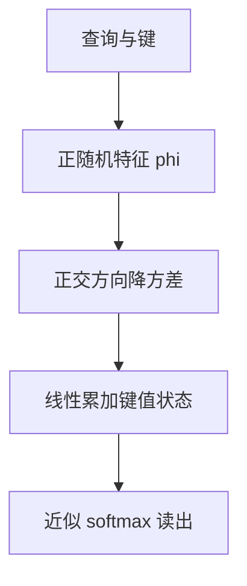

# Performer / FAVOR+

用正的正交随机特征去逼近 softmax 核，注意力就可以在线性时间内计算，同时尽量保住原来的相似度。

<footer>—— Krzysztof Choromanski 等, Rethinking Attention with Performers, 2021</footer>

[Linear Attention](/llm/linear-attention) 已经说明：只要 $\mathrm{sim}(q,k)=\phi(q)^\top\phi(k)$，计算就可以对长度线性。Katharopoulos 的 $\phi$ 是确定的，并不逼近 $\exp(q^\top k)$。Choromanski 等人 2021 年的 Performer 把 $\phi$ 换成随机特征，使内积在期望上等于 softmax 核；FAVOR+（Fast Attention Via Positive Orthogonal Random Features）是其中稳定、可训练的一套特征。本篇只谈这条「随机特征逼近 softmax」的机制，不把所有线性变体打包进来，也不把稀疏图当作同类。

## 问题

希望保留 softmax 的尖峰——因为拷贝与检索依赖它——又希望不要物化 $QK^\top$。随机傅里叶特征能逼近平移不变核，但对 softmax 核会出现负分量，注意力权重再归一化时可能翻号、方差爆炸。训练中的 Transformer 对这种噪声很敏感：一层抖，残差会把抖传到整网。需要的是：正值特征，使近似权重可解释为非负质量；低方差，使有限 $m$ 个特征就够用；以及与因果扫描兼容，以便自回归。

Performer 把目标写成对核的蒙特卡洛：

$$
\exp(q^\top k)\approx \mathbb{E}_\omega\big[\phi_\omega(q)^\top\phi_\omega(k)\big]
$$

有限 $m$ 维 $\phi$ 代入线性注意力的结合律，得到 $\Theta(n m d)$ 量级算法。$m$ 是精度旋钮：太小，近似偏向平滑，尖峰变钝；太大，线性优势被特征维吃掉。

## 方法

### 随机特征逼近 softmax

FAVOR+ 构造正特征。直观做法是对高斯方向 $\omega$ 取 $\exp(\omega^\top x-\|\omega\|^2/2)$ 一类映射，再乘上 $\exp(\|x\|^2/2)$ 的修正，使 $\mathbb{E}[\phi(q)^\top\phi(k)]=\exp(q^\top k)$（尺度可并进 $1/\sqrt{d}$）。正值保证 $\phi(q)^\top\phi(k)\ge 0$，分母求和不会正负相消。与普通随机傅里叶相比，这是专门为注意力核改的。得到 $\phi(Q),\phi(K)$ 后，算法与线性注意力相同：累加 $\sum \phi(k_j)v_j^\top$ 再与 $\phi(q)$ 相乘。

无偏是对核值而言，不是对 softmax 行向量而言。先逼近 $\exp(q^\top k)$ 再按行归一化，归一化是非线性，有限 $m$ 下权重仍有偏。实践中我们接受这一点，靠 $m$ 和正交化把误差压到训练能吞的范围。

### 正交化如何降方差

独立采样的 $\omega$ 在有限 $m$ 下方差大，不同头、不同层的近似质量不齐。FAVOR+ 用正交随机特征：先抽一组高斯向量，再 QR 正交，使方向在球面上更均匀。这不改变期望（在适当缩放后），但降低核估计的方差，于是较小的 $m$ 就能稳住注意力图。训练时可把 $\omega$ 固定（像一组冻结的投影），也可偶尔重采；固定更利于复现，重采带一点正则，但生成时必须与训练一致。

因果版本与 Katharopoulos 相同，只是 $\phi$ 变成随机的。前缀状态 $S_t$ 对 $\omega$ 敏感：若推理时换了一组特征，状态空间整个错位。部署必须固化 $\omega$，把它当作架构参数，而不是每次请求重抽的噪声。

### 正值特征与训练稳定

负特征会让近似核出现负「权重」，softmax 的概率解释坏掉，梯度也怪。正特征把近似留在正象限，损失曲面更接近原 Transformer。即便如此，早期训练仍可能出现分母过小（特征碰巧都小）或过大（长序列累加）。对策包括：对 $\phi$ 输出做缩放、在分母加 $\varepsilon$、与残差和 Pre-LN 搭配、对注意力输出再归一。Choromanski 等人在编码器与自回归设定下都给出了可训练证据；后来的经验是，中等长度、对尖峰不极端的任务上 Performer 接近稠密，极端检索仍落后于真 softmax。

## 机制

计算路径是「随机投影 → 逐点非线性 → 线性注意力扫描」。误差来源拆两项：核估计误差 $\|\phi(q)^\top\phi(k)-\exp(q^\top k)\|$，以及归一化引起的权重误差。正交化主要减第一项的方差；$m$ 同时减两项。因为扫描是确定性的给定 $\phi$，训练仍可反向到 $Q,K,V$；$\omega$ 若冻结则不接收梯度，若可学习就变成另一组投影，不再保证无偏，一般不这么做。

与稀疏 softmax 的对比：稀疏是精确 softmax 定义在子集上，尖峰仍硬，只是有的键不在子集里。Performer 是全部键都参与，但通过平滑核，尖峰变软。失败模式不同：稀疏会「完全看不见那根针」，Performer 会「看见但分不出针与干草」。评测应分开设计。同一条针测曲线不能既用来骂稀疏又用来骂 Performer。前者的错误是召回为零，后者的错误是精度被背景键稀释。改 $m$ 只缓解第二种；第一种只能改可见集。

$m$ 个特征可以看成在随机方向上对核做蒙特卡洛积分。正交化之后，这些方向更像一组确定的低差异点集，方差随 $m$ 下降得更快。实践中 $m$ 取与头维同阶往往是起点：再小，近似偏向均匀核；再大，扫描的状态矩阵开始比分块 softmax 更贵。编码器可以双向累加两套状态（左到右、右到左），解码器只能单向，因此同样 $m$ 在生成任务上更吃精度，也更怕 $\omega$ 在部署时被悄悄重采样。

## 边界与工程取舍

$m$ 的选择必须在目标 $n$ 上画延迟–质量曲线。短序列上 Flash softmax 极快，Performer 没有必要。超长序列上，若任务是分类或平滑汇总，Performer 很合适；若任务是单点精确引用，应保留至少一层真 softmax，或改用可学习稀疏。随机特征与 RoPE 的复合要小心：先旋转再映射，$\omega$ 是在旋转后的空间里采样的，外推位置上核近似误差会变，可能被误诊为位置编码失败。

工程上，$\phi$ 的指数非线性容易在混合精度下溢出，应对 $q,k$ 先按 $1/\sqrt{d}$ 缩放再进特征，并在 BF16 上对累加用 FP32。因果扫描的状态是 $m\times d$，比 KV 列表小，但 $m$ 到 256、头数再多时，状态更新也可能打满带宽。不要假设「线性 = 一定省显存」而不测量。把 Performer 当成「免费的 softmax」会失望。它买的是可调的核近似误差对二次代价。误差预算要用针测与复制任务单独报，不能只看语言建模损失。

## 小结

- FAVOR+ 用正正交随机特征逼近 softmax 核，再套线性注意力的结合律。
- 正值避免负权重；正交化降低有限 $m$ 下的方差，使特征维不必过大。
- 无偏针对核值，归一化后的注意力仍有偏，尖峰弱于真 softmax。
- $\omega$ 必须在训练与推理间冻结，否则因果状态错位。
- 短序列与极端检索不是主场；平滑长程与编码器文档更合适。
- 与确定特征线性注意力相比，Performer 更接近 softmax，也更挑数值与 $m$。
- 出处：Choromanski et al., *Rethinking Attention with Performers*, ICLR 2021；对照 Katharopoulos et al., Linear Attention, 2020。
