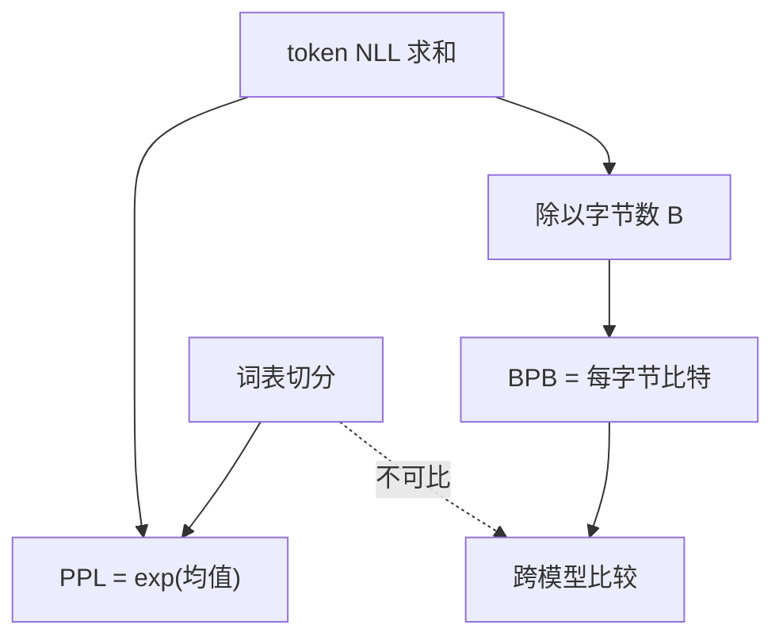

# 困惑度与 bits-per-byte

困惑度是交叉熵的指数，单位是「有效分支数」；换成每字节比特，才能在不同词表之间比较压缩能力。

<footer>—— 交叉熵与比特见 Shannon, 1948；语言建模里的 perplexity 传统见 Jelinek 一脉；跨词表比较见 Radford et al., GPT-2, 2019 对 BPB 的使用</footer>

[上一课](/llm/label-smoothing-lm)改了训练目标，并要求日志里保留硬目标 CE。缺口是：这个 CE 如何报成对外数字。词表一换，$|V|$ 与切分粒度都变，同样一段文本的 token 数不同，**按 token 平均的 CE 不能直接比**。本课把困惑度（PPL）和 bits-per-byte（BPB）钉成两种读法：前者对固定词表的训练曲线有用，后者跨分词器可比。后课读损失曲线阶段，默认你会这两种单位，不再把「PPL 降了」当成跨模型的定理。

## 问题

对长度为 $T$ 的 token 序列，平均负对数似然

$$
\mathrm{NLL}=\frac{1}{T}\sum_{t=1}^{T}-\log p(x_t\mid x_{<t}),
$$

自然对数下单位是 nat。困惑度 $\mathrm{PPL}=\exp(\mathrm{NLL})$。直观：每一步模型还在几个等价选项里平均地犹豫。均匀分布时 $\mathrm{PPL}=|V|$；完美预测时为 1。它与训练 CE（硬目标、无平滑）一一对应，所以优化器直接推的就是它的对数。

换 BPE 词表之后，$T$ 变了。更粗的切分让 $T$ 变小，每 token 任务更难，PPL 通常变大；更细的切分相反。于是「模型 A 的 PPL 低于模型 B」在词表不同时没有意义。GPT-2 用 bits-per-byte：把同一批 UTF-8 字节上的总 NLL（仍来自 token 因子，但加总后除以字节数）再换成以 2 为底：

$$
\mathrm{BPB}=\frac{1}{B\ln 2}\sum_{t}-\log p(x_t\mid x_{<t}),
$$

$B$ 是字节数。这是这段文本的压缩率上界（算术编码意义下），与切成多少 token 无关。

NLL 必须声明底。$\log$ 是 $\ln$ 则 PPL 用 $\exp$；若损失在代码里已经是 $\log_2$，PPL 要用 $2^{\cdot}$。混用会让曲线整体乘 $\ln 2$，看起来像换了数据。

## 方法

训练日志至少打三个数：token 平均 CE（nat）、PPL、以及若做对外比较时的 BPB。BPB 需要一份固定的评测字节流，不能在预处理里丢掉空白或改 NFC 而不改 $B$。packing 把多条文档拼成一条时，文档边界处的条件被切断，应在边界把条件重置或把边界 token 从平均里剔除，否则 BPB 含「强行接上篇」的假条件。

上下文长度截断：PPL / BPB 都依赖条件长度。报一个数必须写清窗口（例如 2048）。滑动窗口评测时，重叠部分的 token 只能计入一次，或明确写「 stride」。不要把训练 packing 的 CE 直接当验证 PPL——训练 CE 常含短文档填充、忽略 index 的 mask，分母不是 $T$。

与标签平滑：对外 PPL / BPB **只用硬目标**。平滑 CE 可以另栏，不叫 perplexity。

## 机制

PPL 对错误的极低概率事件敏感：一个 $p=10^{-12}$ 的 token 就能把平均 NLL 抬很高。这是特性：语言建模要为每一个位置负责。若评测集含乱码、代码、或切分爆炸的字节串，PPL 会被少数位置主导。报告分位数或按领域拆开，比只报一个均值更诚实。

BPB 把敏感性改到字节。一个被切成很多 token 的罕见词，其总 NLL 仍摊在固定字节上；词表更细不会自动「看起来更好」。这正是跨 SentencePiece / BPE / 字节级模型比较时要用 BPB 的原因。领域转移时 BPB 同样可比：都是「这段字节好不好压」。

训练曲线仍应用 token CE：它与 Adam 的 step 对齐，BPB 还要依赖评测集字节统计，不适合每 step 算。阶段分析（下一课）看的是 token CE 的斜率与尖峰，不是 BPB。

## 边界

本课不定义下游准确率，也不处理「contamination 让 PPL 虚低」。PPL 不是智能指标，只是压缩指标。MoE 的负载均衡损失、z-loss 不应计入对外 PPL；它们是训练正则，加进去会让历史曲线不可比。多语言评测要按语言拆 BPB：平均字节会把高熵脚本淹没。

## 小结

- PPL 是硬目标 token NLL 的指数，只在固定词表、固定窗口内读训练曲线。
- BPB 把总 NLL 摊到字节上，跨分词器比较压缩。
- 对数底、packing 边界、滑动窗口 stride 必须与分母一起声明。
- 平滑、z-loss、均衡项不进对外 PPL。
- 出处：Shannon, 1948；Jelinek 的语言建模 perplexity 传统；Radford et al., GPT-2, 2019。
