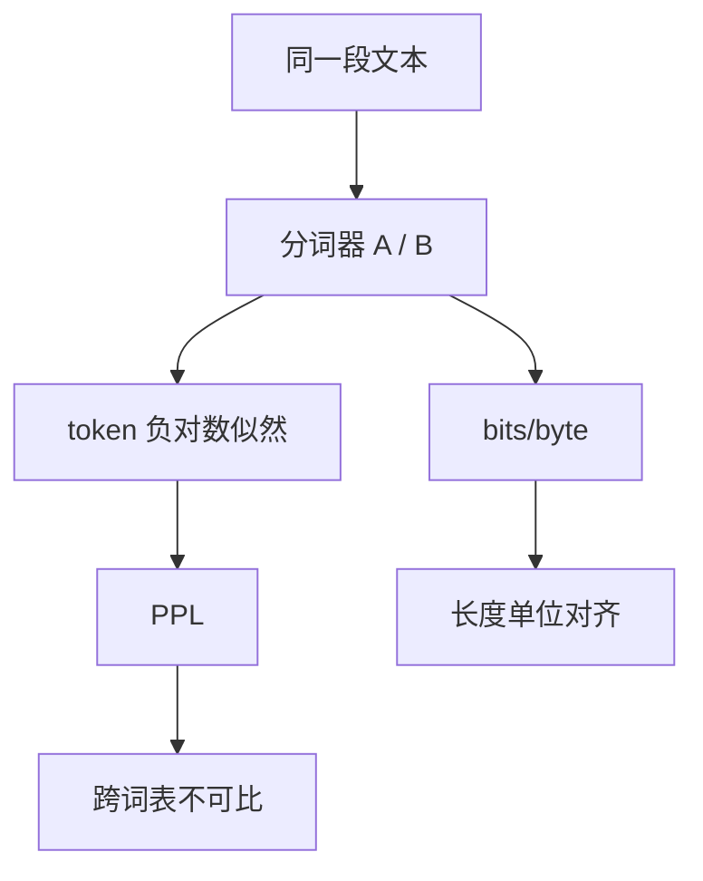

# 困惑度评测的陷阱

困惑度是词表与分词器上的交叉熵指数，不是「懂多少」的通用单位。换一套 BPE，同一个模型可以换一张完全不同的榜。

<footer>—— 对照 Jelinek 的经典定义；分词器耦合见后续对数似然评测课</footer>

[上一课](/llm/weight-sharing-compress)把压缩课序收到权重共享。压缩报告里常把困惑度（perplexity, PPL）当「量化没把模型打坏」的证据。本课打开评测进阶：PPL 作为**能力数字**有哪些陷阱。缺口不是再推交叉熵，而是：发布声明若写成「PPL 更低所以更强」，仪器已经选错。后课对数似然对生成式评测默认你已知道 PPL 不能单独签发能力。

## 问题

PPL 是 $2^{H}$ 或 $e^{H}$，其中 $H$ 是每个 token 的平均负对数似然。它忠实于语言建模目标，因此对训练损失、数据域、[分词器](/llm/bpe-merge-rule) 都敏感。换词表、换预分词、是否把标点粘在词上，都会改 token 数与每个 token 的难度，PPL 随之动，模型权重可以一动不动。跨模型比 PPL，等于在比两套不同的计数单位。

第二陷阱是域。在维基上低、在对话上高，只说明预训练域，不说明指令遵循或解题。第三陷阱是与生成质量脱节：Holtzman 等人已说明，低 PPL 的极大似然解码会退化成重复；用户要的是可接受的样本，不是测试集上的指数损失。

压缩与蒸馏课用 PPL 当**同一分词器、同一验证集**上的回归探针，这是合法的。非法的是拿它去横比不同词表的基座，或用它代理 MMLU。

## 方法

合法用法：固定 tokenizer、固定验证文档、固定是否含特殊符号，报告平均负对数似然（nats 或 bits/byte 比 PPL 更可移植）。bits/byte 把长度归一到字节，减轻词表宽度作弊。非法用法：在聊天模板打开的模型上对裸语料算 PPL；在指令模型上对预训练 holdout 报 PPL 并声称对齐没有损伤——模板本身就改了条件分布。

发布时若必须报 PPL，同时报：词表、字节级损失、验证域。能力声明改走任务评测。

## 机制

softmax 在词表上归一。大词表把概率质量摊到更多原子上，每个 token 更「难」，但一段话的 token 更少；小词表相反。PPL 按 token 平均，奖励切得碎的系统。bits/byte 按底层 UTF-8 平均，比较的是对同一字节串的压缩率，更接近「这个模型对这份语料的编码效率」。

PPL 与开放生成还隔着解码器：温度、截断、停止符都不进损失。损失好只约束教师强迫分布，不约束你实际画出的那一条路径。

## 边界

本课不废除验证损失。训练曲线、过拟合、量化退化，仍应看同一仪器上的 NLL。下一课把「看选项的对数似然」和「生成后再抽答案」拆开——那是另一类被 PPL 思维带偏的评测。

## 小结

- PPL 绑定词表与域，不能当跨模型能力单位。
- 同一分词器上的 NLL / bits/byte 才是压缩与回归探针。
- 生成质量还取决于解码，低 PPL 不阻止退化。
- 出处：Jelinek 困惑度传统；Holtzman 等关于极大似然解码退化；字节级损失的工程实践。
