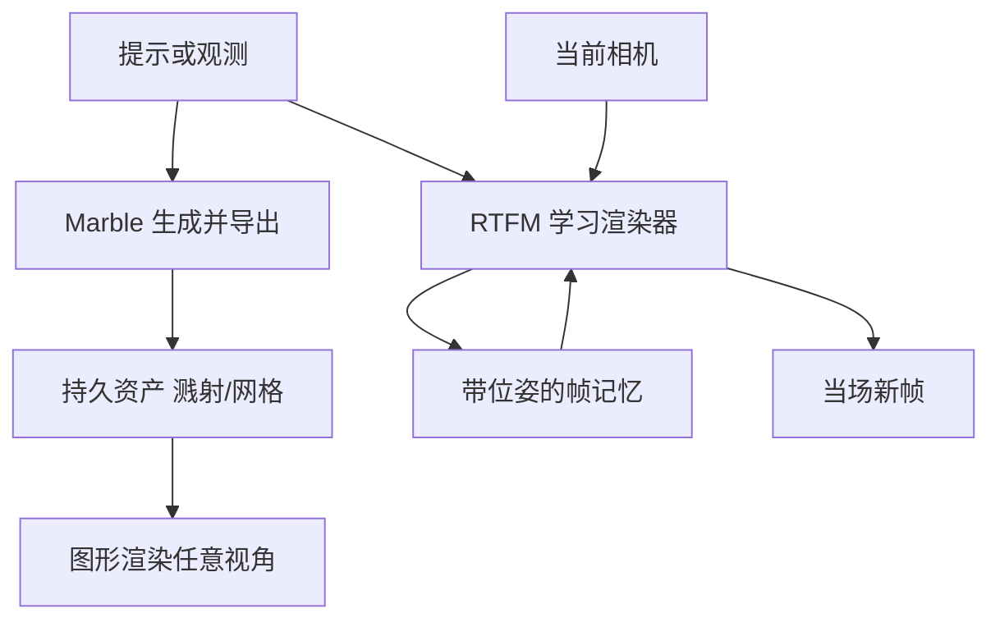

# 持久三维世界 vs 边走边生成帧

Marble 做出可下载的持久三维环境，而不是在你探索时当场生成世界；后者正是实时帧模型那条路。

<footer>—— 对照 World Labs 对 Marble 与 RTFM 的产品分工（公开报道与博文）</footer>

同一家实验室两条出世界的路。Marble 把结果写成可导出的三维资产：高斯溅射、网格、可控相机视频，世界在你关掉标签页之后仍在磁盘上。RTFM（Real-Time Frame Model）在你移动时当场出下一帧，表示主要留在带位姿的帧记忆与网络激活里，不先建成一份可下载的场景再光栅化。本篇只做对比：持久三维与边走边出帧各承诺什么、各在哪一类任务上更省事，不展开任一侧的完整架构或编辑工具。

## 问题

用户说「我要一个能走进去的世界」时，其实在要两种可能不相容的东西。一种是资产：交给引擎、交给 DCC、交给下一个人，几何与外观应相对固定，回头看昨天走过的角落应还在。另一种是体验：现在就绕着这张照片转，延迟要到交互帧率，不必先等重建结束，也不必把场景塞进显存里当网格。传统图形管线默认第一种：先有表示，再渲染。生成视频默认既不是第一种也不是第二种：它出的是一条不能回头改相机的像素带。

World Labs 把第一种交给 Marble，把第二种交给 RTFM。对比的核心不是谁更「智能」，而是世界的存储位置。持久三维把世界存在显式几何（或等价的三维原语）里；边走边出帧把世界存在「已经生成的带位姿帧 + 还能继续问模型要帧」里。选错存储位置，后面的工具链会整段作废：游戏要碰撞与导出，却只拿到一段实时视频；概念预览要立刻转圈，却被网格烘焙卡在分钟级。

### 形变与不一致性从哪来

当场出帧的系统每次都在采样，历史约束若不够硬，同一面墙会在第二次经过时换纹理、换几何，这就是形变。持久资产把采样提前做完，漫游时只做确定的渲染，形变被压到生成那一次；之后的不一致主要来自表示本身的缺陷（空洞、浮点、简化网格），而不是每帧重新发明。公开对比里强调 Marble 因持久可下载而更少「边走边长」的形态漂移，针对的正是这种差异。

RTFM 博文仍把「转过身世界还在」写成目标，并用带位姿的空间记忆去逼近持久。那是隐式持久：世界没有忘记你，但你未必拿得到一份独立于模型权重的文件。Marble 的持久是资产持久。两个「持久」不要读成同一个词。

## 方法

### 持久三维：先提交，再渲染

Marble 的合同是：输入提示或观测，输出一份可离开生成服务而存在的 $W$。$W$ 可以是三维高斯集合、视觉网格或碰撞网格。此后任意相机 $T$ 的图像由经典或近经典的渲染器 $R(W,T)$ 给出，不必再问生成模型。提交（commit）发生在导出时刻：你接受这份资产，后续管线当它是真的场景。编辑、扩展、拼世界都是在改 $W$，而不是改某一帧。

### 边走边出帧：查询即渲染

RTFM 的合同是：给定已有帧与要去的新位姿，模型直接给出新图像。世界的工作表示是激活与 KV，外加按空间取回的近邻帧（公开叙述里的 context juggling）。没有单独的「先写盘再打开」步骤。效率目标写得很具体：单卡 H100 上交互帧率。它把自己当成从数据端到端学成的渲染器，而不是先预测网格再走光栅化。

$$
I_{\mathrm{Marble}}(T)=R_{\mathrm{gfx}}(W_{\mathrm{exp}}, T), \qquad I_{\mathrm{RTFM}}(T)=f_\theta(\mathcal{M}(T), T).
$$

左边 $W_{\mathrm{exp}}$ 已导出；右边 $\mathcal{M}(T)$ 是按查询位姿取出的帧记忆，随探索更新。

两条路可以接力：公开叙述提到用 Marble 生成世界再用 RTFM 渲染复杂光影。那是管线组合，不是把对比取消。对比仍然成立：最终交付物是资产还是帧流。

## 机制

持久资产把计算预算花在生成那一次。生成可以慢、可以离线、可以用更大的模型，因为漫游不再付生成费，只付渲染费。高斯溅射或网格的渲染成本随原语数量增长，但与「再跑一遍扩散变换器」不是同一量级。代价是：未生成到的区域不会在你走过去时凭空变清晰，除非再走一趟生成（扩展、重烘焙）。世界的边界是资产的边界。

边走边出帧把计算预算花在每一帧。模型必须小而快，或高度蒸馏，才能在单卡上跟手。它换来的是：你朝没见过的方向走，系统仍能出画，不必先有那一区的网格。代价是每帧都有采样误差，长期一致性要靠空间记忆而不是靠磁盘上的真值。记忆按位置取回，避免上下文随探索线性胀到不可算——这是实时帧路线能「一直走下去」的机制，但也说明世界没有一份与路径无关的完整拷贝。

### 评测应分开

资产路线应测：导出后换实现是否仍像同一世界、多视角是否锁死、能否进引擎。帧路线应测：帧率、长时探索后是否遗忘、转身回来是否还能对上。用资产的网格误差去打分实时帧模型，或用第一人称观感去打分导出网格，都会得出无意义的胜负。形变这项尤其如此：它是帧路线的典型病，不是网格简化的典型病。

「实时」在两边意思不同。资产侧的实时是渲染实时；帧侧的实时是生成实时。把 Marble 预览窗口的帧率拿来和 RTFM 的生成帧率比，是把光栅化吞吐和网络前向比成一个数。

## 边界与工程取舍

本对比不包含谁更接近空间智能的终局。显式三维更利于碰撞、编辑、工业工具链；隐式帧更利于复杂外观、反射、以及在没有网格的情况下先探索。终局系统很可能两者都要：探索用帧，提交用资产。现在把其中一条说成已经过时，会误导选型。

不要把 RTFM 的「不建显式三维」读成「没有三维」。它把位姿当查询键，先验仍是欧氏三维，只是不把物体几何写成独立文件。也不要把 Marble 的可下载读成「已经仿真」。下载的是静态或准静态世界，动力学仍要引擎或后续模型。对比轴只有一条：世界是否作为独立于本次会话的三维资产存在。

工程配额也不同。资产要存溅射点数、网格面数、贴图；有上限（产品文档里对溅射计数有配额一类约束）。帧流要存近期位姿帧与 KV，配额是显存与上下文策略。搬家、协作、版本管理：资产可以进 Git 或网盘；帧记忆很难离开原模型原权重谈复现。需要交付给他人时，持久三维几乎是强制选项。需要此刻在浏览器里证明「这张图后面还有空间」时，边走边出帧更便宜。

另一条边界是本篇不讨论的后续题目：实时帧的形变细节、Marble 的编辑器与溅射格式。对比只需记住决策问题：你要带走的是文件，还是一次还在线的生成会话。

## 小结

- Marble 提交持久三维资产再渲染；RTFM 按相机查询当场出帧，不先导出场景。
- 两个「持久」不同：资产持久是文件还在；帧记忆持久是模型还记得你走过的地方。
- 形变主要来自每帧重采样；导出后再光栅化会把这类漂移挡在生成阶段之外。
- 计算付费点不同：资产付一次生成，帧路线付每一帧。
- 评测与工具链应按交付物选择，不要用同一张观感表决胜。
- 出处：World Labs，*Marble: A Multimodal World Model*；*RTFM: A Real-Time Frame Model*；公开报道中对可下载环境与当场生成的对照。本篇只比较存储与交付，不代替任一侧的专论。
