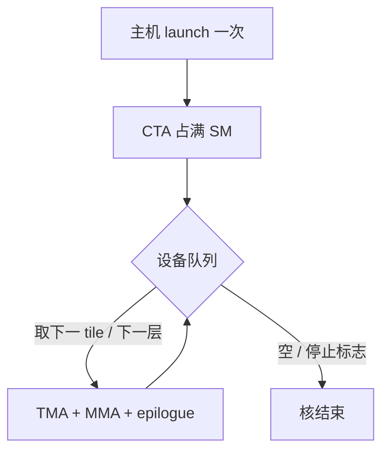

# Persistent kernel

    
让 CTA 在 SM 上住下来，自己从设备侧队列取下一块工作，而不是每块 GEMM 由主机再 launch 一次：省掉的是核间排水与启动，不是单块内部的 MMA。

    <footer>—— NVIDIA CUTLASS 持久化调度 / CUDA 占用率模型，对照 Hopper 白皮书中的异步流水</footer>

默认执行模型里，每个 kernel 启动对应一批 CTA，跑完即走，SM 流水线排空，下一次启动再填满。短核密集时，排水与启动的间隙可见；即使用 [CUDA Graph](/llm/cuda-graph-infer) 把启动收成一次，图中相邻节点仍是两次独立的核，中间仍可能丢占用。Persistent kernel 把网格做成大约「占满 SM」的常驻 CTA，内层循环从工作队列（下一 tile、下一层、下一请求的一块 GEMM）取活，直到队列空。CUTLASS 的 persistent / stream-K 调度、部分推理引擎的 decode 循环，都在这一模型里。

本篇写何时该常驻、工作如何分发、以及和 Graph、融合的分工。不编造未公开的 SM 排水周期数。

## 问题

GPU 的吞吐建立在延迟隐藏上：足够多的 CTA / warp 在等内存时切出去做别的。核一结束，这些现场消失，下核再从零填指令缓存、记分牌和流水线。若每个核只做一小块工作（decode 的瘦 GEMM、一层里拆开的 RMSNorm），填满—排空的占空比变差。融合能把小核合成大核，但融合有数值与编译边界；Graph 能减 CPU 提交，但不保证 GPU 侧两个节点之间不断流。持久化要回答的是：能否让同一批 CTA 跨过「逻辑上的多个任务」保持占用。

代价同样真实。常驻 CTA 把 SM 占住，若队列短暂空闲，别的流上的核进不来，延迟尾部变差。工作分发若在设备上抢队列，原子争用会成为新瓶颈。问题是占用与公平、以及队列粒度，不是「常驻一定更快」。

### 与 grid-stride 循环的差别

Grid-stride 是一个核内：CTA 用 `blockIdx + gridDim` 的步长扫完所有 tile，扫完核结束。它减少启动次数，但网格大小通常仍按 tile 数来，可能远超 SM 数，调度器靠过量 CTA 做切换。持久化把网格钉在「每 SM 一到数个 CTA」，循环条件是队列非空而不是「我的 stride 走完」。长时间驻留、跨多次逻辑 GEMM、甚至跨层，才是 persistent 这一词在 CUTLASS 与推理文献里的意思。二者都是「少启动」，粒度不同。

主机侧 `while` 里反复 launch 同一核，即使核很小，也不是持久化。持久化的判定是：设备上的 CTA 在一次 launch 里消费了多次逻辑工作项。Nsight Systems 上应看到一次很长的核，而不是一排同名短核。

## 方法

实现上通常有三件套。

**占用目标**：grid 取 `sm_count × cta_per_sm`，`cta_per_sm` 由寄存器与 smem 反推，保证常驻而不过度超订。超订在持久化里帮助变小——反正 CTA 不退出，多余的 CTA 只是排队等 SM，浪费队列里的工作项编号。

**工作队列**：可以是全局内存里的原子计数器（下一个 tile ID）、按层预排好的静态表、或 Hopper 上与 TMA 描述符列表结合的「下一盒子」。Stream-K 一类调度把 $K$ 维切给不同 CTA 再规约，也常落在持久化 CTA 上：CTA 跑完自己的 K 片段后去取下一项，而不是结束核。

**退出条件**：队列空、或主机写入的停止标志。推理 decode 可以把「一整步的所有层」放进一次持久核，层间不退 SM；也可以每层一个持久核，由 Graph 串起来。前者占用最好，但要把一整步的控制流写进同一核，MoE 与变长很难。后者更模块化，排水发生在层边界。

### 与 warp 特化、流水的组合

Hopper 上持久化 CTA 内部往往仍是 [warp 特化](/llm/warp-specialization) 加 [软件流水](/llm/sw-pipeline-buffer)：常驻解决的是**工作项之间**不断流，特化解决的是**一项内部**拷贝与 MMA 重叠。不要用持久化替代 TMA 流水——队列再快，块内若同步搬砖，屋顶线还在。CUTLASS 3.x 的 Hopper 主循环把三者做成可组合的 kernel adapter：调度器（persistent 与否）在核入口，集体主循环在内层。

服务侧还要考虑与连续批处理的接口。若每步 batch 形状变，持久核必须能从固定缓冲读到当前形状，或在步边界结束核、下一步再 launch。把「永远不退出的核」和「每步换拓扑」绑在一起，会把动态调度全部塞进设备侧，调试成本通常高于收益。

## 机制

收益来自保持 SM 的热状态：指令缓存、MMA 流水、已经填好的 pipeline stage、以及（在允许时）不重复做的预热拷贝。对短工作项，这些固定成本被摊到多次消费上。对已经很长的 prefill GEMM，一次核已经占满墙钟，持久化几乎无增益，甚至因调度器少了灵活超订而略差。

正确性依赖于工作项划分无重叠、规约有明确所有者。Stream-K 的部分和要写到指定缓冲再做一次归约核或核内协作归约；持久化不自动处理这部分。原子队列要避免所有 CTA 打同一 cache line：可以用每 SM 私有的工作范围，或条带化 tile 编号。争用严重时，持久化的墙钟会差过「普通网格一次 launch」。

持久核把 GPU 变成一台拉模型的工作机，主机变成填队列的生产者。CPU 若填得比消费慢，SM 空转在轮询上，功耗与延迟都差。队列项应足够粗（一整块 GEMM tile 或一整层），不要按标量任务投喂。

### 和 CUDA Graph 怎么选

Graph：拓扑固定、多个**不同**核、要减 CPU 提交。Persistent：同一套 CTA 代码、多个**同类**工作项、要减 GPU 排水。Decode 一步若是「RMSNorm 核 + GEMM 核 + 注意力核」三种代码，Graph 更自然；若已融合成一个大核反复吃层，持久化更自然。二者可叠：Graph 的一个节点是持久核。先用 profiler 看间隙在 CPU launch 还是在 GPU 核间空闲，再加其中一个，避免两套状态机同时上。

## 边界与工程取舍

不要在多租户 MPS 上默认常驻占满 SM，除非理解对邻居延迟的影响，见 [MPS 与 MIG](/llm/mps-mig)。不要让持久核内出现可阻塞的设备侧等待（无超时地等主机旗标），否则整卡卡死难以取消。不要把 NCCL 调用塞进持久循环却不核对图/流语义。取消与超时应走主机停止标志 + 有限轮询间隔，并在文档里写清最坏唤醒时间。

占用计算要用实际寄存器与 smem，含 pipeline stage。复制 CUTLASS 示例的 grid 到自己更大的 tile 上，可能每 SM 驻不下，网格空转。数值上，持久化改变 tile 被处理的顺序（尤其 stream-K），浮点尾差会变，应对照非持久路径设容差。

出处：CUTLASS 文档的 persistent CTA / stream-K 调度；CUDA Occupancy 与 launch 配置；Hopper 白皮书提供异步主循环为何值得跨 tile 保持常驻。CUDA Graph 指南说明二者解决的提交层不同。

## 小结

- Persistent kernel 用常驻 CTA 从设备队列拉多次工作，减少核间排水与重复启动。
- 与 grid-stride 的差别是网格钉在 SM 占用上，循环跨逻辑任务而不是一次扫完就退出。
- 适合短而重复的同类工作；大 prefill GEMM 与高度动态的拓扑收益有限。
- 块内仍要靠 TMA / WGMMA / 流水打屋顶线；持久化不替代融合。
- 与 Graph 按瓶颈选择或叠加；注意多租户占用与取消语义。
- 出处：CUTLASS 持久化调度与 CUDA 占用率模型。
