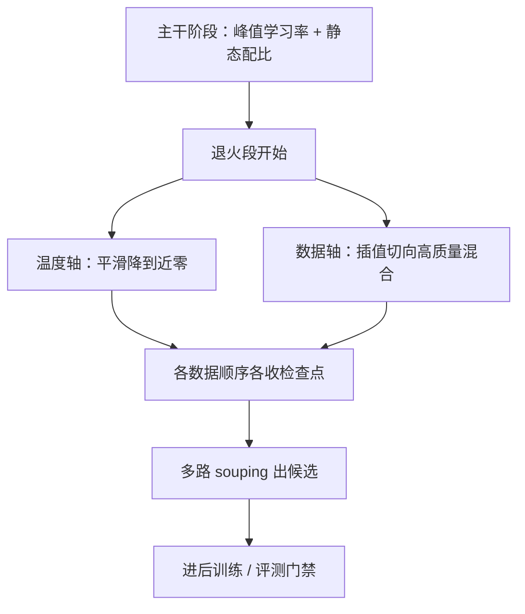

# 退火与数据课程

退火从来不是单纯的降温：学习率降下去的同时，数据要换上来——温度与测度是同一阶段的两根轴。

<footer>—— 据 OLMo 2（arXiv:2501.00656）与 Llama 3、MiniCPM 的退火段配方整理</footer>

[上一课](/llm/pf2-data-exhaustion)处理的是计划外的数据缺口；本课进入收束单元，写计划内的最后一段：退火期把学习率降到零，同时把数据测度切向高质量混合。[退火阶段](/llm/annealing-phase)与[退火混合](/llm/anneal-mixture)两课已分别写过温度轴与数据轴；本课把两轴合回一个阶段配方，并厘清它与 OLMo 2 式中训的谱系关系。

## 问题

把退火只当温度处理会白烧这一段：学习率降下来只是让更新变细，末期的高质量数据若不换上来，降温只是在幂律尾巴上多磨掉一点 CE——该补的能力补不上。反过来，只换数据不降温也不行：高温下大步长会把细粒度的知识抖散，学不深。两根轴要同时动，这就是为什么退火是「阶段」而不是「日程的最后一段」：它有自己的混合、自己的检查点策略、自己的评测点。另一个易错点是把它与 SFT 混淆——退火换的是预训练测度，仍是下一词预测，不引入对话模板。

### 阶段配方

退火占算力预算的末段，通常只占约百分之五到十的 FLOPs，却消耗配方里最精的数据。温度轴：从峰值段平滑降到近零，寿命与主干计划绑定。数据轴：$w_{\mathrm{anneal}}$ 抬高质量源——数学、代码、教科书风、长上下文——守住[去污](/llm/decontamination-pipeline)与语种字符预算，与主干混合用插值衔接而不是硬切。产物轴：OLMo 2 的做法是把这一段与「中训」叠在同一短阶段——预训练检查点加 Dolmino 混合加线性降到零，并从**多个数据顺序**各收一个点做 souping，见[中训配方](/llm/olmo2-midtrain-recipe)与[模型汤](/llm/model-soups-averaging)。

## 方法

落地四条。第一，**插值衔接**：混合切换按 token 平滑过渡，硬切会在切换点留下可见的损失台阶，让之后的归因都多一个混杂变量。第二，**与检查点同表**：退火段加密收点，每个点的（学习率、混合、token 位置）三元组与检查点同存——选点一课的候选池就来自这里。第三，**评测对齐**：退火后的模型才与最终评测可比；拿主干未退火的点去打别人退火后的分数，是比较事故。第四，** Souping 纪律**：多路汤的成员必须共享同一预训练起点、只差数据顺序或短阶段混合；验证集拒远点，防一碗夹生汤。

退火段补数学与代码靠的是换混合而不是降温本身：单看温度轴，退火后训练 CE 只降一截；OLMo 2 的中训把平均分抬了约十分，主要记在 Dolmino 混合与新能力源上——「cooldown 会自动整理出能力」是这一课最常见的误读。

## 机制

为什么两轴必须同时动：学习率决定每个样本被「写」的深度，测度决定写什么。高温写深但糙，适合粗结构；低温写浅但稳，适合把已经成形的能力整理、把高质量样本的细节刻进去。单独动任何一轴都在浪费另一半的功。为什么与中训合并在一个短阶段：两者共同点是「低学习率下的能力注入」，分开做会付出两次交接成本；合并后一次降温支撑多份数据分叉，每个分叉都便宜到可以消融。为什么插值优于硬切：梯度预算的转移是连续量，模型对测度的突变没有准备——台阶本身无害，但它是免费的混杂变量。

## 边界

本课的阶段配方不覆盖 SFT 与 RLHF：退火不换目标函数，不引入模板；交接给后训练的口径是候选模型加证据，见[继续预训练](/llm/continued-pretraining)对 mid-training 命名的讨论。序列长度的阶段化（先短后长）是训练中段的结构课程，见[序列长度预热](/llm/sequence-length-warmup)，退火期把长上下文抬进混合只是数据轴的一个分量。多路 souping 的统计细节与拒远点判据在选点一课展开。最后，短预算下这一段可以做成本可实验的接口——多混合多顺序各跑一次退火再选优；预算大时它收敛为一次，接口形态不变。

## 小结

- 退火是双轴阶段：温度降到近零与测度切向高质量混合必须同时做。
- 占约 5%–10% FLOPs；混合用插值衔接，守去污与语种预算。
- 与中训同构：低学习率下注入能力源，多数据顺序收点做 souping。
- 退火后的点才与最终评测可比；cooldown 不自动产生能力。
- 出处：OLMo 2（arXiv:2501.00656）；Grattafiori et al., Llama 3；Hu et al., MiniCPM。
