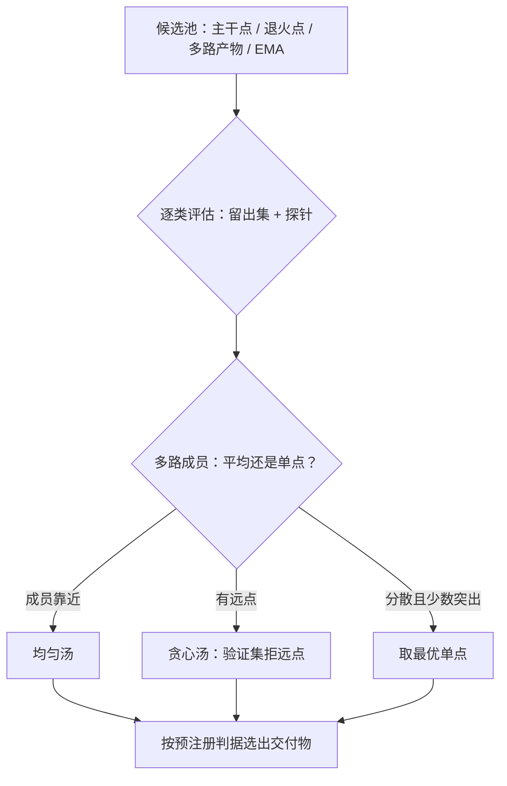

# checkpoint 的挑选

选点是一次有判据的决策，不是浏览相册：每个被送出去的候选，都要能说出它凭什么排在别人前面。

<footer>—— 据 OLMo 2 多数据序 souping（arXiv:2501.00656）与 Wortsman et al., ICML 2022 的模型汤实践整理</footer>

[上一课](/llm/pf2-annealing-curriculum)的退火段在检查点分线上留下了一批候选：主干终点、退火途中各点、多数据顺序的多路产物。本课写从中挑出交付物的流程：候选池怎么构、判据用什么、平均与单点的取舍、以及怎么防止把选点做成对评测集的过拟合。[检查点的存储与分线](/llm/ti-checkpoint-engineering)已提供设施；本课用的是配方口径。

## 问题

选点容易滑成两种坏形态。一种是**默认终点**：训练到死线，拿最后一个检查点交付，不问倒数第二个或退火中途是否更好——日程的尾部与数据课程的存在意味着终点未必是局部最优的交付点。另一种是**榜单挑选**：把所有候选跑一遍公开榜，谁高分选谁——这在统计上是对评测集的选择性使用，选出的「最好」有一部分是评测集上的运气，换一批题就蒸发。两种形态的共同病根是：没有先于观测的选点判据。

### 候选池与判据

候选池先分类，再逐类定判据。**主干与退火各点**：按训练 CE 与探针分数的联合表现入围，要求轨迹契约完好——没有尖峰回退污染的脚注。**多路退火产物**：共享预训练起点、只差数据顺序，先各自评，再考察[均匀汤与贪心汤](/llm/model-soups-averaging)：均匀平均全部成员，或用验证集拒掉偏离远的成员再平均；汤的推理成本与单体相同，是便宜的提升。**EMA 权重**：时间轴上的隐式平均，作为另一类候选与汤并列。判据权重启动前写进[检查清单](/llm/pf2-pretrain-checklist)：哪张留出集说了算、平手怎么办、汤与单点差多少以内算平手。

## 方法

执行三条。第一，**留出集分层**：选点用的留出集与发布评测用的门禁集分开；前者可以频繁用，后者只在选点结束后动用一次。第二，**平手与方差**：候选间差距小于种子方差时不宣布胜负，宁可交付多候选给后训练接口并行试；种子数按实测方差反推，见[超参搜索](/llm/ti-hparam-search-eng)的噪声下界口径。第三，**谱系写全**：交付物附带它的来源——哪个 run、哪个检查点、是否汤、成员列表与拒绝记录；这继承配方管理一课的四元组纪律。

同一条训练轨迹上相邻检查点的平均是时间轴平滑，与「超参轴的汤」不是一回事：前者只压噪声，后者需要真正的多样性；把同轨迹多点平均冒充模型汤，会在对比实验里高出一段不存在的收益。

## 机制

为什么平均能赢单点：多路退火的成员在不同数据顺序上学到略有不同的解，平均落在它们张成空间的中心，抹掉各自的特异性误差；Wortsman 等的结果表明共享预训练上的多样微调平均后普遍不差于最优成员。但它有两个前提——成员足够靠近（权重空间里可加），以及验证集能识别远点；两个前提都不满足时，汤会夹生，最优单点反而是安全交付。为什么判据要预注册：选点是一次自由度很高的搜索，评测集被反复使用后，最高分不再是能力的无偏估计；预注册把这次搜索的预算与停止规则定死，评测集的统计效力留给最终门禁。

## 边界

本课选的是预训练交付物，不含后训练之后的最终选型；RL 或蒸馏阶段的候选语义不同。汤的成员资格以「共享预训练起点」为界，不同词表、过远策略的两支不在范围内，见[模型汤](/llm/model-soups-averaging)的边界课。检查点怎么存、分线怎么保留、resume 演练怎么做，是[检查点工程](/llm/ti-checkpoint-engineering)与[预训练检查点](/llm/pretrain-ckpt)的口径，本课只消费分线产物。发布前的全面评估是下一课的模型评估门禁——选点只回答「送谁去考」，门禁才回答「能不能发布」。

## 小结

- 选点是预注册判据下的决策：候选池分类，判据启动前写进清单。
- 多路退火产物先评单点再评汤：均匀汤、贪心汤与最优单点三选一，平手并行交付。
- 选点留出集与发布门禁集分开；差距小于种子方差不宣布胜负。
- 交付物带全谱系：来源 run、检查点、汤成员与拒绝记录。
- 出处：Wortsman et al., Model Soups, ICML 2022；OLMo 2（arXiv:2501.00656）的多数据序实践。
