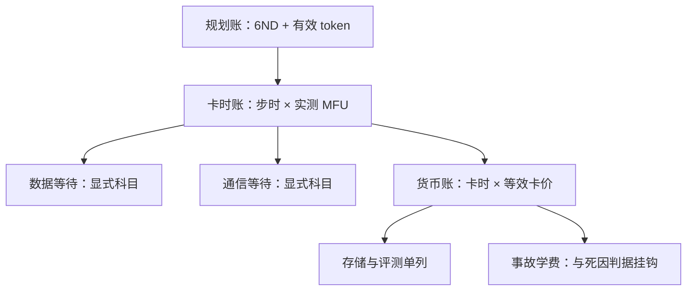

# 算力账

配方决策的第一行是 $C\approx 6ND$ 个 FLOPs，最后一行是钱；两行之间所有换乘都可能有损耗，账要把损耗记出来。

<footer>—— 据 Hoffmann et al., 2022 的计算口径与大规模训练预算实践整理</footer>

[上一课](/llm/pf2-scaling-failures)把缩放决策的失败拦在适用域上；本课把整门课程的决策换算成统一的记账单位。配比、超参、日程、退火、选点，每个决策都在花同一笔预算——算力——而预算最终兑成卡时与货币。[成本的三层记账](/llm/ti-cost-analysis)在设施课建好了账本；本课写配方口径：名义 FLOPs 与实际卡时的差、预算在阶段间怎么分、事故在账上长什么样。

## 问题

算力账最常见的错法是只用名义数：$C\approx 6ND$ 算出总 FLOPs，除以标称算力得到工期，再乘单价得到预算——三步里每一步都藏了损耗。第一步，$6ND$ 只计训练主环，不含评测、探针、退火多路分叉与报废重跑；第二步，标称算力与实际 MFU 之间隔着通信等待、数据等待与尾延迟，见[预训练通信](/llm/pretrain-comm)；第三步，卡时单价之外还有检查点存储、评测机器与事故学费。名义账的问题不在不准，而在它把损耗挪进了「意外」科目——预算超支时没有人能指出是哪个决策超的。

### 三本账并记

**规划账**：以 $C\approx 6ND$ 与有效 token 计，回答「这次点火理论上要多少计算」，配比的绝对 token 数在这里兑现。**卡时账**：以步时与实测 MFU 计，回答「机器上要跑多久」；数据等待与通信等待是账上的显式科目，不是隐含折扣。**货币账**：卡时乘[等效卡价](/llm/ti-cost-analysis)加存储加评测，回答「项目花多少钱」；事故（回退、重跑、废 run）在货币账上单列，与死因档案的判据挂钩。

## 方法

配方口径三条。第一，**阶段预算显式切分**：主干、退火（约 5%–10%）、中途评估、发布评测各占多少，点火前写成表格；退火多路分叉这类「可选消费」标注单价，决定做多宽时有意识。第二，**损耗归因到决策**：利用率低先分清是配置问题（[MFU 优化](/llm/dist-mfu-case)的口径）还是数据流水线饿——两者在卡时账上的科目不同，解法也不同；账不分科目，优化就靠猜。第三，**对照口径钉死**：与别家比成本前先对齐 FLOPs 计数口径与 MFU 口径；「我们更便宜」的声明只在同口径下成立。

Chinchilla 同算力对照里，Gopher 是 280B 参数训 300B token，Chinchilla 是 70B 训 1.4T——名义 FLOPs 相同，账面结论却是后者各项下游全面更好：算力账的第一课是「同样的钱，分割比总量先起作用」。

## 机制

为什么三本账不能合并成一本：它们服务的决策不同——规划账服务规模决策（配比、$D/N$），卡时账服务工程决策（MFU、流水线、调度），货币账服务管理决策（预算、止损、立项）。合并记账会把三种粒度的信息压成一个数，任何一方的异常都无法归因。为什么事故要单列：学费若混进常规成本，重复犯错的信号就被稀释；单列加死因判据，才能回答设施课那句「学费累计额可查」。为什么评估要计价：中途探针与发布评测占用的机器就是训练让出的机器——把评估当免费，评估就会无限膨胀；计价之后，评估频率的决策才有约束。

## 边界

本课管预训练项目的算力记账，不管集群调度与抢占策略——那是[多实验调度](/llm/ti-multiexp-scheduling)与设施课的口径；本课只消费它们的账目科目。推理侧成本（每 token 服务成本、批处理经济）是服务课程的对象，训练账与推理账只在「过训小模型换推理省卡」这一类决策上相遇，那笔联合账在[计算最优](/llm/chinchilla)的边界一节。多实验组合的总预算分配（多少个候选、多少代理搜索）在[超参搜索](/llm/ti-hparam-search-eng)与[实验调度](/llm/ti-multiexp-scheduling)之间，本课只要求每个实验报账。最后，账的口径会随硬件换代漂移——钉住的是「三本账、损耗显式、事故可归因」这套结构。

## 小结

- 三本账并记：规划账（$6ND$ 与有效 token）、卡时账（实测 MFU 加显式等待科目）、货币账（卡价加存储加评测）。
- 阶段预算显式切分：主干、退火、评估各占多少，可选分叉标单价。
- 事故学费单列并与死因判据挂钩；评估计价，免费评估必然膨胀。
- 跨项目比成本先对齐 FLOPs 与 MFU 口径；同样的钱，分割先于总量起作用。
- 出处：Hoffmann et al., 2022 的计算口径；据大规模训练预算与成本实践（对照 ti-cost-analysis 三层记账）整理。
