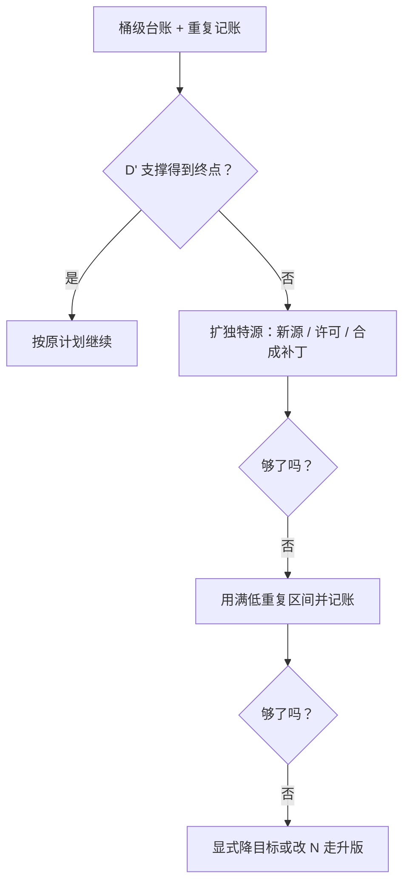

# 数据耗尽与再配比

token 数要分两个账本：名义上喂了多少，和其中有多少是真正没见过的；耗尽发生在第二个账本上。

<footer>—— 据 Muennighoff et al., Scaling Data-Constrained Language Models, 2023 与 Hernandez et al., 2022 整理</footer>

[上一课](/llm/pf2-midtrain-eval-gates)把中途决策收进门禁，其中「调整」通道的合法入口之一就是数据侧的再配比。本课写这条通道本身：训练中途发现数据不够，怎么判、怎么补、怎么记账。[数据受限缩放](/llm/data-constrained-scaling)与[多 epoch 重复](/llm/multi-epoch-repetition)已经给出规律；本课把它们接到配方决策：耗尽的判定信号、补救选项的次序、以及被迫重复与有意过训的区分。

## 问题

耗尽的判定之所以容易错，是因为名义 token 数永远好看：配比定稿时每个桶都写足了量，但清洗与去重之后**独特数据** $U$ 往往比计划少一截，而训练日志上的 $D$ 名义值照常增长。用名义 $D$ 规划的团队会在后段不知不觉进入高重复率体制：损失下降变缓、记忆回路被强化、验证集若与训练池有重叠还会先涨后骗。判定要用[有效数据](/llm/data-constrained-scaling) $D'$ 而不是名义 $D$：重复的边际收益在头几个 epoch 后快速衰减，之后每个名义 token 换来的新信息越来越少。

### 判定与补救次序

判定信号三条：桶级台账显示剩余独特 token 低于计划消耗；重复记账表显示有效 epoch 数进入衰减区；曲线对照同桶的历史 epoch 表现。补救按代价排序。**先扩独特源**：新来源、许可解锁、[合成补丁](/llm/synthetic-pretrain)——合成在预训练里是补真实数据的稀疏，不是主食。**再调重复率**：头几轮重复接近新数据，把它当扩 $D'$ 的手段用满，但记进重复账本。**最后动规模**：改 $N$ 等于改配方的一切坐标——超参、日程、检查点都要重对，中途改 $N$ 是最重的选项，通常留给下一次点火。

## 方法

记账口径三条。第一，**两个账本并记**：名义 $D$ 与有效 $D'$ 分列，重复率 $R=D/U$ 按桶记账；「无意重复」（去重漏网的）与「有意 epoch」都计入 $R$，否则 $D'$ 高估。第二，**验证集有独立预算**：验证集的重复上限单独设，且评测集重叠有[去污](/llm/eval-contamination)审计——重复最容易先把验证集学好。第三，**再配比走升版**：中途把某桶权重调高（比如数学）是配比变更，按[配比定稿](/llm/pf2-data-mix-final)的例外通道处理：声明变更理由、跑对照探针、升版本号；借「数据不够」之名把新桶混进来而不留档，是配比证据链断裂的开始。

衰减点会移动：大约前四个 epoch 的重复仍接近新数据，是特定容量与数据多样性下的拟合读数；小模型或窄分布上这个数会变。把「4」写进自动化脚本当常数，是本课最常见的事故。

## 机制

为什么补救次序按代价排：扩独特源改变 $U$，直接修复缺口，代价是采集与清洗时间；调重复率不改变 $U$，用衰减中的收益换 token 效率，代价随 $R$ 上升——包括记忆化带来的隐私与泛化风险；改 $N$ 动的是整个缩放坐标系，代价最大。这个次序与[数据受限缩放](/llm/data-constrained-scaling)的结论一致：$D'$ 饱和后，增量算力更该花在加独特源或调 $N$ 上，而不是无限重复。为什么被迫重复与过训要区分：过训是数据充足时**故意**拉大 $D/N$ 换推理效率，重复体制清楚、目的明确；被迫重复是规划失误的事后状态，若不显式记账，事后分析会把两者混为一谈，把「规划失误」误读成「过训策略」。

## 边界

本课管训练中段的数据缺口决策，不管数据管线怎么建——去重参数、指纹、预取是[数据工程](/llm/dataloader-pipeline)与[网页清洗](/llm/web-clean-dedup)的口径。合成补丁的具体工艺（改写、题解、回译）与崩塌风险的控制见[合成数据在预训练](/llm/synthetic-pretrain)。退火期换高质量混合是**计划内**的配比切换，不是本课的应急再配比，两者在退火一课区分。课程学习式的顺序调整与配比无关，见[数据顺序与课程](/llm/data-ordering-curriculum)。最后，若判定的结论是「$U$ 永远撑不起这个 $N$」，正确的动作是把降目标提案交给下一次点火，而不是在本轮硬撑到死线。

## 小结

- 耗尽判在有效数据 $D'$ 上：名义 $D$ 好看不代表独特数据够用。
- 补救按代价排序：扩独特源、用满低重复区间并记账、最后才考虑改 $N$。
- 双账本并记：$D$ 与 $D'$ 分列，重复率按桶记账，无意重复也算。
- 被迫重复与有意过训必须分开记账与叙述；再配比走显式升版。
- 出处：Muennighoff et al., 2023；Hernandez et al., 2022；合成占比约束见 DoReMi 与 RefinedWeb / FineWeb 的数据工作。
