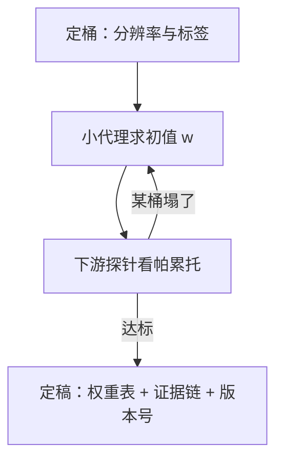

# 数据配比的最终决定

配比不是「各来一点」，而是把每一枚训练 token 的梯度预算在桶之间做分配；它是数据侧的一阶决策。

<footer>—— 据 Xie et al., DoReMi, NeurIPS 2023 与 Gopher / Llama 的来源配比实践整理</footer>

[上一课](/llm/pf2-pretrain-checklist)把数据冻结写成开工判据，要求先洗后比、按真实 token 记账。本课补上那张清单里最重的一项怎么定：配比的最终决定。配比怎么求、谁说了算、定稿的文书长什么样——这是[领域配比](/llm/data-mixture-laws)与 DoReMi 那些课的工程落点；本课不重讲 group DRO 的机制，只写最终决定在开工时刻如何拍板。

## 问题

配比的困难不在没有方法，而在**没有终点**：网页、代码、数学、多语言、百科，每类都能讲出扩张的理由，消融的空间是连续的，而点火是一次性的。没有终点的决策会退化成两种失败：一种永远在扫配比，预算耗在五十亿 token 的代理上却迟迟不开工；另一种凭直觉拍一组数，之后所有曲线异常都先怀疑配比，配方失去辩护能力。最终决定要回答的是：用哪个流程产出权重、用什么证据接受它、定稿后谁还允许动它。

### 从证据到定稿

定稿走三步。第一步，**定桶**：桶的分辨率决定 $w$ 的含义——「网页」是一个桶还是拆成教育价值分级，直接改写权重向量；桶标签要在清洗后的数据上打，与[质量过滤器](/llm/data-quality-filter)的档位同表。第二步，**求初值**：用小代理模型上的优化流程，如 [DoReMi](/llm/doremi) 的 group DRO，得到一组照顾最差桶的权重 $w$；这组数是初值，不是答案。第三步，**探针裁决**：用下游探针（数学、代码、多语言、阅读）检查帕累托面，允许牺牲一点网页验证损失换取目标能力；显式声明哪一桶是付账方。

## 方法

定稿文书要能被复述：各桶权重 $w_i$ 按清洗后 token 计、合计为一；每桶的来源、清洗档位与指纹；初值来自哪次代理运行（配置哈希可查）；探针分数表与接受理由。配比与预算联动：总 token 数 $D$ 定了，每个桶的绝对 token 数 $w_i D$ 才落地——只写百分比不写绝对量，会让「数据够不够」在后课的数据耗尽判断里无法回答。定稿之后配比进入冻结区：训练中改配比不是本课的操作，那是数据耗尽与退火两课的例外通道，都要走显式升版。

DoReMi 的做法是在 280M 量级的代理上求权重，然后直接用到十倍以上的大模型上仍有效——但「小模型求权重」担保的只是权重，不是每个桶的最优 token 数；后者随规模移动，别把两件事并成一步。

## 机制

为什么配比是采样测度上的一阶决策：交叉熵的期望按采样测度加权，$w$ 直接决定每个桶分到多少梯度预算，比学习率、日程这些二阶旋钮的作用更靠前。为什么初值与终值要分开：DRO 的目标是补最差桶，它对「上游给多少」不敏感也不负责；探针裁决补的是方向性——你要的下游能力在哪条权衡线上。为什么定稿要带证据链：训练三个月后没有人记得当时为什么给代码 15% 而不是 12%；证据链让后课的每一次异常归因能先排除或确认配比，而不是重新猜一遍。

## 边界

本课定的是主干阶段的静态配比；退火期换高质量混合是另一根旋钮，见退火与数据课程一课。桶内怎么清洗、去重怎么配参数，是数据工程课的事，本课只消费它们的输出档位。合成数据作为独立桶进入 $w$ 的口径、以及对占比的约束，见[合成数据在预训练](/llm/synthetic-pretrain)的讨论。指令格式进预训练测度同样只是配比里的一个小桶加模板约束，见[指令进预训练](/llm/instruction-in-pretrain)。最后，配比的最优值随模型规模与数据制度移动：这次定稿是这次点火的定稿，不是定理。

## 小结

- 配比是把梯度预算在桶之间分配，是数据侧的一阶决策，先洗后比、按真实 token 记账。
- 定稿三步：定桶、小代理求初值、探针裁决帕累托；声明付账方。
- 定稿文书含权重表、绝对 token 数、证据链与版本号；只写百分比不算定稿。
- 配比定稿进冻结区；中途改动只走数据耗尽与退火两条显式通道。
- 出处：Xie et al., DoReMi, NeurIPS 2023；Gopher / Llama 的来源配比实践；桶口径对照 Dolma / FineWeb（Soldaini et al.；Penedo et al.）。
