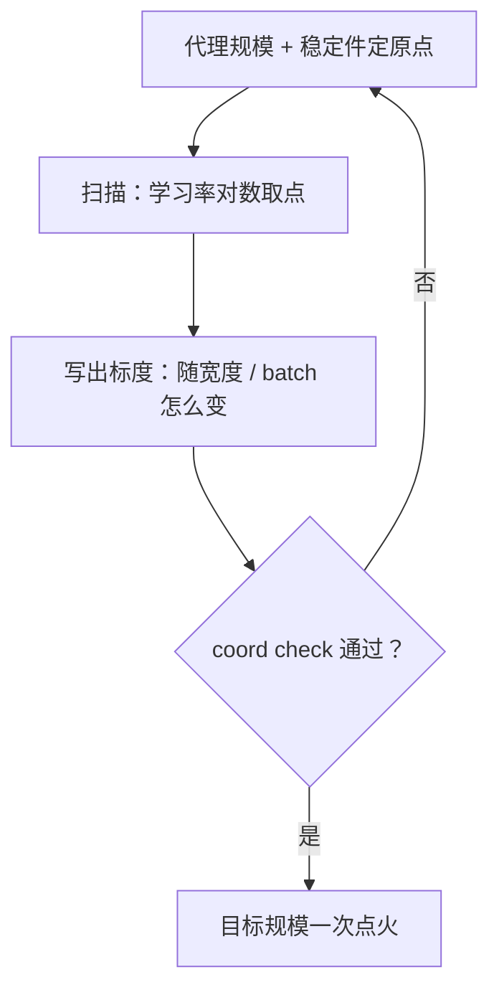

# 超参的缩放规则

大模型的学习率不是在大模型上找到的，而是在小模型上定好、按标度规则搬上去的；搬运规则本身才是要管理的东西。

<footer>—— 据 Yang & Hu, Tensor Programs V（μP）与 Goyal et al., 2017 的大 batch 规则整理</footer>

[上一课](/llm/pf2-data-mix-final)定下配比与总 token 数，超参只剩一组决定。目标规模的运行只有一次机会，网格搜索在大模型上不可负担，所以问题变成：哪些超参在小代理上扫、按什么规则迁移到目标规模、迁移的担保边界在哪。[μP 的实践](/llm/lr-sensitivity-mup-practice)与[学习率随 batch 的规则](/llm/lr-batch-scaling-law)已经把两条主轴讲过，本课把它们组装成开工前可执行的一套缩放规则，并写清它管不着什么。

## 问题

小代理上扫出的峰值学习率直接搬到大模型，常以发散或欠优收场：宽度和深度变了，更新的合理尺度就变了；batch 变了，学习率与噪声的平衡也变了。失败的典型是把「扫出来的数」当结论带走，而把「扫的坐标系」扔掉——超参是绑定在宽度、深度、batch、序列长这些坐标上的函数，不声明坐标系就没有可比性。第二个失败是反向的：把某一次拟合的标度律当定理，搬到换了优化器、换了词表、加了稳定件的新配方上，谷底已经移走。

### 一条规则的三个部件

每条缩放规则都要写全三部件。**原点**：在哪个代理规模、哪套稳定件组合下扫描；词表与稳定件不进原点，规则失效。**标度**：随哪个变量怎么变——μP 按宽度重标初始化与学习率，使不同宽度下都做特征学习；batch 规则给出临界 batch 之下学习率随 $B$ 线性放大、之上只换墙钟的分割。**校验**：迁移到目标规模前用 coord check 验证——看各层更新幅度对宽度是否如预期，不看代理损失是否碰巧都降。三部件缺一，这条规则就不许进配方。

## 方法

实操顺序：先冻结[稳定件](/llm/z-loss)与[优化器](/llm/adamw)——它们是原点的一部分，之后换 Muon 这类矩阵优化器就要重走一遍网格；再在两三个宽度上跑 coord check 确认目标真是 μP 口径；然后对数取点扫峰值学习率，耦合维度（如 $\lambda$ 与 $\eta$ 的挂法）声明成单一自由度；最后把规则写成表格随配方升版：每个超参一行，列出原点值、标度式与校验状态。扫描预算遵守[超参搜索工程](/llm/ti-hparam-search-eng)的封顶口径——约一成预算做搜索，产出响应面归档，成为下次的先验。

μP 的担保表只有宽度：深度、序列长、词表、batch 的极端区都不在定理范围内；换优化器（如 Muon）更要在目标规模附近单独网格。把「μP 迁移超参」读成「一切维度都免扫」，是最常见的误用。

## 机制

为什么规则三部件缺一不可：原点缺失则两条曲线不可比——换了稳定件，敏感度谷的位置本身会移；标度缺失则只有孤立的数，宽度一变就作废；校验缺失则不知道标度在本次配方上是否成立——小代理复现不稳是有文献记录的失败（Wortsman et al., ICLR 2024）。缩放规则的本质是把「在哪搜索」的决策从目标规模挪到代理规模：目标规模上只做一次有校验背书的点火，而不是用全价卡时当搜索算力的燃料。这与 Chinchilla 用约四百次运行支撑拟合面是同一经济学：便宜的尺度买信息，贵的尺度花信息。

## 边界

本课管优化侧超参的迁移：学习率、batch、初始化、衰减的挂法。架构轴的标度——参数与 token 怎么随算力放大——是[缩放律](/llm/kaplan-scaling)与[其拟合方法](/llm/scaling-law-fitting)的事，本课只要求规模落点写进[检查清单](/llm/pf2-pretrain-checklist)。数据侧的配比迁移（小模型求权重、大模型使用）上一课已写，属于另一条通道。日程随总步数的缩放是学习率日程课的主题，这里只钉一句：日程寿命与训练长度耦合，本身是要随规则一起缩放的对象。规则之外永远保留例外通道：目标规模上首轮观测若显示谷在网格外，停下来扩网格，不要外推硬点火。

## 小结

- 缩放规则三部件：原点（代理规模加稳定件）、标度（随哪个变量怎么变）、校验（coord check）。
- μP 只担保宽度；深度、序列长、词表与换优化器都要单独网格。
- batch 规则在临界点两侧含义不同：之下是 token 效率工具，之上只换墙钟。
- 扫描预算封顶约一成，响应面连同失败点归档为下次先验。
- 出处：Yang & Hu, Tensor Programs V；Goyal et al., 2017 与 Shallue et al., 2019；Wortsman et al., ICLR 2024 对小代理迁移不稳的记录。
