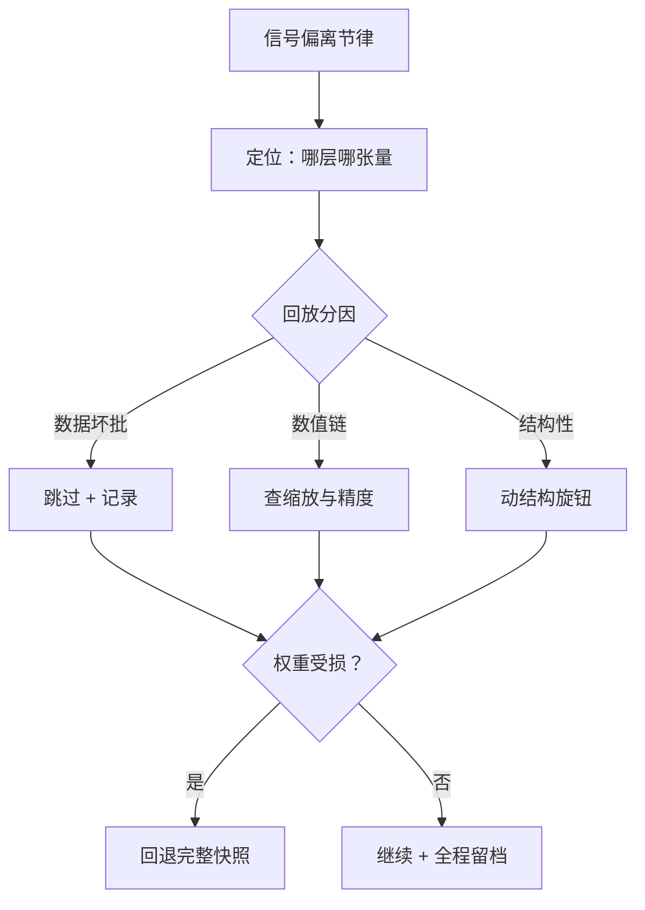
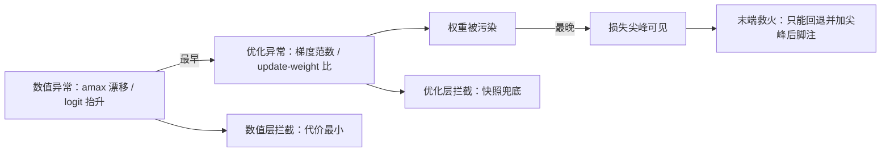

# 长训练的健康管理

数周的训练里，损失曲线是最后知道坏消息的传感器；健康管理的对象是那些先于损失显形的信号。

<footer>—— 据 PaLM 训练报告（Chowdhery et al., 2023）与 OPT 训练日志（Zhang et al., 2022）的尖峰处置整理</footer>

[上一课](/llm/pf2-regularization-dropout)定下正则取舍，稳定件常开。本课写训练中段的健康管理：观测什么、尖峰怎么办、什么信号允许你继续跑。[观测的设施](/llm/ti-numerical-health)——绊网分级、断言定位、注入演练——已在设施课建好；本课配的是配方口径：哪个信号指向哪一课的旋钮，以及处置后如何归档才能保住可比性。

## 问题

长训练的故障谱里，损失尖峰只是显形最晚的一种。它之前还有：梯度范数漂移、update/weight 比异常、注意力 logit 抬升、低精度 amax 漂移、零更新层——[低精度长跑的故障面](/llm/num-longrun-health)里列出的每一项都先于损失变动。没有分层观测的团队只在尖峰出现时行动，而尖峰出现时往往已经说不清是数据、优化、精度还是结构的问题。[损失曲线的分期](/llm/loss-curve-phases)给了背景节律：压熵段、幂律段、突变段、衰减段各有正常形态；健康管理就是拿实时信号对照这张背景图，偏出节律才动手。

「update/weight 比」就是这一步权重的改动量与权重本身的比值：太小说明更新被吞了（比如掉进低精度的舍入误差里），太大说明步子迈得离谱——它常比损失尖峰早很多步亮红灯。

### 尖峰的 triage

尖峰处置按预案走，不做现场发挥。第一步，**定位**：梯度范数在哪一层爆炸——全局 $\ell_2$ 范数之外要能下钻到层与张量，见[梯度与权重直方图](/llm/ti-gradient-weight-histograms)。第二步，**分因**：回放可疑 batch，切数据与数值两条因果链——数据坏批与数值溢出的处置完全不同。第三步，**处置**：数据坏批跳过并记录；数值问题按精度链路查缩放；结构性的（注意力塌缩、$\beta_2$ 滞后导致的伪尖峰，见 [Adam 的 $\beta_2$ 尖峰](/llm/adam-beta2-spikes)）动结构旋钮。第四步，**回退或继续**：权重已损则回退到最近的完整快照，见[预训练检查点](/llm/pretrain-ckpt)的 resume 口径；处置全程留档，死线触线即杀。

## 方法

配方口径三条。第一，**分级响应**：绊网分三级——低级断言失败即停并带定位；中级绊网触发自动快照加人工 triage；高级死线（发散、平台、吞吐塌方）启动时写明、触线即杀，响应路径不留临场决定。第二，**常态巡检**：update/weight 比是中心指标——向下落进 ULP 区间是吞更新，向上暴涨是尖峰前兆；告警用同周期对照带，不设绝对阈值。第三，**归因纪律**：尖峰不拟合进幂律段、不当噪声忽略、也不顺手压学习率了事——每一步处置写死因判据，这继承设施课「尖峰当噪声不归档」的拦错事。

梯度裁剪是保险丝不是分类器：长期步步触发说明峰值学习率没用上，或在掩盖某个结构性问题——把「靠裁剪活着」当正常状态，等于让每次真尖峰都晚一拍发现。

常见误区：初学者容易给巡检指标设一个写死的绝对阈值。实际上不同层、不同阶段的正常范围差得很远，该用「同周期对照带」——跟昨天同一时刻的自己比，而不是跟一个固定数比。

## 机制

为什么信号要分层：故障的传播有先后，数值问题先于权重损坏，权重损坏先于损失可见；观测层次决定你能在一环拦截还是只能在末端救火。为什么处置要预案化：尖峰出现时人的判断质量最差——压力、时间与信息不全叠加；预案把判断前移到冷静时刻。为什么回退优于硬扛：从坏权重继续训练的隐性成本是整段轨迹被污染，之后一切对比都要加「尖峰后」脚注；回退到完整快照保住的是轨迹契约，损失的是几个小时的算力——这笔账到算力账一课再算一次。

直觉类比：发现一锅汤里掉了灰，倒掉重做一小锅，远比硬着头皮端上桌再逐桌道歉便宜——回退损失的是几小时算力，硬扛污染的是整条轨迹和之后所有对比实验的可信度。

这张图回答的是「为什么观测要分层」：故障沿数值、优化、权重、损失四级传播，越晚发现，处置代价越大、可逆性越差。

## 边界

本课管训练中的配方口径，不管设施实现——绊网怎么分级、快照怎么原子发布，见[数值健康检查](/llm/ti-numerical-health)与[检查点工程](/llm/ti-checkpoint-engineering)。数值方案的机理（FP16 损失缩放、FP8 的 amax 统计）在[混合精度](/llm/pretrain-mixed-precision)与低精度课程里，本课只消费它们的告警指标。中途评估的门禁是下一课：本课的信号回答「这一步有没有问题」，门禁回答「训练继续还是停下」。稳定件的机理（QK-Norm、z-loss）在正则与稳定性各课，不重复。

## 小结

- 损失是最后知道坏消息的传感器：梯度范数、update/weight 比、amax、logit 抬升都先于损失显形。
- 尖峰走四步预案：定位、回放分因、处置、回退或继续，全程留档。
- 绊网分级响应，死线启动时写明、触线即杀。
- 裁剪是保险丝不是分类器；「靠裁剪活着」说明旋钮挂错了地方。
- 出处：Chowdhery et al., PaLM, 2023；Zhang et al., OPT, 2022；Pascanu et al. 的梯度裁剪与尖峰来源分类。
