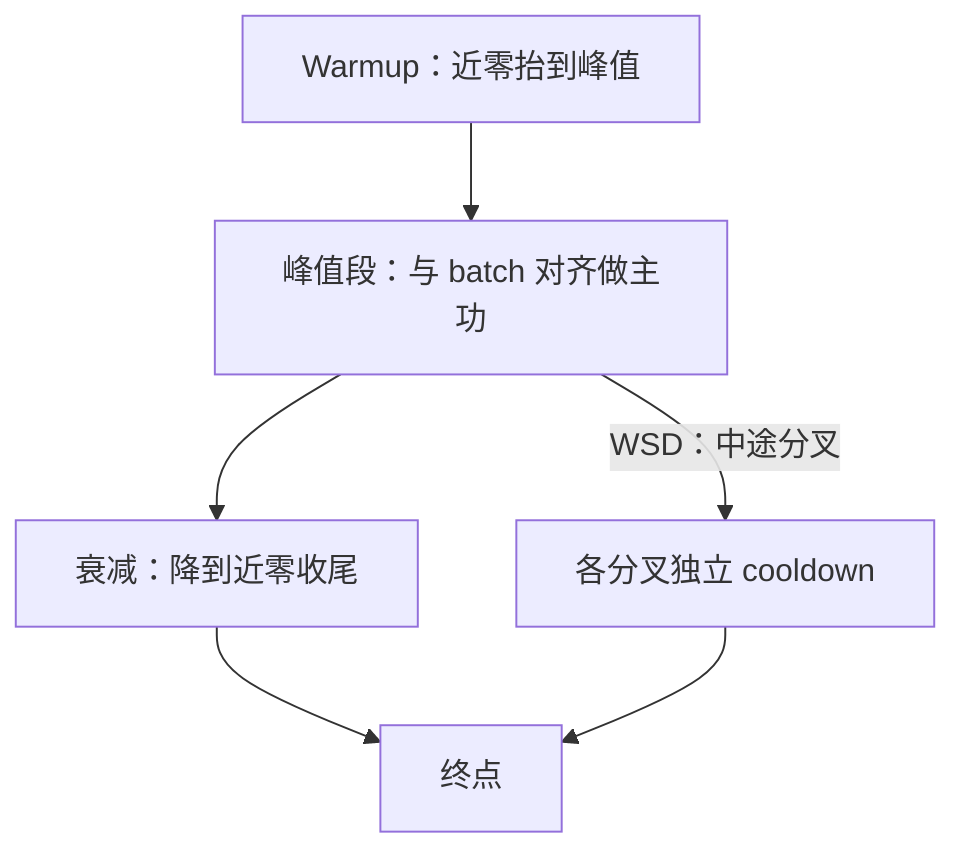
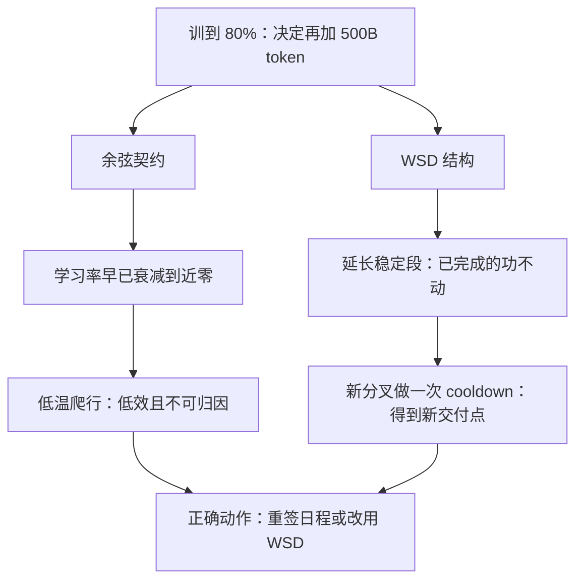

# 学习率与预热实践

学习率日程是一份训练开始前就签字的承诺：预热多长、峰值多少、何时降到零，写成契约，而不是训练中的随手旋钮。

<footer>—— 据 Loshchilov &amp; Hutter 的余弦退火与 GPT-3 配方（Brown et al., 2020）的日程设定整理</footer>

[上一课](/llm/pf2-hparam-scaling-rules)把峰值学习率的迁移规则写成三部件：原点、标度、校验。本课进入训练中单元的第一课，写日程怎么落地：预热怎么设、峰值与 batch 怎么对齐、寿命为什么必须绑死总 token 数、中途要延长训练时日程怎么办。[日程的谱系](/llm/lr-schedule)——余弦与 WSD——已经讲过，本课只补配方口径：这三段各自承担什么、改错的代价落在哪。

## 问题

日程最容易在两处出错。其一，预热被当成仪式：抄来「前两千步线性升」，却不问它在保护什么。预热保护的是三件未热的东西——Adam 的矩估计还没有积累、激活尺度还在漂、注意力还在寻找头分工；深度大或 Post-LN 结构下它甚至是生存条件，见[预热与结构](/llm/post-ln-warmup)。保护不足，第一周就见发散；保护过度，峰值学习率该做功的阶段被吃掉。其二，寿命与数据脱钩：余弦把衰减绑在预定总步数 $T$ 上，中途决定「再加五千亿 token」而不改日程，等于让模型在早已降到近零的学习率上爬行，训练低效且不可归因。

直觉类比：预热像发动机冷启动先怠速——机油（Adam 的矩估计）还没循环开，一上来就地板油（直接给峰值学习率）容易拉缸（发散）；怠速一小段再加速，代价小、稳得多。

### 三段分工

Warmup 段只做一件事：把学习率从近零抬到峰值，给矩与尺度留缓冲，长度按 token 声明而不是按步数——batch 与序列长一变，同样的步数对应的 token 完全不同。峰值段做主功：与 batch 对齐的峰值在前课的规则里定死。衰减段收尾：余弦或线性降到近零，让末期的大梯度步不再把已成形的能力抖散。WSD 的工程价值在于把衰减段做成短促的 cooldown：稳定段可以延长、可以在多个分叉上各做一次冷却，训练总长度因此可以「走一步看一步」。

## 方法

落地检查三条。第一，**寿命先签**：$T$ 与配比的 $D$ 绑定，写进[检查清单](/llm/pf2-pretrain-checklist)；后续任何延长训练的提议都触发日程重签，而不是默认续跑——这与 Chinchilla 的教训同源：日程寿命与训练长度不匹配，会直接歪曲「该训多久」的结论。第二，**对齐口径**：日程按 token 表达；batch 改变时重看峰值与噪声平衡，见[学习率随 batch 的规则](/llm/lr-batch-scaling-law)。第三，**中途异常不拿日程救火**：尖峰的处置走健康管理一课的预案，临时压学习率是止血不是归因。

比较余弦与 WSD 的实验必须对齐冷却后的模型：拿 WSD 未衰减的稳定段中间点去打余弦已退火的终点，会得出「余弦更好」的假象——两边此刻根本不在同一个温度上。

数字实例：按总 token 的 2% 预热、总预算 1T token，就是前 20B token 线性升温；若写成「前 2000 步」，batch 翻倍后同样的 2000 步对应的 token 翻倍，预热就悄悄变长了——这就是日程要按 token 声明的原因。

## 机制

为什么日程是一份契约而不是旋钮：它定义了每一时刻的步长预算，模型能力的成形顺序与之耦合——粗结构在高温期成形，细节在降温期整理；中途改日程等于改动这份顺序，已经写完的曲线段全部失去可比性。这解释了为什么延长训练的正确做法不是「继续跑」，而是像 WSD 那样把结构设计成可延长的：稳定段延长不动已完成的功，分叉冷却各自成点。也解释了为什么中途压学习率救尖峰会毁掉归因：你无法区分是数据问题被温度掩盖了，还是温度本身就是问题的一部分。

常见误区：初学者容易以为学习率中途随时可以顺手调。实际上日程与能力的成形顺序耦合：粗结构在高温期成形、细节在降温期整理，中途改动会让已完成的曲线段失去可比性——要改就显式重签并升版本号，而不是悄悄拧。

这张图回答的是「中途要延长训练时，两种日程各会发生什么」：余弦的寿命绑死 $T$，WSD 把可延长性做进了结构，这是两者的工程分野。

## 边界

本课写日程的配方口径，不重讲[学习率敏感度与 μP](/llm/lr-sensitivity-mup-practice) 的宽度迁移，也不重讲 [Muon](/llm/muon) 这类矩阵优化器下学习率要另起的标定——那些是优化器课的口径。预热长度与深度的互补关系在 Post-LN 课已有结论，这里不重复推导。序列长度的阶段化（先短后长）会在切窗点同时改变有效 batch 与噪声尺度，属于数据课程与序列预热课的交叉，本课只要求切窗点在日程表上显式登记。最后，日程数值不迁移：换词表、换稳定件、换优化器，契约重新签。

## 小结

- 日程是训练前签字的契约：预热、峰值、寿命一起定，中途改动走显式重签。
- 预热保护矩、激活尺度与注意力分工三件未热的事；长度按 token 声明。
- 余弦寿命绑死 $T$；要「走一步看一步」就用 WSD 的分叉冷却结构。
- 中途异常不拿日程救火：压学习率是止血，归因走尖峰预案。
- 出处：Loshchilov & Hutter 的余弦退火；Brown et al., GPT-3, 2020 的 warmup + 余弦；WSD 见 MiniCPM（Hu et al.）等预训练报告。
