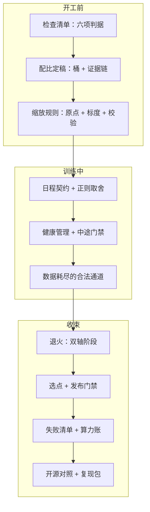

# 预训练配方收束

配方的剩余物不是超参数字，而是判据：换一代硬件、换一套数据，数字全部过时，判据仍在。

<footer>—— 据本课程十六课整理</footer>

[上一课](/llm/pf2-repro-recipe-mgmt)把配方存档成复现包，十六课到此齐了。本课不添新内容，像所有收束课一样做减法：把三次点火之间的决策收成一张总图、几条不变量与一排高频拦错事，让细节退场之后，配方还能被交接、被审计、被下一次开工复用。本课程到此收束。

## 问题

为什么要收束：十六课的细节——coord check 怎么做、插值衔接怎么平滑、留出集怎么分层——都会随工具与规模换代，但配方事故的类型不会。收束课把每类事故倒推回它该被拦住的那一课：配比失控是开工前判据没写、尖峰失控是预案没建、选点失控是门禁没预注册——病根同构：某个决策点没有判据就放行了。收束之后，检查一张配方是否健康，不再需要读完十六课，只需要对这张图问几个问题。

### 一张总图

开工前三课定地基：[检查清单](/llm/pf2-pretrain-checklist)把六项写成启动判据，[配比定稿](/llm/pf2-data-mix-final)把梯度预算分到桶并留证据链，[缩放规则](/llm/pf2-hparam-scaling-rules)用原点、标度、校验三部件把超参从代理搬到目标。训练中五课管过程：[日程契约](/llm/pf2-lr-warmup-practice)与[正则取舍](/llm/pf2-regularization-dropout)定旋钮初值，[健康管理](/llm/pf2-longrun-health)与[中途门禁](/llm/pf2-midtrain-eval-gates)守过程，[数据耗尽](/llm/pf2-data-exhaustion)给计划外缺口留合法通道。收束八课管交付与反思：[退火](/llm/pf2-annealing-curriculum)、[选点](/llm/pf2-checkpoint-selection)、[发布门禁](/llm/pf2-model-eval-gates)走完交付链，[缩放失败](/llm/pf2-scaling-failures)与[算力账](/llm/pf2-compute-accounting)复盘规划，[开源对照](/llm/pf2-opensource-recipes)与[复现包](/llm/pf2-repro-recipe-mgmt)对外与对后。

## 方法

三条不变量横贯十六课。其一，**判据先行**：任何决策——点火、调整、选点、发布——的判据写在观测之前；事后解释不是判据。其二，**口径同源**：token、FLOPs、卡时、钱四层记账同一来源；配比的桶、日志的曲线、报告的分数引用同一套指纹，三处不一致则一切对比作废。其三，**旋钮可指认**：任何中途动作都能说出动的是哪一课的哪个旋钮、走了哪条合法通道；说不出指认的动作都算事故。高频拦错事七件：检查单没判据、先配比后清洗、代理结论越界直搬、尖峰当噪声不归档、用测试榜选点、把 20 当常数写进脚本、复现包只有权重。七件各占一课的份量，收束时并成一排。

对账的硬指标与设施课同构：拿最近一次废掉的点火回放，能否在十分钟内指出它违反哪条不变量、该在十六课的哪一课被拦住——指不出来，说明配方没有真的在管。

## 机制

为什么按「总图、不变量、拦错事」收而不是按单元复述：十五课的依赖顺序就是故障的传播路径——开工判据缺一项，训练中的每个观测都失去对照；口径不同源，收束时的一切复盘都在流沙上。对账因此从后往前问：复现包为什么走不通谱系、发布门禁为什么临时改判据、中途门禁为什么变成看分数猜趋势——每一步都能指回前一步的欠账，配方才算闭环。这也回答了这门课与「训练基础设施」课程的分工：那边管骨架与账本，这边管决策与判据；两条线在复现包里会合——骨架记账户，判据记决策，缺一条，另一条都不可信。

## 边界

本课程管预训练段的配方决策，不管后训练的配方结构——RM、SFT、RL 各自成课；推理与服务的成本账在服务课程。设施层（骨架、检查点、调度、跟踪）整体在「训练基础设施」，本课只消费其判据。配方数值的半衰期最短：词表、稳定件与优化器的换代都会重画敏感度谷；课程钉住的是判据先行、口径同源、旋钮可指认这三层不变量。对下一次开工，交接物就是上一课的复现包加这一课的三条不变量——数字从新拟合，判据照旧执行。

## 小结

- 十六课收成一张图：开工前三课定地基，训练中五课守过程，收束八课管交付与复盘。
- 三条不变量：判据先行、口径同源、旋钮可指认。
- 七件高频拦错事：无判据清单、先比后洗、越界迁移、尖峰不归档、测试榜选点、常数化系数、权重式复现包。
- 与基础设施课程的分工：那边管骨架与账本，这边管决策与判据，在复现包会合。
- 出处：按本课程十六课整理；数量级与口径见各课出处行。
