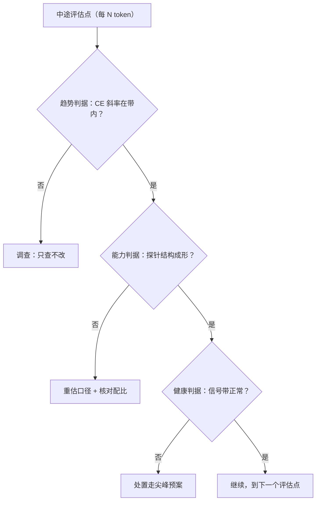

# 中途评估的门禁

中途评估回答的问题只有一个：这次训练继续、调整还是停下；「这次涨了三分」不是它的问题。

<footer>—— 据 loss 曲线分期（Kaplan et al., 2020；Nakkiran et al., 2020）与大规模训练的门禁实践整理</footer>

[上一课](/llm/pf2-longrun-health)管的是信号健康：这一步有没有问题。本课把观测升到决策层：训练进行到几万亿 token 的中途，用什么评估、按什么判据决定继续或调整。[loss 曲线的分期](/llm/loss-curve-phases)已说明终点 CE 不等于已学会；本课写的是在环内的低频决策点——门禁的判据怎么预注册、评估作业怎么保证不改训练轨迹、什么情况允许动配方。

## 问题

中途评估有两种失败。一种是**没有**：全程只看训练 CE，几周后发现下游能力结构不对——数学塌了或代码没起来——此时已无中途可言，只剩重来。另一种是**太热闹**：每五百亿 token 跑全量榜单，看到分数起伏就当场调配比、换学习率，把一次训练拆成几十次无对照的临时实验；分数的方差全部被解读成趋势，噪声驱动决策。门禁要同时防这两种：评估必须在环，但决策必须预注册。

### 门禁的三层判据

第一层，**趋势判据**：训练 CE 对 token 的斜率是否符合[幂律段](/llm/loss-curve-phases)预期——偏离预期才触发调查，不是触发调参。第二层，**能力判据**：低频跑固定的探针集（数学、代码、多语言、阅读各一小簇），检查能力结构是否随配比意图成形；探针集在开工前与评测隔离一起定死，见[检查清单](/llm/pf2-pretrain-checklist)。第三层，**健康判据**：上一课的信号带——update/weight 比、梯度范数、吞吐——门禁把信号升级为决策。三层各有触发动作：调查（只查不改）、重估（换口径再测一次）、调整（动配方，须显式升版并记录对照损失）。

## 方法

执行口径三条。第一，**频率与预算**：探针评估的频率按决策需要定，不是按好奇心定；每次评估的卡时计入算力账，因为评估占用的机器就是训练让出的机器。第二，**轨迹契约**：评估是旁路设施，开与关的逐步损失必须逐点重合——评估作业不得写回训练存储、不得占用使数据流水线饿死的带宽，这正是设施课不变量在配方层的应用。第三，**决策留痕**：每个评估点的结论写进跟踪库（run 身份四元组不变），「继续」也要写，否则事后无法区分「没评估」与「评估了没问题」。

中途探针的分数量级要提前讲给团队：四选一基准的 25% 是瞎猜线，幂律段的早期模型可能长期贴着它爬——把 25% 附近的起伏当趋势，是中途门禁最常见的误读。

## 机制

为什么判据要预注册：中途决策的诱惑在于事后解释永远好写——「分数降了所以我们调整了」无法被证伪。预注册把可证伪的判据放在观测之前，调整从「兴奋决策」变成「触发条款」。为什么评估要低频：评估本身改变被评对象的环境——占资源、拖进度，更重要的是高频评估的方差会制造不存在的趋势，让团队把功率谱里的噪声读成信号。为什么「只查不改」是一层：调查与调整的混淆会绕过配方冻结——中途改配比必须走数据耗尽一课那样的显式通道，带对照与升版，而不是借一次门禁顺手改。

## 边界

本课的门禁决定「这次训练怎么走」，不是「这个模型好不好」——候选模型的发布门禁在模型评估门禁一课，判据密度完全不同。探针集的设计与去污属于评测工程，本课只要求它开工前锁定；评测框架的版本绑定见[评测工具链](/llm/eval-harness)。曲线怎么画、口径怎么统一，见[loss 曲线的解读](/llm/ti-loss-curve-reading)。健康信号本身的机理上一课已写。最后，门禁触发的调整只有两条合法通道：数据侧的再配比（数据耗尽一课）与结构侧的显式升版；学习率日程不在中途调整之列——那是日程契约课的边界。

## 小结

- 中途门禁答「继续、调整还是停下」，不是答「涨了几分」。
- 三层判据：趋势（CE 斜率对带）、能力（探针结构）、健康（信号带）；各有触发动作。
- 评估是旁路设施：不写回训练存储、不占垮流水线，逐步损失与不开它逐点重合。
- 决策留痕，「继续」也要写；中途改配方只走显式升版通道。
- 出处：Kaplan et al., 2020 与 Nakkiran et al., 2020 的曲线分期口径；据大规模训练门禁实践整理。
