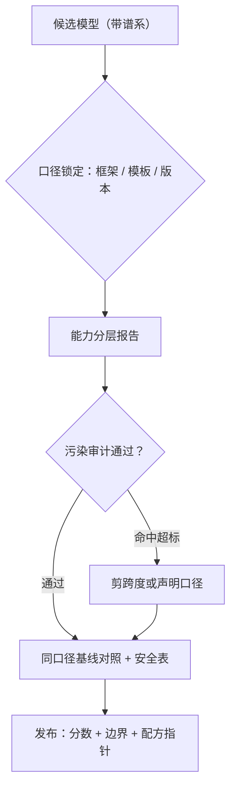
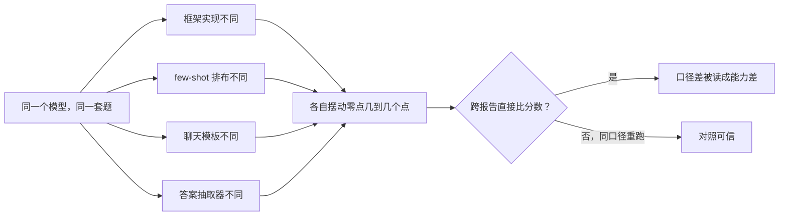

# 模型评估门禁

发布门禁是配方最后一次行使其权力：它决定这个模型以什么口径被记住，以及哪些对照必须陪它一起发布。

<footer>—— 据 HELM（Liang et al., 2022）与 lm-evaluation-harness（Gao et al.）的评测规范整理</footer>

[上一课](/llm/pf2-checkpoint-selection)选出交付候选；本课是它的下一关：候选模型进入发布前的全面评估门禁。与中途门禁不同，这里的判据不再答「训练怎么走」，而是答「这个模型对外是什么水平、有什么已知边界、以及这份声明是否可信」。[评测工具链](/llm/eval-harness)与[基准的口径](/llm/mmlu)已有专课；本课把它们组装成一次发布前的门禁流程。

## 问题

发布评估的失败几乎都是口径失败。框架与模板不锁版本，两次评测的分数不可比，对外声明建立在流沙上；总分掩盖学科结构，MMLU 涨两分说不清是数学修好还是格式学会了；评测集与训练语料的污染没审计，分数里混着背过的题；基线缺失，涨跌没有参照物。这些问题在内部评测里各自都能修，但发布是一次不可撤回的对外声明——门禁的价值在于把口径问题拦在声明之前。

「污染」指评测题目或其近义改写混进了训练语料：模型靠「背过这道题」拿分，而不是靠能力。好比考卷提前泄了题——分数照样高，但说明不了任何东西。

### 门禁的四关

第一关，**口径锁定**：评测框架版本、任务配置、适配器与聊天模板全部钉死并写进报告；多选与生成式分表，不混成单一「开源评测分」。第二关，**能力分层**：知识、数学、代码、多语言、长上下文分层报告，保留学科细分；总分只作索引，见 [MMLU 的口径](/llm/mmlu)。第三关，**污染审计**：发布前完成对评测集的训练语料检索审计，报告命中口径与处理方式，见[评测污染](/llm/eval-contamination)。第四关，**对照与边界**：同代基线在**同口径**下重跑（不是抄榜单）；安全评测与拒答行为单独成表；饱和基准按[饱和口径](/llm/benchmark-saturation)降权或换仪器。

## 方法

执行三条。第一，**基线同口径重跑**：对照模型在本方 harness 上重测，逐题输出保留，使差异可下钻到题目层；抄别人报告的数字做对照是最常见的不可比来源。第二，**门禁判据预注册**：哪些层必须过线、哪些允许带边界发布，在评测前写明；「高分就发、低分再议」不是门禁。第三，**报告三件套**：分数表、已知失败模式清单、指向训练配方的指针——评测分数离开配方口径就没有复述价值，这是[配方管理](/llm/ti-recipe-management)的收尾动作。

逐题输出是门禁最便宜的保险：分数异常时能下钻到题目层定位是抽取器、模板还是能力问题；只留总分 CSV 的团队，每次异常都要重新跑一遍全量评测。

直觉类比：两支队伍用不同卷子考出的分数没法直接排名；让基线模型在你自己的考卷（框架、模板、抽取器）上重考一遍，才是同一把尺子量出来的差距。

## 机制

为什么基线必须同口径重跑：基准分数绑定框架实现、few-shot 排布、模板与抽取器，任何一个都会在实现间摆动几个点；跨报告对比把口径差读成能力差，是排行榜时代最系统的噪声源。为什么污染审计是硬关：污染把「能力」偷换成「记忆」，且补考无法补救——训练完成后发现的泄漏只能声明口径，不能消除；这是配方权力最后一次能真正改变结果的地方。为什么安全单独成表：能力总分不携带拒答与越权信息，安全是另一根轴，混进总分会让两根轴互相稀释，见对齐评测各课的口径。

常见误区：初学者容易以为安全是能力的一部分，可以折进总分。实际上安全（拒答、越权）与能力是两根独立的轴，混在一起只会互相稀释——能力榜高不代表更安全，反之亦然。

这张图回答的是「为什么同一模型在不同报告里能差出几个点」：四个口径部件各自引入摆动，叠加后足以吞掉真实的能力差距——所以基线要同口径重跑。

## 边界

本课是发布前的能力与口径门禁，不含对齐专项评测的深钻——红队、越权与诚实性的方法论在对齐评测课程里，本课只要求其结论入表。基准怎么选、饱和怎么判是[基准演进](/llm/benchmark-saturation)与[动态基准](/llm/live-benchmarks)的课题。评测与训练的隔离（探针集、去污管线）在中途门禁一课已定，这里只消费其产物。对外声明的措辞规范——哪些结论有背书、哪些是外推——属于[开源发布](/llm/eco-repro-report-writing)的写作课，本课交付的是它引用的数字与边界。

## 小结

- 发布门禁四关：口径锁定、能力分层、污染审计、同口径对照加安全表。
- 基线在本方 harness 重跑，逐题输出保留；抄榜做对照不可比。
- 判据预注册：哪些层过线、哪些带边界发布，评测前写明。
- 报告三件套：分数表、已知失败模式、配方指针；分数离开配方口径不可复述。
- 出处：Gao et al., lm-evaluation-harness；Liang et al., HELM, 2022；Hendrycks et al., MMLU, ICLR 2021。
