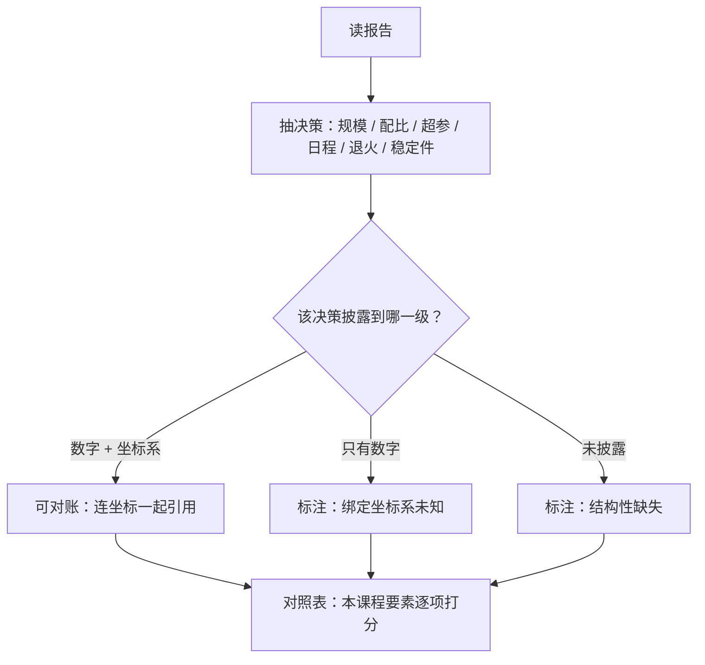

# 开源配方对照

模型报告是快照，配方才是可复现物；读报告的本事，是把快照还原回它背后的决策表。

<footer>—— 据 OLMo 2（arXiv:2501.00656）全开放配方与 Llama 3 报告（arXiv:2407.21783）对照整理</footer>

[上一课](/llm/pf2-compute-accounting)把全部决策换算成账。本课把这套配方框架拿去读公开工作：Llama 3、OLMo 2、FineWeb 这些公开配方，逐项对照本课程的要素表——哪些决策披露了、哪些只能猜、哪些连报告作者也没定死。数据配方的开放性见 [Dolma 与 FineWeb](/llm/dolma-fineweb)；本课的对象是训练配方整表。

## 问题

读公开报告有两个方向性错误。一个是**当菜谱抄**：把报告里的超参数字抄进自己的配方，而不问那些数绑定在什么坐标系上——Llama 3 的 batch 与学习率绑定它的 15.6T token、特定序列长与稳定件组合，搬到不同的词表与算力预算上没有任何担保。另一个是**当论文批**：拿「报告没写种子」去否定整份报告——生产报告本来就不是可复现物，它的价值在于披露决策结构。对照的正确姿态介于两者之间：抽取**决策**而不是**数字**，标注每个决策的披露完整度。

### 三个样本的对照

[Llama 3](/llm/llama3-report) 披露了一条清晰的主线：稠密架构选型求稳、15.6T token 上 405B 是**显式的过训决策**——为推理效率故意偏离计算最优，配比与退火期的混合切换也有交代；但种子、完整消融与多数中间检查点不在披露范围。[OLMo 2](/llm/olmo2) 走另一极：数据、代码、中间检查点、每个阶段的混合全部开放，稳定件组合（QK-Norm、z-loss、输出侧 RMSNorm）与中训多路 souping 都可对账——它是本课程各课能「逐课核对」的少数样本。[FineWeb](/llm/fineweb-paper) 则示范数据侧配方怎么写成可消融的管线：每个过滤档位的效应单独发表。

## 方法

对照表按本课程要素排六行：规模与 $D/N$ 分割（对照[计算最优](/llm/chinchilla)与过训声明）、数据配比与清洗管线、优化器与超参迁移口径、学习率日程与退火结构、稳定件组合、评估门禁与污染声明。每行记三档：可对账（数字加坐标系）、半披露（只有数字）、缺失。读的时候问两个问题：这个数字**绑定在什么上**；这个缺失是**能力问题还是刻意保密**——两者对「能不能借鉴」的答案不同：前者可以推理补全，后者只能保守假设。

Llama 3.1 的 405B 用约 $3.8\times 10^{25}$ FLOPs 训了 15.6T token——按每参数约 20 token 的旧口诀是明显「过量」，报告把这笔账明写成推理效率决策；这是「过训 vs 等比」从隐性选择变成显式声明的范例。

## 机制

为什么抽决策优于抄数字：配方要素之间的耦合意味着单点数字离开坐标系就没有语义——同一个峰值学习率在 WSD 与余弦下含义不同，同一份配比在不同清洗档位上不是同一份数据。开放配方的真正价值因此不是「数字可抄」，而是**坐标系完整**：OLMo 2 让你能核对「退火混合换没换、souping 拒没拒远点」，这些决策结构才是可迁移的知识。为什么报告不能当复现物：生产报告的写作目标是声明能力与边界，不是教学；把复现期望寄托在报告上，会系统性低估配方管理的工作量——这也是下一课把复现包从报告里独立出来的原因。

## 边界

本课对照的是预训练段配方；后训练（RM、SFT、DPO、RLVR）的披露结构不同，各有专课。安全评测的披露深度在各对齐评测课，不在这里评分。社区榜单的公信力问题（分数怎么被指标与实现摆布）见[社区基准的公信力](/llm/eco-community-benchmark-credibility)。许可证对「借鉴什么」的法律约束是[开源生态](/llm/eco-license-spectrum)的课题——本课的技术对照不构成使用授权。最后，对照结论会过时：下一份报告可能改变某个要素的工业默认值，对照表按配方版本维护，不写成永恒结论。

## 小结

- 读报告抽决策不抄数字：每个数字绑定坐标系，离开坐标系没有语义。
- 对照表六行：规模分割、配比管线、超参迁移、日程退火、稳定件、评估声明；各记披露档位。
- Llama 3 示范显式过训声明，OLMo 2 示范全开放可对账，FineWeb 示范数据侧可消融管线。
- 缺失要区分能力问题与刻意保密；两者的借鉴策略不同。
- 出处：Grattafiori et al., Llama 3, arXiv:2407.21783；OLMo Team, arXiv:2501.00656；Penedo et al., FineWeb。
