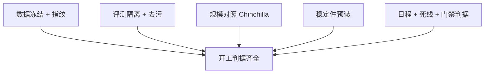
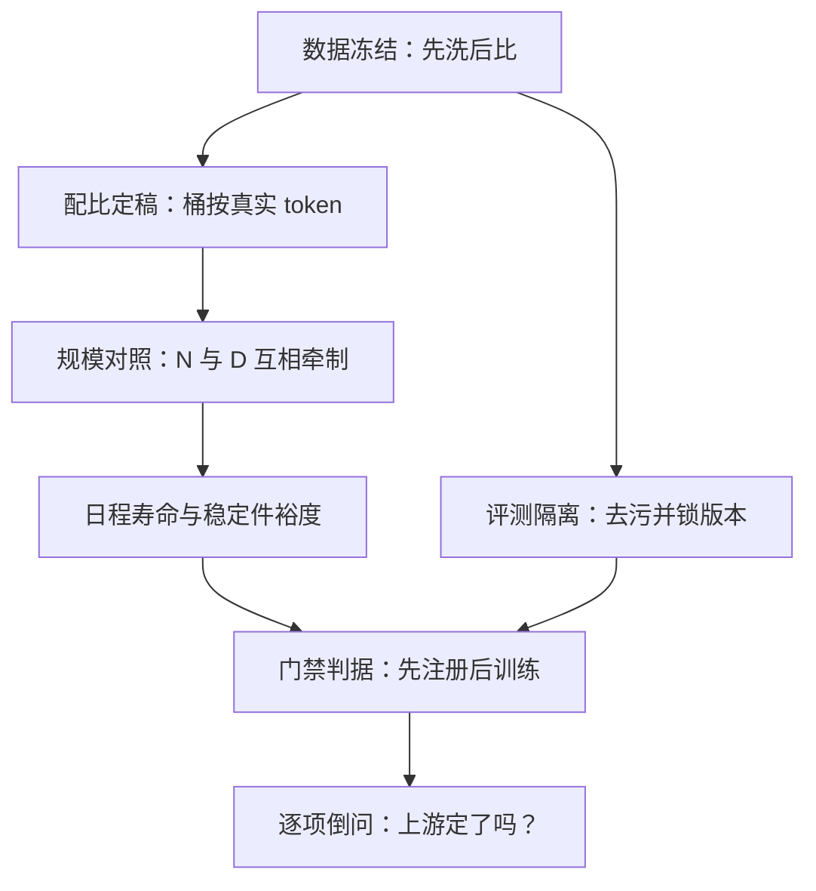

# 训练前的检查清单

预训练里最贵的错误不是训崩，而是开工时没写判据：它要烧掉几周卡时，才换来一句「当初该想到」。

<footer>—— 据 OPT 训练日志（Zhang et al., 2022）与 PaLM 训练报告（Chowdhery et al., 2023）的尖峰与返工记录整理</footer>

[上一课](/llm/rlsys-map)把 RL 训练系统收成一条主线与三条不变量：生成 → 打分 → 组批 → 更新 → 同步回生成端，版本号全程随行；收束留下一句「机器可安装，配方需自建」。机器可安装了，配方要自己写——本课是「预训练实践配方」的第一课，不再谈设施怎么架，只谈配方层面开工前要一次定清的决定：数据冻结到什么程度、token 预算对照谁、稳定件装哪些、日程与门禁的判据是什么。设施课的决策单回答「账记在哪」，本课的检查清单回答「配方定没定」。后课默认这张清单已经在跑。

## 问题

开工前的决定最难返工：数据没洗净就定了配比，洗完之后配比作废；词表还在动就切了分词，指纹全部重打；评测集没先隔离，中途的探针分全被污染吃掉。这些错误的特点是**显形晚、归因远**——问题在第一天埋下，症状在第三周出现，而第三周的注意力都在曲线上。检查清单的任务不是罗列好习惯，而是把每一项写成启动时刻可判定的判据：通过或不通过，没有「回头再补」。

「稳定件」就是从第一天就装上的防翻车装置：z-loss 压住 logits 别爆、QK-Norm 压住注意力得分、梯度裁剪剪掉异常大的更新。它们平时几乎不改变结果，出事时决定你还有没有下一周。

### 清单六项

第一，**数据冻结**：清洗、[去重](/llm/minhash-dedup)、[质量过滤](/llm/data-quality-filter)在配比定稿**之前**完成并打数据指纹；桶的大小以清洗后的真实 token 计。第二，**评测隔离**：探针与门禁集在启动前完成[去污](/llm/decontamination-pipeline)并锁版本，评测产物不写回训练存储。第三，**规模对照**：$N$ 与 token 预算按[计算最优](/llm/chinchilla)口径落点，写明是有意过训还是等比。第四，**稳定件预装**：z-loss、QK-Norm、梯度裁剪阈值在第一天生效，见 [QK-Norm](/llm/qk-norm-pretrain) 的组合谱系。第五，**日程与死线**：学习率日程的寿命与死线——发散、平台、吞吐塌方——启动时写明。第六，**门禁判据**：中途评估触发什么动作，先注册后训练。

## 方法

把六项写进一张单，评审在开工前完成。判据要能被第三方复核：「数据冻结」不是一句声明，而是指纹哈希与清洗后各桶 token 数的表格；「规模对照」不是「大模型」，而是 $N$、$D$ 与目标 $D/N$ 的三个数。清单的执行成本刻意压在启动日：判据都在那一刻可查，不依赖训练中途的记忆。任何一项在启动时填不出来，就停在那里，不带洞点火——这正是上一课程「指纹唯一」不变量在配方层的投影。

清单里最容易被漏判的是数据冻结的顺序：先在脏桶上定配比、再补清洗，等于把配比建在流沙上——清洗会改变每个桶的真实大小，也改变泄漏的分布。先洗后比是硬顺序，不是偏好。

数字实例：「数据冻结」的判据不是一句话，而是这样的表格——桶「网页-高质量」：指纹 a3f9…、清洗后 780B token；桶「代码」：指纹 77c1…、210B token。评审时逐行核对，哪行填不出来就停在哪。

## 机制

为什么清单必须判据化而不愿望化：愿望在团队里没有评审对象，「我们会注意数据质量」无法被否决；判据可以——它要么有指纹，要么没有。这同时是成本问题的答案：开工前的核查以小时计，而一个未冻结的数据集引发的返工以周计。六项的排序也不是任意的，它沿着依赖链：数据先洗后比，配比与规模互相牵制（下一课展开），规模又决定日程寿命与稳定件的裕度。倒着问每一项「上游定了吗」，清单就从愿望单变成了决策单。

常见误区：初学者容易把检查清单当成「好习惯收集」。恰恰相反——每一项都要能被否决：「我们会注意数据质量」是愿望，不可评审；「指纹哈希已登记」是判据，过不了就停。愿望进不了闸门。

这张图回答的是「六项为什么按这个顺序排」：它们不是并列的好习惯，而是一条依赖链——上游不定，下游的判据就没有可核对的锚点。

## 边界

本课不管设施怎么实现——检查点层级、绊网分级、跟踪库字段都在「训练基础设施」课程里，本课只消费它们的判据。清单也不含架构选型：GQA 还是 MHA、词表多大，属于模型设计课；清单只要求选型在启动前冻结并与词表快照同版。判据的数值会随规模移动：小模型上过的关不能自动当成大模型已过，这一迁移问题留给超参缩放一课。最后，清单是开工前的闸门，训练中的健康管理与中途门禁各有专课，不在本单里加行。

## 小结

- 开工前六项：数据冻结、评测隔离、规模对照、稳定件预装、日程死线、门禁判据。
- 每项必须写成启动时刻可判定的判据，愿望不进清单。
- 先清洗去重、再定配比；桶按清洗后的真实 token 记账。
- 带洞点火的最贵场景是数据未冻结：显形晚、归因远、返工以周计。
- 出处：据 OPT 训练日志（Zhang et al., 2022）、PaLM 训练报告（Chowdhery et al., 2023）与 Chinchilla 计算口径（Hoffmann et al., 2022）整理。
