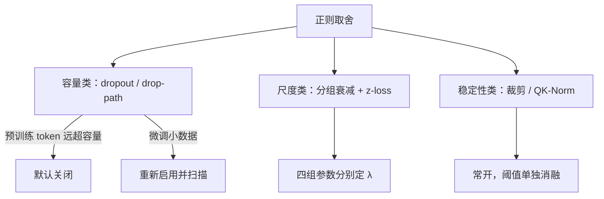
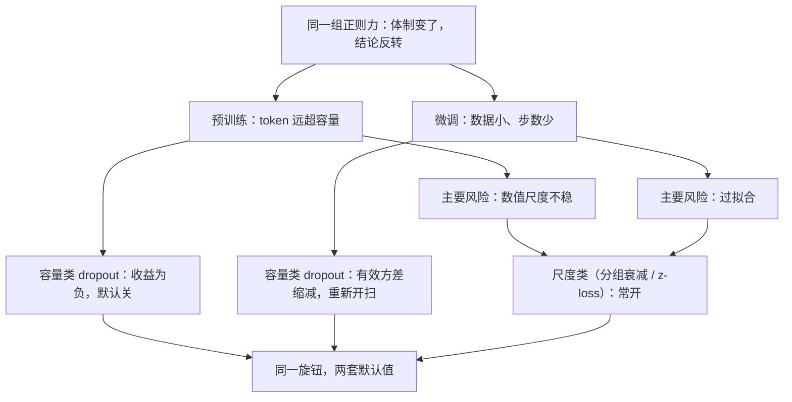

# 正则与丢弃的取舍

当数据远大于模型容量，正则的任务不再是防止过拟合，而是控制尺度与稳定训练；把教科书默认值抄进预训练，多半是错的。

<footer>—— 据 Gopher（Rae et al., 2021）与 Llama 系列的预训练设定对照 Srivastava et al., JMLR 2014 整理</footer>

[上一课](/llm/pf2-lr-warmup-practice)签下日程契约，本课处理正则面的取舍：预训练里 dropout 开不开、权重衰减给谁、z-loss 算不算正则。[dropout 在 Transformer 里的位置](/llm/dropout-transformer)与[衰减的豁免清单](/llm/weight-decay-exemptions)各有专课，本课把它们放进同一张取舍表：每一项正则力作用在哪个对象上、预训练为什么大多关小、微调为什么又开回来。

## 问题

教科书默认值在预训练里会反向出错。dropout $p=0.1$ 来自监督数据远小于模型的年代：正则防的是记住训练集。预训练是 token 数远超容量的欠拟合体制，dropout 在这里不防过拟合，只降低每个 step 的有效容量与 token 效率——同样的算力学得更少，公开配方普遍取 $p=0$ 是这个经济学的结果，不是疏忽。权重衰减的方向相反：不能因为「大数据」就全局开大，$\lambda$ 对归一化增益与嵌入长尾是错误的尺度先验，一个全局 $\lambda$ 会悄悄压死词表的低频行。取舍问题因此是逐项的：每个正则力要对得上一个具体对象。

「欠拟合体制」是说模型还没把数据学完：token 数远大于模型容量，「记住训练集」这种过拟合病在这时几乎不发生。教科书里防过拟合的药，自然也就不对症。

### 三条力的分工

把预训练在用的正则力分成三类。**容量类**：dropout、drop-path——只在数据受限或参数远大于 token 时启用；微调小数据时再开回来扫。**尺度类**：权重衰减（按参数组豁免）、[z-loss](/llm/z-loss)——衰减给矩阵参数收缩先验，norm 与 bias 豁免，z-loss 钉住 logits 的绝对尺度保护半精度与门控。**稳定性类**：梯度裁剪、QK-Norm——它们不是正则，但常被当成正则调；裁剪是保险丝不是分类器，见[裁剪与尖峰](/llm/grad-clip-loss-spike)。

## 方法

配方落地四条。第一，dropout 在预训练配置里显式写 $p=0$ 并注明是决定，不是遗漏——否则复现者会以为是漏抄。第二，权重衰减按[四组参数](/llm/weight-decay-exemptions)分开写：矩阵、嵌入、输出头、norm 与 bias；验证不看「配置里写了多少」，看各参数组的范数分位数是否符合预期尺度。第三，衰减与学习率通过 $\eta\lambda$ 耦合，日程降温时有效收缩率跟着变；这条耦合在[衰减与 μP](/llm/weight-decay-mup) 的口径下随宽度如何挂，要小网格验证而不是背口诀。第四，z-loss 系数按词表规模定，词表变化不照抄小词表的数；它与衰减是两条独立的尺度力，要能单独开关。

Transformer 的默认 dropout 打在残差增量与嵌入之后，不打在 Pre-LN 的主干通路上——位置本身就是设计：主干公路承载恒等映射，往上面丢噪声会同时放大深度方向的方差。

数字实例：若 $\lambda=0.1$、峰值学习率 $\eta=3\times 10^{-4}$，每步有效收缩率约 $3\times 10^{-5}$；日程后期 $\eta$ 降到近零，同一 $\lambda$ 的收缩力也跟着趋零——所以「衰减恒定」其实是错觉，它随日程一起降温。

## 机制

为什么预训练的正则取舍偏向「关容量、留尺度」：欠拟合体制下，容量类正则的边际收益为负——它换掉的是本可以学到的规律；尺度类正则的收益为正——数值稳定与尺度受控是长训练的生存条件。微调体制恰好反转：数据小、更新步数少，过拟合重新成为主要风险，dropout 的随机性重新变成有效的方差缩减。为什么衰减要分组而不全局：$\lambda$ 隐含「参数应向零收缩」的先验，这个先验对矩阵参数成立（小权重对应平滑函数），对归一化增益（本就该围绕 1）和长尾嵌入（低频词行不更新，衰减会让它沉向死区）不成立——全局 $\lambda$ 是把一个先验强加给了异质对象。

常见误区：初学者容易把 dropout 当成「普遍有益的健康习惯」到处加。实际上它是一笔「用容量换方差」的交易：数据充足时你卖出容量却拿不到收益，只有数据稀缺时这笔交易才划算。

这张图回答的是「为什么同一组旋钮在预训练与微调里默认值相反」：风险结构变了，每类正则力的收益符号跟着翻转，照抄任何一边的默认值都会错。

## 边界

本课不重讲优化器本身：[AdamW](/llm/adamw) 的解耦机制、[Muon](/llm/muon) 的谱视角是各自的主题。数据侧的「正则」——去重减少记忆、去污防泄漏——不叫正则，它们是数据工程课的口径，不要混进这张取舍表。z-loss 与 [MoE 路由 z-loss](/llm/z-loss-moe) 是两个对象，本课只钉词表侧。最后，取舍表随体制移动：数据耗尽被迫进入重复体制时，容量类正则的权衡要重新打开——那是数据耗尽一课的事，这里只留指针。

## 小结

- 预训练是 token 远超容量的欠拟合体制：容量类正则默认关，dropout 显式写 $p=0$。
- 尺度类正则常开：衰减按四组参数分别定，norm 与 bias 豁免；z-loss 钉 logits 尺度。
- 裁剪与 QK-Norm 是稳定件不是正则，常开但单独消融。
- 微调小数据体制反转：dropout 重新启用并扫描。
- 出处：Srivastava et al., JMLR 2014；Loshchilov &amp; Hutter, AdamW, ICLR 2019；Gopher（Rae et al., 2021）与 PaLM 的预训练正则设定。
