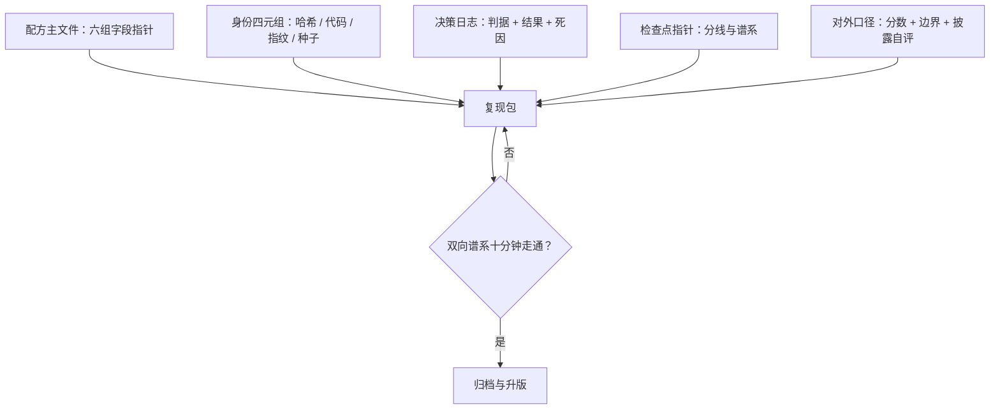

# 复现包与配方管理

复现的单位不是模型权重，而是配方加指纹：权重是配方的最大那个派生物，派生物丢了源头就丢了。

<footer>—— 据大规模训练配置管理与实验跟踪实践整理</footer>

[上一课](/llm/pf2-opensource-recipes)用披露档位读别人的配方；本课反向操作：把自己的配方做成可对账、可复现、可交接的交付物。[配方六组字段](/llm/ti-recipe-management)与[实验跟踪的四元组](/llm/ti-experiment-tracking)在设施课已定；本课把它们与全课程十六个决策收进一个复现包，写成配方的存档形态。

## 问题

训练结束时的知识状态最脆弱：配方散在配置文件、改动记录与几个人的记忆里；三个月后要回答「这个模型的数学能力是哪次改动带来的」，答案无处可寻。两种常见病：一种是**快照病**——只存了最终权重与一份 README，配方不可追溯，任何复现尝试都从猜开始；另一种是**流水账病**——什么改动都记，但没有结构，后来者在几千条 commit 里找不到主线。复现包的目标是让「模型—配置—结果」的双向谱系十分钟走通——设施课的验收标准在课程末尾兑现。

### 复现包的构成

复现包五件。**配方主文件**：六组字段——模型、数据、优化、数值、观测、治理——每组是指针的集合：数据指向指纹与桶台账，优化指向超参迁移声明，观测指向绊网配置与死线，见[配方管理](/llm/ti-recipe-management)。**身份四元组**：配置哈希、代码版本、数据指纹、种子，全链路同值。**决策日志**：本课程每个决策点的判据与结果——配比定稿的证据链、超参扫描的响应面、尖峰处置的死因判据、选点的拒绝记录。**检查点指针**：分线目录与谱系，指向权威快照而不拷贝副本。**对外口径**：评估门禁的分数表、边界声明与披露档位自评——按上一课的对照表给自己打分。

## 方法

管理三条。第一，**改动即升版**：任何字段变更升配方版本并写继承声明（父版本加 diff）；训练中途改配方在制度上禁止——中途变更走显式例外通道（数据耗尽的再配比、门禁触发的结构升级），事后在决策日志里可查。第二，**评审分级**：改学习率与改配比的风险不同，评审的严格度分级，但**改了不评审**不存在；判据变更（门禁线、死线）一律高级评审。第三，**归档带负结果**：失败的 run、放弃的配比、废掉的扫描与成功同等归档——负结果可检索才不让学费重交，这是[失败实验归档](/llm/ti-failed-exp-archive)的纪律在配方层的落点。

配方主文件是「指针的集合」而不是副本的集合：数据、检查点、评测产物都存指针，权威在各自的一级目录。副本式配方必然分叉——两处副本更新不同步的那天，就是「配置哈希三处不一」事故的开始。

## 机制

为什么复现的单位是配方加指纹：权重的信息量来自整条决策链——数据怎么洗、配比怎么定、超参怎么迁、日程怎么签；权重本身不携带这条链。指纹（哈希、版本、种子、数据指纹）是链上每个环节的锚点，配方是链的显式化；两者合起来，复现才从「重跑碰运气」变成「按图施工」。为什么负结果必须进包：下一次配比决策的证据链里，「这个方向试过、死因是什么」与「成了」是同等信息；只归档成功的复现包会系统性高估当初的把握度。为什么十分钟验收：走不通的谱系等于没有谱系——超时的知识检索会被跳过，跳过一次就是失传的开始。

## 边界

本课写配方的存档与交接形态，不重讲跟踪库与台账的实现——那是[实验跟踪](/llm/ti-experiment-tracking)与[配方管理](/llm/ti-recipe-management)的口径；本课消费它们做成包。对外发布的写作规范在[复现报告的写作](/llm/eco-repro-report-writing)；本课交付的对外口径是它的原料。权限与合规（数据许可、敏感样本）是数据工程与合规课的事，复现包只挂指针。最后，复现包不是博物馆：每次点火后都要更新——配方是活的文档，本课程也把「管理」交还给下一次开工。

## 小结

- 复现包五件：配方主文件（六组指针）、身份四元组、决策日志、检查点指针、对外口径。
- 配方是指针的集合，不做副本；副本分叉即指纹事故。
- 改动即升版加继承声明；中途改配方只走显式例外通道。
- 负结果与成功同等归档；双向谱系十分钟走通是验收线。
- 出处：据大规模训练配置管理、实验跟踪与复现实践整理；对照 OLMo 2 的公开配方结构（arXiv:2501.00656）。
