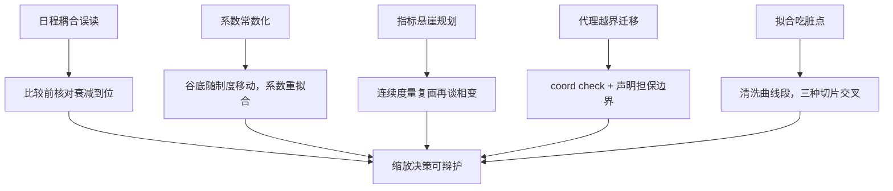

# 缩放的失败模式

缩放律是经验拟合，不是定理；缩放事故的大多数，是把一次拟合当成了普适定理来用。

<footer>—— 据 Hoffmann et al., 2022 对 Kaplan et al., 2020 的修正与后续复现文献整理</footer>

[上一课](/llm/pf2-model-eval-gates)关上发布门禁，交付链走完。本课在收束段回望整套规划的地基——缩放决策本身——把散落在先修课与前面各课里的错用收成一份失败模式清单。[Kaplan 的标度律](/llm/kaplan-scaling)、[Chinchilla 的修正](/llm/chinchilla)与[拟合方法](/llm/scaling-law-fitting)是正面的；本课写反面：每一类失败怎么发生、怎么在配方里预防。

## 问题

缩放决策错一次的代价是整代模型的算力：$N$ 与 $D$ 的分割、代理规模的选取、预算里程碑的设定，一旦错了要在数月后以「下一代模型不及预期」的形式显形，而那时账已经烧完。失败之所以反复出现，是因为缩放律的结论常以口诀形式传播——「每参数二十个 token」「大模型更样本高效」——口诀丢掉了原拟合的坐标系与前提，剩下的数字被当成常数使用。清单化失败模式，就是把口诀还原回它的适用范围。

「缩放律」就是拿几十到几百次不同规模的训练结果，拟合出「损失随参数与数据量怎么降」的经验曲线——它像实验物理的拟合公式，在测过的范围内好用，超出范围谁也不担保。

### 五类失败

**一，日程耦合的误读**：Kaplan 时代「偏大模型」的分割部分来自学习率日程与训练长度的耦合——模型在远未训完的日程上被比较；[Chinchilla](/llm/hoffmann-chinchilla) 对齐寿命后谷底移向等比。预防：比较前先核对各家日程是否衰减到位。**二，常数化系数**：把 20 token/参数写进脚本；MoE、重复数据、过训目标都会移动谷底，见[MoE 标度](/llm/moe-scaling-laws)与[数据受限缩放](/llm/data-constrained-scaling)。**三，指标悬崖规划**：用下游准确率的涌现点做买卡里程碑，而准确率悬崖可以是阈值度量造出来的，见[涌现之争](/llm/emergence-debate)。**四，代理越界迁移**：小代理结论搬过深度、序列长、词表或优化器的边界，μP 只担保宽度。**五，拟合吃脏点**：用混入 warmup 段、尖峰、SDC 缺口的曲线拟合指数，谷底整体移位。

## 方法

把预防写进配方流程。规模落点进[检查清单](/llm/pf2-pretrain-checklist)时，强制附三行：本次 $D/N$ 相对哪次拟合、本次数据制度（重复率、MoE 与否）与拟合制度差在哪、代理迁移的担保边界声明。缩放实验遵循[拟合方法](/llm/scaling-law-fitting)的口径：清洗 warmup 与尖峰段、用有效数据 $D'$、三种切片交叉验证谷底同侧、留出最大点不参与拟合。下游里程碑一律换算成损失或 FLOPs 口径再进预算文档——能力声明用多度量，预算规划用连续量。

Chinchilla 的三种估计（三项式、IsoFLOP 剖面、末点插值）在约四百次运行上交叉支撑同一个结论——单方法单切片的「缩放结论」在文献里可以差出很远；读到任何新系数，先问它用了几种切片。

## 机制

为什么这些失败反复出现：缩放律的每个系数都绑定一个隐式坐标系——架构、数据制度、日程形状、稳定件组合——而决策场景永远与新坐标系有出入。失败不是「律错了」，而是**适用域判断缺失**：20 这个数字在它自己的拟合制度内是对的，错的是搬到 MoE 或重复体制时不变。这也是为什么预防的组织形式是清单与声明而不是「更聪明的拟合」：拟合技术已经足够好，坏的是使用纪律。本课程的检查清单、重复记账、代理校验三处都在替这张失败清单执行拦截——缩放失败模式的真正解药散布在前面各课，本课只负责把它们并排点名。

## 边界

本课清单针对预训练的规模与预算决策；推理侧的算力与部署规模是服务课程的对象。能力涌现的哲学争论——训练动态突变与度量伪影两根轴——在[涌现之争](/llm/emergence-debate)已分头处理，本课只取其对预算规划的结论。架构标度（MoE 的总参与活跃参、词表与序列长的标度）在各自专课；本课把它们当「会移动谷底的制度变量」引用。最后一类边界：缩放律对「下一代」的预言力本身会衰减——数据制度剧变、目标函数更换时，旧拟合全面失效，此时唯一诚实的动作是小规模重拟合。

## 小结

- 五类失败：日程耦合误读、系数常数化、指标悬崖规划、代理越界迁移、拟合吃脏点。
- 每个系数绑定隐式坐标系；失败源于适用域判断缺失，不是律本身错。
- 规模落点附三行声明：依据哪次拟合、制度差在哪、迁移边界在哪。
- 预算用损失与 FLOPs 口径，能力声明用多度量；两种语言不混写。
- 出处：Kaplan et al., 2020；Hoffmann et al., Training Compute-Optimal LLMs, 2022；Schaeffer, Miranda &amp; Koyejo, NeurIPS 2023。
