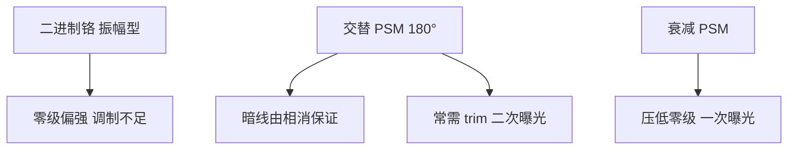

# 相移掩模 PSM

在相邻透光区之间引入 $180^\circ$ 相位差，暗区靠相消干涉形成，而不是只靠铬的阴影。

<footer>—— 归纳自 Levenson, Viswanathan, Simpson 的相移掩模思想，以及 Mack 书中对 PSM 作为 RET 的表述</footer>

二进制铬掩模用「透或不透」调制振幅。密图形时零级衍射很强，空中像调制不足。相移掩模（PSM）在透光区之间加上约 $180^\circ$ 的相位台阶，让相邻开口的光在本该是暗的地方相消，等效于削弱零级、抬高可印对比度，从而在同一 $\lambda$ 与 $\mathrm{NA}$ 下降低 $k_1$。两条量产主干是交替型（alt-PSM、Levenson）与衰减型（att-PSM、嵌入式 MoSi 等）。本篇讲相位如何进入衍射，以及相位冲突、缺陷与 trim 掩模为什么让强相移没有统治所有层。

## 问题

低 $k_1$ 下二进制掩模的空中像暗区不够黑，胶阈值一漂，CD 就垮。光学上需要在目标暗线处强制电场过零。相移提供这种过零：两侧开口相位相反，中线干涉相消，与铬宽度弱相关，对焦深也往往更宽。问题是相位是全局约束。给每一条密线的两侧都分配相反相位，在二维连通图形上会遇到无法 2-染色的区域——相位冲突。强相移因此需要第二张 trim 掩模去掉多余的相位边，或把布局限制成可染色的一维栅。

衰减相移不试图把相邻开口全做成 180° 交替，而是让「不透」区仍漏过百分之几的光并带 180° 相移，压低零级、改善台阶覆盖。它与二进制兼容性更好，成为接触孔与许多 DUV 层的默认掩模类型之一。

### 交替与衰减不是同一强度的药

Alt-PSM：相邻开孔相位差 $180^\circ$，铬可以很窄甚至在极限想法里做成无铬相移；暗线由干涉保证。Att-PSM：背景透过率典型为百分之几量级（常讨论 6% 一类的嵌入式衰减），相位约 $180^\circ$，图形仍由透光开口定义。前者分辨率潜力更大，掩模制造、缺陷（相位缺陷几乎不可修）与设计限制也更重。后者可以走标准 OPC 流程，缺陷行为更接近二进制加一层衰减膜。

「6% 衰减」是常见工艺讨论值，不是物理学常数。具体透过率由掩模膜系与层类型决定。不要把某一个百分比写进所有节点的设计手册而不看掩模规格。

## 方法

掩模厂在石英上刻出台阶或沉积相移膜，使光程差 $\Delta n\cdot t \approx \lambda/2$。扫描机侧仍是同一套投影光学；PSM 不改 [波长](/llm/litho-wavelengths)，只改物体平面的复透过率。照明通常与 [OAI](/llm/off-axis-illumination) 联立：衰减相移配环带或四极是接触孔经典组合；交替相移对部分相干与对准更挑剔。OPC 必须用能算相位的模型，二进制 OPC 直接套用会在相位边产生假图形。

Alt-PSM 的典型流程是：相移掩模印出密线，再用二进制 trim 曝光去掉相位边界在不该有暗线的地方留下的残影。这已经是两次[光刻](/llm/litho-process-flow)，要计入套刻与产能。衰减相移通常一次曝光，代价是对比度增益小于交替型。

### 相位缺陷与检测

石英坑或膜厚误差造成的相位缺陷，在空中像上可以是亮或暗的致命点，且不易像铬缺陷那样用补镀修复。掩模检测必须对相位通道敏感。这是强 PSM 成本的一部分：不是多一层膜那么简单，而是良品掩模更难。本篇不把掩模厂良率写成晶圆厂节点良率。

## 机制

物体透过率写成复数 $t(x)=A(x)e^{i\phi(x)}$。交替相位让相邻周期的傅里叶零级互相抵消，能量进入更高衍射级，空中像在暗区过零。离焦时两束（或选定级）的相位关系仍能维持过零，故 DOF 改善。衰减型保留一部分背景光，与开口光干涉，在边沿产生更陡的强度斜率，改善对隔离线与孔的打印，但对最密线的极限不如交替型。

相位边本身是一种图形：两个同振幅反相位区的交界必然有暗线。这在想要的栅极处是特性，在逻辑拐角处是缺陷。设计规则要么禁止冲突拓扑，要么用 trim。这与[离轴照明](/llm/off-axis-illumination)不同：OAI 不在掩模上制造额外暗线，只选择哪些级进光瞳。

无铬相移（CPL 等）把透过区几乎铺满、靠相位岛定义图形，是 PSM 家族的变体。制造与 OPC 更难，量产渗透不如衰减 MoSi 普遍。不要把会议论文里的 CPL 演示当成所有厂的默认掩模。

### 与多重图形的关系

PSM 是单次曝光内的 RET，目标是把 $k_1$ 降下来。多重图形是把一层拆成多次曝光或 spacer，目标是突破单次 $k_1=0.25$ 的节距。两者可叠加：LELE 的每一张掩模仍可以是衰减相移。不要说「有了 SADP 就不需要 PSM」——掩模类型与图形分解是不同层级。EUV 掩模是反射型多层膜加吸收体，相移机制与透射 DUV 的石英台阶不同，不在本篇展开。

## 边界与工程取舍

强交替 PSM 的设计规则、二次 trim、相位缺陷，使它在逻辑上往往输给「二进制或衰减 + OAI + OPC」，或输给后来的多重图形。存储器与某些规则栅极层更适合交替相移。衰减 PSM 几乎成为 DUV 标配膜系之一，但透过率、膜应力与光学邻近仍要按层标定。

PSM 不修复套刻，也不抬高 $\mathrm{NA}$。它不能单独把浸没单次曝光推过约 36–40 nm 半节距的物理区；那是两束极限与 $\mathrm{NA}=1.35$ 的事。引用时写 Levenson 等人 1982 年的相移掩模工作与 Mack 教科书，不要给 PSM 编造一篇不存在的「7 nm 良率论文」。

相位差对波长敏感：$180^\circ$ 为某一 $\lambda$ 与膜厚而设计。ArF 掩模不能拿到 KrF 机上当同一 PSM 用。换波长台阶必须换掩模膜系。

## 小结

- PSM 用约 $180^\circ$ 相位在暗区制造相消干涉，降低单次曝光 $k_1$。
- 交替型潜力大，常遇相位冲突并需要 trim；衰减型一次曝光、增益较小、更通用。
- 相位缺陷难修复，掩模成本与检测高于二进制铬。
- PSM 与 OAI、OPC 叠加，与 LELE/SADP 属于不同层级。
- 不改变波长与 $\mathrm{NA}$，也不能单独突破两束成像的节距极限。
- EUV 反射掩模的相位问题另论。
- 出处：Levenson et al., IEEE 1982 相移掩模；Mack, *Fundamental Principles of Optical Lithography*。
