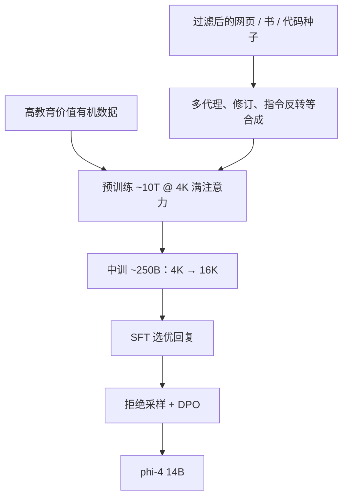

# Phi-4

Phi-4 把合成数据贯穿预训练而不只是蒸馏教师的聊天风格；在 STEM 问答上它可以超过教师模型，说明配方已不只是模仿 GPT-4。

<footer>—— Abdin 等，Phi-4 Technical Report，arXiv:2412.08905</footer>

Microsoft 的 Phi 线从教材式代码小模型走到 Phi-3 的手机档。2024 年 12 月的 **phi-4** 是 **14B** 解码器，技术报告写得很硬：多数大模型预训练以网页与代码等「有机」数据为主，phi-4 则让**合成数据成为预训练的主体**，并用多种生成流程（多代理提示、自我修订、指令反转）专门喂推理。架构几乎沿 Phi-3-medium，改分词与注意力窗。本篇只写 14B 的 phi-4 报告，不把后来的 Phi-4-mini / reasoning 变体写进同一张规格表；前史见 [Phi 小模型路线](/llm/phi)。

## 问题

Phi-1 到 Phi-3 很大程度是在蒸馏更强教师（报告点名 GPT-4）的解题风格。若学生永远小于教师，STEM 上限会被教师的错误与保守性卡住。phi-4 要验证：合成数据若设计成「可逐步学习的推理轨迹」，加上有机数据做种子与知识补丁，**14B 能否在 STEM QA 上超过教师**——这被当作「超越蒸馏」的证据，而不是又一次 1.3B 教材奇迹。

小模型的另一缺口是长上下文与多语。Phi-3-medium 用过 2K 滑窗；phi-4 改成 4K 满注意力再中训到 16K。分词换 tiktoken，垫到词表 **100352**，明确为了多语。问题是在几乎不改层结构的前提下，靠课程与数据混合把推理、知识、上下文一起抬上去。

### 合成数据不是便宜网页替代品

报告把合成数据的优势写成结构：人类文本里下一 token 与当前推理步骤常常错位（答案写在最前、编辑是非线性的），而模型生成的解题过程在训练目标上是左到右可预测的，相当于「喂勺」。种子必须极干净——有机数据上的小错误会被合成管线放大。因此网页过滤不是可选项，而是合成管道的输入卫生。约 50 类合成数据集，各用不同种子与提示工作流。只拿合成、不留知识型网页，消融里知识榜与幻觉会变差；只堆新鲜网页、少重复合成，推理榜不如多 epoch 合成。

「有机」在报告里指人类产生或非合成数据。phi-4 并非零网页：过滤后的网页、许可书籍、代码既直接进预训练，也当合成种子。标题级口号是合成贯穿全程，不是「没有互联网」。

## 方法

架构：14B 解码器，预训练上下文 4096，中训到 **16K**。相对 Phi-3-medium：tiktoken；**4K 满注意力**，去掉 2K 滑窗。预训练约 **10T token**，峰值学习率 $3\times 10^{-4}$，weight decay 0.1，全局 batch 5760。中训约 250B token，学习率降到预训练峰值的十分之一；长数据来自学术、书、代码里筛出的长样本及新合成长序列，并保留约 70% 预训练回放以防遗忘；RoPE 基频提到 **250K**（报告写明跟随 Meta 的做法）。

### 后训练：SFT、拒绝采样与改过的 DPO

SFT 用公开与合成用户提示，多样本生成再由 LLM 评审挑最好。偏好阶段用拒绝采样，以及报告称为 novel 的 DPO 用法（含 pivotal token 一类对关键 token 的强调，细节以报告为准，本文不把未写清的超参补全）。目标是在已经很「教材腔」的底座上修格式、安全性与逐步推理的稳定性。评测含 GPQA、MATH、HumanEval 以及 2024 年 11 月 AMC 10/12；报告强调对照模型都在这些 AMC 日期前发布，以降低泄漏口实。

## 机制

超越教师的机制被报告解释为：合成轨迹可以在教师分布之外做验证（代码执行循环、科学题的多数投票换答案）、多步修订、以及指令反转（从代码生成题面，只保留能重建原代码的对）。学生学的是**可验证的推理格式 + 多种解题路径**，不是逐句克隆 GPT-4。STEM QA 上超过教师，并不蕴含开放域事实、工具使用或多语聊天全面超过 GPT-4o。

满注意力替换滑窗，使 4K 内任意两 token 有直接边，中训再把长度拉到 16K。对「定理在文首、应用在文末」的教材，这比层叠滑窗更直。14B 相对 3.8B 的 Phi-3-mini，装下更多事实，幻觉风险从「容量不够编」部分转为「合成腔编得更圆」——报告自己用「只合成则知识榜差、幻觉增」来警告。

中训 30% 新长数据 / 70% 回放是报告的混合原则。人工把短样本 pad 成 16K，不如天生长的书与代码。不要用「把对话拼到 16K」当 phi-4 中训的复现。

### 和 phi-3、和 MiniCPM 的差别

Phi-3 仍明显是小模型 + 过滤网页 + 合成；phi-4 把合成比例与生成流程升级，并明确打「超教师」叙事。架构改动最小：分词、窗、RoPE 基频。[MiniCPM](/llm/minicpm) 用 WSD 让小模型多吃真实 token；phi-4 用合成把 token 变得更「可学」。两者都谈数据质量，一个调日程，一个调数据生成器。

## 边界与工程取舍

14B 不是端侧 3.8B。16K 不是 128K。许可与 Azure / Hugging Face 可用性以模型卡为准。去污染对 AMC 与内部 STEM 集是生存条件；外部复现若数据管线不可得，只能把报告当存在性证明。后训练 DPO 细节不足以从零复现「novel DPO」。不要把 phi-4 写成视觉或 MoE。

安全与过度自信：教材腔步骤完整，事实可以仍错。STEM 强不自动等于医疗或法律可部署。

14B 的 BF16 大约 28GB 权重，单卡 24GB 只能量化；与「小模型」口碑相比，它已经是工作站档。中训 16K 对长论文够用，对整本仓库或 128K 合同不够，需要检索。合成数据的教师若来自 GPT-4 一类闭源模型，权重可下不等于数据生成流程可复现，也不等于可以无限制地用教师输出来训竞品——要读当时服务条款。评测上的 AMC 时间切割降低了那一套竞赛题的泄漏嫌疑，不能推广到所有内部 STEM 集都干净。

真实编号：Phi-4 技术报告 arXiv:2412.08905（MSR-TR-2024-57）。Phi-3 为 arXiv:2404.14219；phi-1 为 arXiv:2306.11644。不要给 Phi-2 编会议论文号。

## 小结

- phi-4 是 Microsoft 2024 年 12 月的 14B 语言模型：合成数据贯穿预训练，STEM 上宣称可超过教师。
- 架构近 Phi-3-medium，但 tiktoken 词表 100352、4K 满注意力、中训至 16K、RoPE 基频 250K。
- 预训练约 10T token；种子卫生与去污染和准确率同级。
- 只合成会伤知识、增幻觉；有机数据仍要过滤后保留。
- 出处：Abdin 等，*Phi-4 Technical Report*，arXiv:2412.08905，2024。
