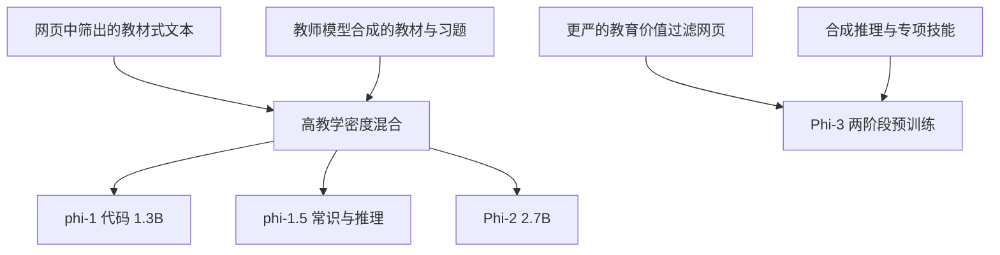

# Phi 小模型路线

    
phi-1 只有 1.3B 参数，却在经过筛选的「教科书质量」网页和合成教材上训了几天——规模定律在这里被数据质量拧弯。

    <footer>—— Gunasekar et al., Textbooks Are All You Need, 2023</footer>

Microsoft 的 Phi 线不靠把解码器推到百亿来赢，而靠把训练数据做成「教材」：少噪声、有讲解、有习题。Gunasekar 等人 2023 年的 *Textbooks Are All You Need* 给出 phi-1（1.3B）在 HumanEval / MBPP 上相对同尺寸代码模型的跳跃；随后 phi-1.5、phi-2、Phi-3 把同一假设从代码扩到常识推理，再扩到「能进手机」的通用小模型。本篇沿这条数据路线写，架构保持为常规 Transformer 解码器，不把未公开的内部层表写成论文定理。

## 问题

Kaplan / Chinchilla 一类标度律默认数据是「互联网的一个可缩放切片」：参数、数据、算力按幂律配平。若切片里充满重复模板、错误代码、无讲解的论坛碎片，小模型会先记住噪声，再来不及学算法。代码模型尤其明显：15B 级语料堆上去，HumanEval 仍可能停在很低的 pass@1，因为模型很少见到「从定义到习题」的完整推导。Phi 要问的是：在 **1B 量级参数、远小于 1T 的 token 预算** 下，能否靠提高每个 token 的教学密度，达到通常认为只有大模型才有的编码与推理行为。

### 教科书质量不是「再滤一遍 Common Crawl」

Gunasekar 等人把数据分成两类。一类是网上筛出来的教材式文本：有说明、有结构，而不是星散的代码文件。phi-1 里这部分约 6B token。另一类是用 GPT-3.5 合成的教材与习题，约 1B token，用来补「讲解—练习」闭环。合成不是无约束蒸馏竞赛题，报告强调主题覆盖与去污染，避免把评测题写进训练。质量假设因此是双重的：人类写的干净讲解，加上教师模型按教材体裁生成的练习，而不是「越多网页越好」。

「Textbooks Are All You Need」是针对 phi-1 那次代码实验的标题，不是说通用 LLM 可以不要网页。Phi-3 报告写得很清楚：后续仍用大量按教育价值过滤的网页，再加合成数据。路线是「质量优先」，不是「只有书」。

## 方法

phi-1 是 1.3B 的 Transformer 代码模型，在 8 张 A100 上训约 4 天。训练分预训练与习题微调：后者在编码练习上继续，引出报告所谓相对 phi-1-base 的涌现式行为。对照模型 phi-1-small（350M）走同一数据管线，HumanEval 仍远高于当时许多更大的代码模型——用来表明增益主要不来自 1.3B 这个数字，而来自数据。评测报 HumanEval pass@1 约 50.6%、MBPP 约 55.5%（以论文表格为准）。

phi-1.5（*Textbooks Are All You Need II*，arXiv:2309.05463）把目标从 Python 竞赛扩到常识与推理，仍是约 1.3B。Phi-2（2.7B，微软研究博客，2023）继续用教材式合成数据加按教育价值过滤的网页，并做从 1.3B 到 2.7B 的知识迁移以加快收敛。Phi-3（技术报告 arXiv:2404.14219）把小模型推到 3.8B 量级，声称在过滤网页加合成数据、两阶段预训练之后，可与更大的通用模型在若干榜上接近；部署叙事明确包含手机端。

## 机制

小模型的参数容量装不下长尾世界知识。教材数据把梯度用在「可迁移的解题步骤」而不是「某条网页上的偶然事实」。合成习题提供短闭环：定义、例题、变式，损失信号密集。结果是：在 HumanEval 这类与教材体裁同分布的任务上，1.3B 可以打过用粗糙网页训的 10B+ 代码模型；在需要冷门事实、多语言、长尾专名的任务上，同一 1.3B 会明显吃亏。Phi 路线优化的是**样本效率与推理风格**，不是百科容量。

去污染是这条路线的生存条件。数据越像考题，越容易把评测漏进训练。Gunasekar 等人在 phi-1 报告里用专门章节做污染分析。读后续 Phi 数字时，应同时看报告如何过滤与是否披露重叠，而不能只抄 pass@1。知识迁移（Phi-2 写入的从 1.3B 扩到 2.7B）是另一条样本效率杠杆：大一号的模型不是从随机初始化重新发现教材里的算法，而是接着小模型已经形成的表示走。

### 和「合成数据万能」的界限

教师是 GPT-3.5 或后续更强模型时，学生会上教师的解释风格，也会上教师的系统偏差与过时事实。教材体裁对竞赛代码友好，对开放域对话、工具使用、多模态并不自动迁移。Phi-3 把网页过滤加回来，等于承认只靠合成教材撑不起通用助手。小模型本地部署的收益——延迟、隐私、成本——成立的前提是任务分布接近「可教材化」的推理，而不是开放网页问答。

不要把 phi-1 的 7B token 训练预算写成「推翻了 Chinchilla」。标度律在固定数据质量下仍近似成立；Phi 做的是把质量当成第三轴，在小参数、小 token 的角点上移动。换一套脏数据，1.3B 不会再现 HumanEval 50%。

## 边界与工程取舍

### 可复现的是主张，不是那条数据管线

架构不是卖点：常规解码器、常规注意力，服务栈与 Llama 类模型同类。真正难的是数据管线与污染审计，这两项往往闭源。复现「教科书」若只剩「让 GPT 写一万本伪教材」而无过滤与去重，会得到风格华丽、评测虚高、真实代码一碰就碎的模型。公开报告能教你的是：把教育价值当成过滤轴、把合成习题当成闭环、把去污染当成与准确率同级的结果；不能教你的是微软内部的分类器权重与网页切片。因此 Phi 更适合作为「小模型 + 高质量数据」的对照实验，而不是一条可以逐文件抄作业的开源语料配方。

许可与可用性随版本变：有的以报告与有限权重出现，有的进 Azure / Hugging Face。写进产品前读当时模型卡。Phi-3 的「手机」是量化与 3.8B 合在一起的部署故事，不是 1.3B phi-1 的故事。对标 Mixtral 45B 总参或 GPT-3.5 时，要用 Phi-3 报告自己的表，不要把 phi-1 的代码榜接到通用聊天。

安全与幻觉：小模型更会「教材腔地错」。看起来步骤完整，事实可以是编的。教材训练强化连贯推导，不自动强化引用与拒答。

引用只使用真实编号：Gunasekar et al., arXiv:2306.11644；Li et al. phi-1.5，arXiv:2309.05463；Phi-3，arXiv:2404.14219。Phi-2 以微软研究博客为出处，不要给它编造一篇不存在的会议论文编号。

## 小结

- Phi 线的核心主张：在小参数上，教科书质量（筛选网页 + 合成教材/习题）可以显著提高编码与推理的样本效率。
- phi-1（1.3B）把这一主张做在 Python 代码上；1.5 / 2 / 3 逐步扩到常识、通用能力与端侧部署。
- 合成数据依赖教师与去污染；通用能力仍需要过滤后的大规模网页。
- 小模型赢的是可部署性与解题风格，不是长尾知识容量。
- 出处：Gunasekar et al., *Textbooks Are All You Need*，arXiv:2306.11644，2023；后续以 phi-1.5、Phi-2 博客与 Phi-3 技术报告为准。
