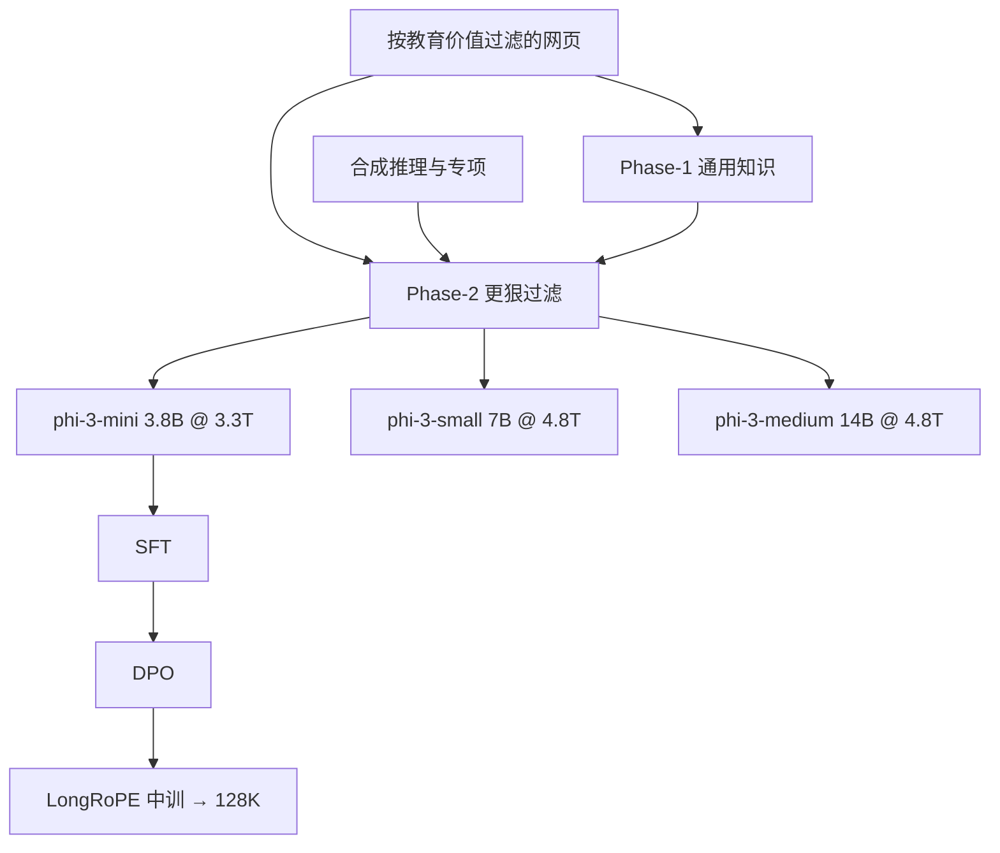

# Phi-3 技术报告

创新完全在训练数据上：把 phi-2 用过的那套「过滤网页 + 合成数据」放大，得到一个小到能在手机上跑、质量却接近 Mixtral 8x7B 与 GPT-3.5 的模型。

<footer>—— Abdin 等，Phi-3 Technical Report，arXiv:2404.14219</footer>

Microsoft 的 Phi 线从教材式代码小模型走到能进手机的通用档。2024 年 4 月的技术报告主推 **phi-3-mini：3.8B，训 3.3T token**，默认 4K 上下文，并给出 7B（small）与 14B（medium）的参数缩放。路线主张见 [Phi 小模型](/llm/phi)；本篇按报告写三档规格、两阶段预训练、LongRoPE 128K，以及后来补进同一份 PDF 的 phi-3.5 变体——不把 [phi-4](/llm/phi-4) 的 14B 合成主体写进来。

## 问题

Kaplan / Chinchilla 默认数据是固定质量的互联网切片。Phi 要问的是：在 **数 B 参数、数 T token** 上，若把网页按教育价值滤到接近教材、再用 LLM 合成推理轨迹，小模型能否达到通常认为只有 7B×8 专家或 GPT-3.5 才有的综合分。报告把这称作靠近「data optimal」：不是算力最优，也不是无限过训练，而是给定尺度下把不该占容量的事实（某日球赛比分）剔掉，把推理结构留下来。

部署约束同样硬。3.8B 4-bit 约 **1.8GB**，报告在 iPhone 14 A16 上离线测到超过 12 tok/s。架构若标新立异，开源推理栈接不上；因此 mini 刻意对齐 Llama-2 块结构与词表。

### mini 对齐 Llama-2，small 才换词表与稀疏注意力

**phi-3-mini**：解码器，隐宽 3072，32 头 32 层，词表 **32064**（Llama-2 词表去掉 BoS、加聊天符），bfloat16，3.3T token，默认 4K。聊天模板为 `<|user|>` / `<|assistant|>`。LongRoPE 把窗口扩到 128K，称 phi-3-mini-128K。

**phi-3-small（7B）**：tiktoken 词表 **100352**，默认 8K；32 头 32 层，隐宽 4096；[GEGLU](/llm/swiglu)；用 μP 在小代理模型上调超参再迁移；[GQA](/llm/gqa) 为 4 个查询共享 1 个键；**blocksparse 注意力**与稠密层交替，头之间用不同稀疏图案覆盖上下文，以减 KV。训练与推理各有 Triton / paged 核。约 10% 多语数据。

**phi-3-medium（14B）**：与 mini 同词表同块结构，40 头 40 层，隐宽 5120，训 **4.8T**（与 small 相同总量、略多 epoch）。报告观察到部分基准从 7B 到 14B 的涨幅小于从 3.8B 到 7B，怀疑 14B 上数据混合还没处在「data optimal」。

MMLU 5-shot：mini 68.8，small 75.7，medium 78.0；MT-bench 8.38 / 8.70 / 8.91（报告表，同一内部管线）。这些是他们的评测口径，和 Open LLM Leaderboard 的 shot 设定不必相同。

## 方法

预训练两段、互不相交。Phase-1 以网页为主，教通用语言与知识。Phase-2 把 Phase-1 里滤得更狠的子集，与教逻辑推理和专项技能的合成数据合并。过滤轴是教育价值：同一条网页，对前沿大模型可能是好知识，对 mini 可能是占容量的噪声。合成数据延续 *Textbooks Are All You Need* 的教师生成教材/习题，不是无约束刷竞赛题。

后训练两段：SFT 覆盖数学、代码、推理、对话、身份与安全；DPO 把不想要的行为当 rejected，并含负责任 AI 数据。SFT 先走英语。长上下文版本另做中训，再在长短混合上做 SFT 与 DPO，使 128K 档在短任务上不掉点。

### phi-3.5：多语、MoE 与视觉

同一份后续修订引入 phi-3.5-mini、phi-3.5-MoE、phi-3.5-Vision。中训加多语与长文本，仍用 LongRoPE，混合窗口把 4K 任务与 128K 一起保住。MoE 为 16 个专家、top-2，每个专家是独立 GLU；16×3.8B 总量约 42B、激活约 **6.6B**，路由用 SparseMixer。Vision 约 4.2B，从 mini 扩，支持单图与多图。RULER 上 128K 仍有明显掉点，报告归因为中训长数据不够，而不是 LongRoPE 公式本身。

## 机制

小模型的参数装不下长尾百科。教材式过滤把梯度用在可迁移的解题步骤上；合成轨迹提供左到右可预测的「喂勺」过程，与人类网页里答案前置、编辑非线性相反。结果是 GSM8K / HumanEval 一类与教材同分布的任务可以打过更大的脏数据模型；TriviaQA 这类事实检索上，Mixtral / GPT-3.5 仍然可以明显领先——报告表里这不是隐藏项。

mini 对齐 Llama-2，是为了让 vLLM、llama.cpp 一类栈几乎零改动。small 换 tiktoken 与 blocksparse，是 7B 上多语压缩和 KV 开始成为瓶颈：词表负责切得动非英语，稀疏头负责 8K+ 的缓存。μP 则把 7B 的学习率从代理模型迁过来，减少再扫一遍的成本。

「创新完全在数据」是报告原句，指向相对架构论文而言。small 的 blocksparse、GQA、GEGLU、μP 仍是架构选择。读 mini 时这句话成立；读 small 时不要删掉稀疏注意力。

### 和「手机 3.8B = GPT-3.5」话术

对标的是报告自己的学术表与内部测试，不是 ChatGPT 产品。4-bit 手机速度证明的是可部署，不证明长尾知识、工具使用或多语聊天全面达到 GPT-3.5。128K 档在 RULER 长档掉点，说明 LongRoPE 给的是长度许可，不是免费的针检索 SOTA。14B 涨幅变缓，说明「同一锅数据放大参数」会先碰到数据最优而不是算力最优。

## 边界与工程取舍

数据管线与污染审计不随权重开源。复现「教科书」若只剩「让 GPT 写伪教材」，会得到风格华丽、评测虚高的模型。mini 的 32k 词表对非拉丁脚本碎；要多语应看 small / 3.5，而不是假设 3.8B 聊天模型自动会中文。blocksparse 需要他们描述过的核，朴素 SDPA 实现会又慢又对不齐数值。

安全与幻觉：小模型更会「教材腔地错」。SFT/DPO 把模型变成助手，不自动变成可引用的知识库。phi-3.5-MoE 的 42B 总量决定装载，6.6B 激活决定算力，两者不要混着写 SLA。手机叙事只绑在量化后的 mini：small 的 blocksparse 核与 medium 的 14B 宽度都不在 A16 的 1.8GB 故事里。把三档都写成「能进手机」是把部署口号从 3.8B 误扩到全家。内部评测管线对所有对照模型共用同一套 few-shot，报告强调他们没有为 phi-3 单独改提示——这降低了「自家模型调 prompt」的口实，也意味着与公开 leaderboard 数字不必逐格相等。

引用 arXiv:2404.14219。phi-3.5 写在同一报告后续版本里，不要另编一篇不存在的「Phi-3.5 会议论文」。Phi-2 仍以微软博客为出处。不要把 phi-4 的 tiktoken 100352 与 16K 中训安到 phi-3-mini 上。

## 小结

- phi-3-mini 为 3.8B / 3.3T / 4K，Llama-2 式块与 32064 词表，4-bit 可在手机离线跑。
- small 7B 与 medium 14B 训 4.8T；small 换 tiktoken、GQA 与 blocksparse；medium 扩深宽但部分榜涨幅变缓。
- 预训练两阶段（通用网页 → 更狠过滤 + 合成推理）；后训练 SFT + DPO；128K 走 LongRoPE。
- 质量主张是数据最优而不是新注意力核；事实类基准仍可能落后更大模型。
- 出处：Abdin 等，*Phi-3 Technical Report: A Highly Capable Language Model Locally on Your Phone*，arXiv:2404.14219，2024。
