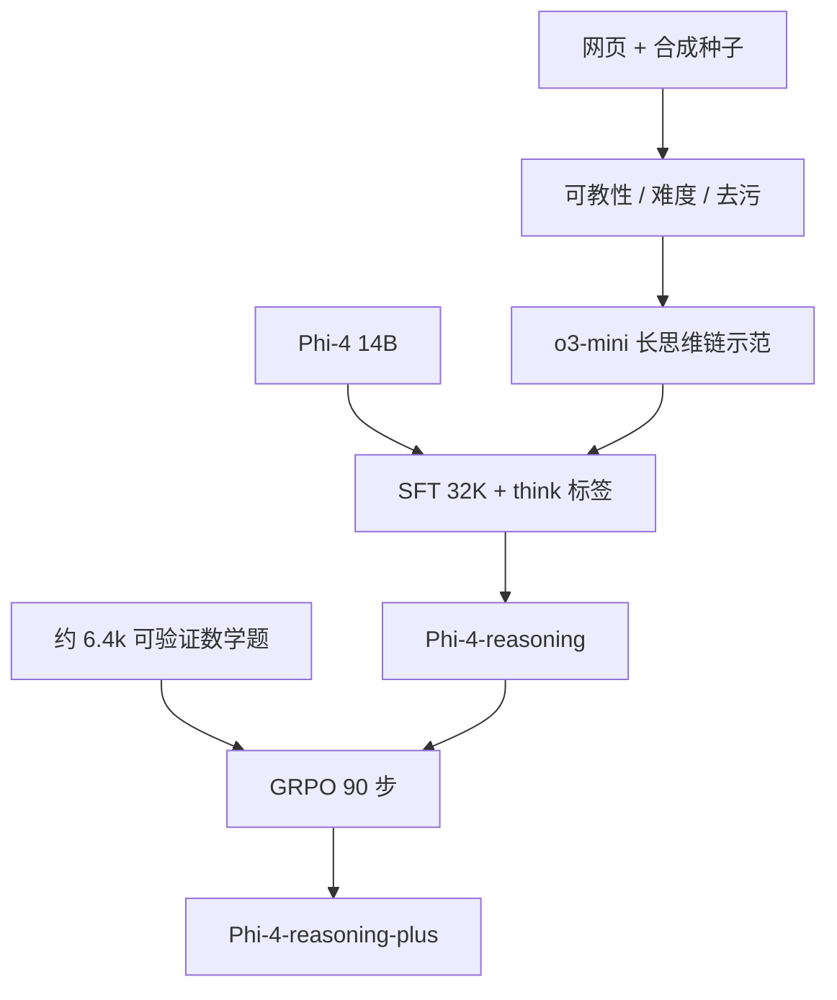

# Phi-4-reasoning

在精心挑选的「可教」提示上，用 o3-mini 的推理示范对 Phi-4 做监督微调；再加一小段基于结果的强化学习，轨迹会更长、数学分会更高。

<footer>—— Abdin 等，Phi-4-reasoning Technical Report，arXiv:2504.21318</footer>

[Phi-4](/llm/phi-4) 的 14B 已经把合成数据贯穿预训练，STEM 问答可以超过教师。它仍不是「会花测试时算力去想」的推理模型：没有拉长的思维链，窗口也停在 16K。2025 年 4 月的 **Phi-4-reasoning** 在同一稠密 14B 上做推理向后训练；**Phi-4-reasoning-plus** 再叠约 90 步 [GRPO](/llm/grpo)。架构几乎不动，改的是数据边界、`<think>` 格式与 32K 上下文。

## 问题

DeepSeek-R1 证明大推理模型的轨迹可以蒸进更小的稠密网。Phi-4 底座已经会解 MATH / GPQA 风格的题，但多数种子对它「太容易」——再喂一遍只会克隆格式。推理 SFT 要的是落在能力边缘的提示：多步、多样、底座做不稳，却仍可被更强教师示范。报告把这类样本叫做 **teachable**。

第二问是测试时计算。若 SFT 只学到把答案包进思维标签，长度不会变成搜索步数。需要示范里真有规划、回退与改错，并且窗口够装下这些 token。Phi-4 的 16K 不够；推理档把 RoPE 基频加倍、最大长度提到 **32K**。第三问是：在已经很强的 SFT 之上，短程结果监督 RL 还能不能涨——以及会不会只换更长的啰嗦。

### 种子过滤比教师型号更先

种子来自网页、已有数据集、许可集合与合成改写，覆盖 STEM、代码与安全。过滤用 LLM 评审：要多步推理，不要纯事实回忆；难度用弱模型相对强模型（或多数票伪标签）的一致率来估，只留「有缺口」的题。把网页证明题改写成带短可验证答案的计算题，是为了下游 RL 好打分。教师是 **o3-mini**（高思考档在扩展阶段更强、轨迹也更长）。训练数据对 AIME 2024、MATH、GPQA、LiveCodeBench 等做了与 Phi-4 同一套去污；**AIME 2025 在数据冻结之后发布**，报告当污染无关基准。

SFT 约 140 万条提示–回复，约 83 亿不重复 token，再训到约 160 亿 token（推理域会过不止一遍）。模型卡：32 张 H100、约 2.5 天、MIT 许可。不要把 16B 训算进 Phi-4 的 10T 预训练。

## 方法

### SFT：格式很快，推理很慢

两个占位符改成 `<think>` / `</think>`。系统消息强制「Thought / Solution」两段，并要求分析、反思、回溯。超参不复用 Phi-4 的指令 SFT：学习率扫到 **$10^{-5}$**（高于底座 SFT 的 $10^{-6}$，低于中训的 $3\times 10^{-5}$），AdamW，weight decay $10^{-4}$，全局 batch 32，约 16K 步，预热 450 步。早期检查点已经会打思维标签，但 AIME / GPQA 随步数继续涨，平均回复长度反而略降——报告把这读成「在学着把预算用在有效步骤上」，而不是越训越长。

数据混合按域（数学、代码）与质量分簇赋权，各域最优权重可以**相加**而不互相拆台。代码数据是在数学配方稳定之后再加的；安全与负责任 AI 用同一教师、同一管道生成，训练时去掉提示里的安全准则，让模型内隐化。底座选指令对齐后的 Phi-4 而不是中训检查点，是为了保住已有安全后训练。

### plus：6 千道题上的 GRPO

RL 只用数学。种子库约 7.24 万道无解答题，每步抽 64 道；最终选用约 **6400** 道、每道 8 条轨迹、约 90 步的检查点（AIME 2024 最好）。奖励是规则式：从 `\boxed{}` 抽答案，对了用余弦把长度奖落在 0.5–1（超过约 25600 token 开始罚短），错了奖落在 -1–-0.5（鼓励再想一会儿）；缺 EOS 或 think 标签格式坏了直接重写；再加 5-gram 重复罚。加权约 $8/13$ 准确率、$1/13$ 重复。GRPO 组大小 8，KL $\beta=0.001$，熵系数 $0.001$，学习率 $5\times 10^{-8}$，32×H100，最大输出约 31744。代码题不在 RL 集里。

## 机制

Teachable 过滤保证梯度打在「底座还不会的搜索策略」上，而不是再背一遍已会的代数。o3-mini 的轨迹提供可模仿的规划语言；Phi-4 预训练里的合成推理则让这些语言不是从零开始。SFT 长度不涨、准确率涨，说明格式不等于能力：标签几天就会，有效回退要整份 1.4M 混合。域加权可加，说明数学里学到的思维链可以当代码的先验，而不必为代码重扫学习率。

GRPO 在已经很强的 SFT 上仍能把 AIME 拉十个点以上，但报告也画了天花板：输出在 31K 截断，更长训不再涨。plus 平均多用约 **1.5×** token，主要发生在数学；代码 / 规划 / 空间上长度差更小。奖励故意在「答对要短、答错允许长」之间拉，避免纯结果 RL 只会啰嗦。

AIME 只有三十题量级。报告强调多次平均、给标准差，并在 AIME 2025 上跑 50–64 次生成。两次「平均 5 次」之间差 5–10 个点，对所有模型都发生，包括 o1 与 R1。不要用单次 AIME 给 14B 封神。

### 迁移到没训过的算法题

3SAT、TSP、日历规划没有作为目标域进 SFT/RL，但相对 Phi-4 仍有大幅准确率提升。报告把这读成推理作为可迁移元技能，而不是题库记忆。通用侧 IFEval、长上下文 QA、ArenaHard 也涨。并行测试时计算（best-of-N）可以让学生在 AIME 2025 上超过教师基线，说明轨迹里的搜索宽度还没被自回归一次采样用尽。生物 / 化学 / 离散数学相对数学物理涨得少，是跨模型的共性缺口。

## 边界与工程取舍

思维块可能复述安全准则；答案块被教成不要泄露准则与完整思维——产品若只展示 Solution，用户看不到回退过程。开源权重让完整 `<think>` 仍可被读出，安全含义报告列为开放问题。RL 截断 31K，服务端若放 64K 采样，行为不保证与训练一致。教师是 o3-mini，学生会继承其风格与盲区；「14B 接近 R1 671B」是若干推理榜上的对照，不是开放聊天全面替代。

不要把 reasoning 写成新预训练，也不要把 plus 的 GRPO 扩写成万亿 token 的 RL。许可 MIT，与 Gemma 条款不同。评测应用 Eureka 与报告表，不要只抄一张 AIME 柱状图。

系统消息在训练里是固定推理提示。推理时乱换系统提示会增加轨迹方差。模型卡把回复结构写成思维块 + 摘要块；聊天模板必须保留 think 符，否则奖励里的格式罚在部署里变成无声截断。

## 小结

- Phi-4-reasoning 是 14B Phi-4 的推理 SFT：约 1.4M 条 o3-mini 轨迹、32K 窗口、`<think>` 格式。
- 提示按可教性与难度过滤；数学与代码配方可加性合并；安全数据走同一教师管道。
- plus 在约 6.4k 道可验证数学上 GRPO 约 90 步，规则奖励含长度与重复，轨迹约 1.5× 更长。
- 对未作为目标的规划 / 算法题与部分通用榜有迁移；AIME 必须报多次平均。
- 出处：Abdin 等，*Phi-4-reasoning Technical Report*，arXiv:2504.21318，2025。
