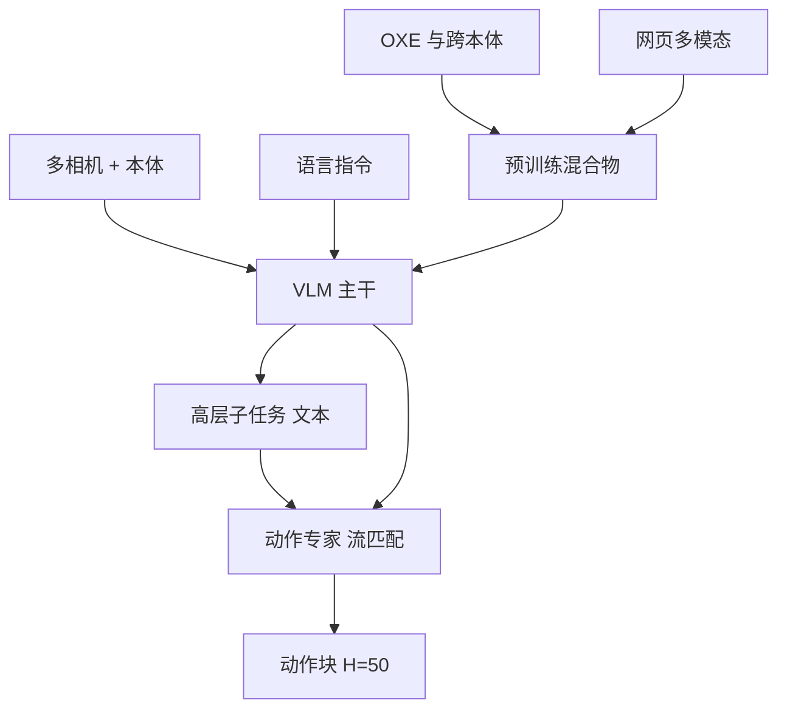

# π0 / π0.5 VLA

    
为了让流匹配与视觉语言模型共存，我们用一套独立的动作专家，把连续动作接在预训练 VLM 之上。

    <footer>—— Black et al., π0: A Vision-Language-Action Flow Model for General Robot Control, arXiv:2410.24164</footer>

Physical Intelligence 把通用机器人策略写成两步。2024 年 10 月 31 日博客与论文 **π₀**（读 pi-zero）给出第一代通才：从 [PaliGemma](/llm/paligemma) 初始化的视觉语言模型，加上约 3 亿参数的**动作专家**，用流匹配输出高频动作块。2025 年 4 月 22 日的 **π₀.₅** 在同一骨架上加异构共训与分层推理，目标从「实验室里的灵巧」改成「没见过的家里做家务」。两篇都是官方论文加公司博客，不是第三方复现。本篇写这一对：连续动作如何进 VLA，以及开世界泛化靠的是数据配方而不是换掉流匹配。

## 问题

语言与视觉基础模型可以靠网页预训练，机器人没有同等规模的交互日志。单一机型、单一房间的模仿学习会在物体、布局或时间尺度一变时崩溃。离散动作 token 能借用语言模型的交叉熵，却难以表达 50 Hz 级的灵巧轨迹；纯扩散策略灵巧，却吃不到互联网语义。Moravec 悖论在博客里被直接点名：下棋容易，叠衣服难。

π₀ 要同时解决三件事：跨本体（单臂、双臂、移动操作）、把 VLM 的离散输出换成连续动作分布、以及预训练/后训练分离——先用杂而广的数据学会恢复与覆盖，再用高质量数据把某一任务做流利。π₀.₅ 面对的是更硬的评测合同：训练里没出现过的厨房与卧室，任务长度 10–15 分钟，提示可以是「打扫卧室」这种高层指令。

### 通才策略的数据不是单一宝库

π₀ 的预训练混合物含自有约 1 万小时级灵巧数据（论文写 7 种机器人配置、68 个「任务」，每个任务本身已是多阶段行为）以及 [Open X-Embodiment](/llm/open-x-embodiment) 等开源集。开源部分约占混合物 9.1% 的时间步，覆盖广、控制频率低；自有数据补高频双臂。π₀.₅ 进一步把移动操作数据放进少数地位：第一阶段约 97.6% 的样本**不是**目标移动操作机在家务上的轨迹，而来自其他机器人、网页多模态任务与高层语义标注。

π₀-small（约 4.7 亿、无 VLM 初始化）在官方对比里明显弱于全尺寸 π₀，用来隔离「VLM 预训练」而不是公平的参数对照。OpenVLA 与 Octo 被他们用同一套更难的收拾/叠衣任务重训，离散动作与小容量扩散都吃力。

## 方法

π₀ 观测是多相机图像、语言指令与本体感受 $q_t$。动作块 $A_t=[a_t,\ldots,a_{t+H-1}]$，$H=50$，对应约 1 秒、最高约 50 Hz。流匹配在噪声与真值动作之间走线性路径 $A_t^\tau=\tau A_t+(1-\tau)\epsilon$，网络预测向量场 $u=\epsilon-A_t$。推理从高斯噪声出发做约 10 步欧拉积分。图像与文本走 VLM 主干；状态与动作走**第二套权重**（动作专家，约 300M），注意力上动作 token 彼此双向可见，前缀 $o_t$ 的 KV 可缓存。配置向量零填充到最大本体维（论文为 18）。骨干约 30 亿（PaliGemma）加专家，合计约 33 亿。

后训练把同一基座特化到叠衣、收拾桌面、组装纸箱、装袋等。更长任务可外接高层 VLM 把「收拾桌子」拆成短指令，类似 SayCan；π₀ 本身仍是语言条件的底层策略。

### π₀.₅：先说下一步，再出动作块

π₀.₅ 把分布写成

$$
\pi_\theta(a_{t:t+H},\hat\ell\mid o_t,\ell)=\pi_\theta(a_{t:t+H}\mid o_t,\hat\ell)\,\pi_\theta(\hat\ell\mid o_t,\ell).
$$

高层 $\hat\ell$ 是语义子任务（「拿起枕头」），底层是条件于 $\hat\ell$ 的连续动作块。同一套权重承担两级：预训练阶段动作用 FAST 离散 token、纯自回归，好扩规模；后训练再接入流匹配动作专家，好实时。推理时先自回归出子任务，再约 10 步去噪出 50 步关节指令。共训任务包括：移动操作、多环境静态臂、跨本体实验室数据、子任务标注、网页的描述/问答/检测，以及人逐步口头指令的示范。消融里，去掉网页数据主要伤 OOD 物体跟随；去掉其他机器人数据则分布内与 OOD 一起掉。

## 机制

动作专家是混合物专家的两专家特例：图文专家继承互联网语义，动作专家专门拟合连续向量场，避免流匹配梯度把语言模型表征冲垮。这与后来「知识绝缘」论文讨论的现象一致，但 π₀ 原文只把分离权重写成经验设计。动作块加双向注意，让 1 秒内的协调（双手撑纸箱、抖掉盘上垃圾）成为一次分布，而不是逐步贪心。

π₀.₅ 的分层不是两个模型。高层通路吃网页与子任务标注，把「干净的卧室」翻译成可执行短语；底层通路吃其他本体的动作，把「拿盘子」落成关节。环境数缩放曲线显示：大约 100 个训练家庭后，OOD 表现接近「在测试房也采过数据」的上界——官方用这条曲线论证配方可及，而不是无穷采集。移动操作本身只有约 400 小时，其余知识靠共训转移。

评测用部分分：收拾对了一半物体得 0.5。这让长程任务可比较，也会让「成功率」听起来高于整段零失败。π₀.₅ 博客自己写：模型常在高层语义与底层动作上同时犯错，只是常常能恢复。

### 离散与连续为什么要分阶段

FAST token 让预训练变成标准语言模型目标，吞吐高、语言跟随稳。流匹配在推理时一步预测整块，不必为每个动作维自回归。π₀.₅ 用注意力掩码让两种动作表示互不看见，于是可以先 $\alpha=0$ 只训离散，再打开连续头。这解释「同一 VLA 又能说话又能 50 Hz 控制」：说话走词表，控制走专家，只在子任务字符串上接口。

## 边界与工程取舍

π₀ 不是已部署的家用产品。洗衣折叠等展示经过后训练，零样本基座在更简单的收拾/折衣上强，不意味着任意新技能只靠一句话。高层规划在 π₀ 里可以是外接 VLM；π₀.₅ 把层级收进同一网络，仍会选错抽屉或擦错位置。跨本体靠零填充与掩码图像槽，不是学到统一运动学。安全、力控与人机共处几乎不在这两篇的实验里。

不要把 π₀.₅ 写成「π₀ 换了更大 VLM」。官方增量是共训配方与分层推理。也不要把 97.6% 读成「不需要机器人数据」——那是第一阶段计数，后训练仍要移动操作与口头指令。后续 FAST、知识绝缘是同一实验室的跟进，另文处理。

出处：Physical Intelligence，π₀ 博客 https://www.pi.website/blog/pi0 与 arXiv:2410.24164；π₀.₅ 博客 https://www.pi.website/blog/pi05 与 arXiv:2504.16054。VLM 骨干为 PaliGemma；跨本体数据含 Open X-Embodiment。流匹配见 Lipman et al.。

## 小结

- π₀：PaliGemma VLM + 流匹配动作专家，跨本体预训练，后训练做灵巧长任务。
- 动作块 $H=50$、约 50 Hz；专家约 300M，推理积分约 10 步。
- π₀.₅：异构共训 + 同一模型先预测语义子任务再出连续动作；可在未见过的住宅做长程家务。
- 网页数据帮 OOD 物体；其他机器人数据帮技能迁移；目标机数据仍必要。
- 部分分与精选视频不等于家用可靠。
- 出处：PI 官方博客与 arXiv:2410.24164、2504.16054。
