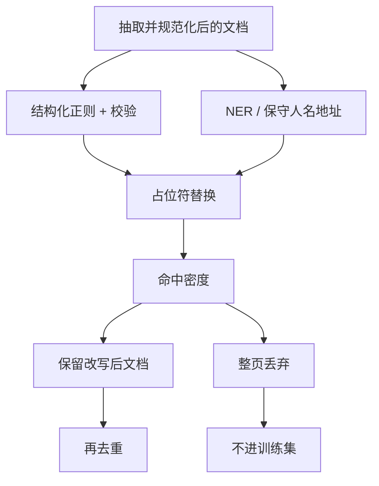

# PII 去除

预训练语料里的电子邮箱、电话与证件号会被模型当成要记忆的字符串；清洗要把可识别个人的跨度拿掉或替换，而不把所有专有名词从语言里剜走。

<footer>—— 综合 C4、Dolma 与常见 PII 识别实践</footer>

网页与论坛包含大量个人可识别信息（PII）：邮箱、电话、身份证号、银行卡、IP、住址，有时还有完整的简历粘贴。语言模型会记忆重复出现的字符串，服务阶段可能被套出。Raffel 等人的 C4 已用正则丢掉部分邮箱与电话；后来的 Dolma 等配方把 PII 当成与质量、毒性并列的一层。本篇写去除的对象、检测手段与替换策略。它不是安全过滤：一篇无攻击性的招聘帖仍可能含手机号。也不是去重：同一条 PII 出现一次就值得处理。

## 问题

PII 没有单一形式语言。邮箱与 URL 可用正则；电话有国家码、分机、把数字写成汉字的变体；证件与银行卡有校验位，但也有故意写错的示例；人名与住址则几乎只能靠命名实体识别，且与新闻里的公众人物、百科条目冲突。召回不足，模型仍会背出用户隐私；精确率不足，模型学不到「谁在何处做了什么」——历史、地理、代码里的示例邮箱（`user@example.com`）会被误杀。

训练与服务的目标也不同。训练侧希望梯度看不到真实手机号，但仍希望看到「联系方式」这类语言现象，因此常用占位符替换。服务侧对用户输入的 PII 可能要另做日志脱敏，那是产品合规，不是语料管道。本篇只讨论进入预训练（及常一并处理的指令数据）之前的文本改写。法律定义因地而异，工程上应把类别表写成配置：至少覆盖联系方式、政府标识、支付账号，再决定是否对人名、精确地理坐标下手。

### 结构化模式与开放实体

第一类 PII 是结构化的：邮箱、URL 中的查询参数、IMEI、信用卡（Luhn 校验可降假阳性）、部分国家的身份证正则。这类应用正则加校验，假阳性相对可控。第二类是开放实体：人名、电话口语、住址。NER 模型在新闻上训练，搬到论坛会把昵称当真人，或把「张三丰」这类文学人物当 PII。第三类是准标识符组合：单独的邮编或年龄不是 PII，与姓名、学校拼在一起就是。管道很难穷尽第三类，通常用「高召回结构化 + 保守 NER」覆盖前两类，并承认准标识符要靠抽样审计而不是宣称清零。

「去掉 PII」若实现成「删掉整页」，会把含一句联系方式的高质量教程整篇丢掉，对小语种尤其伤。优先改写跨度：把匹配换成 `<EMAIL>` 一类特殊 token 或固定假邮箱，页仍可学。只有当页的主体就是个人信息倾倒时，才整页丢弃。

## 方法

管线位置应在正文抽取与语言识别之后、去重前后皆可，但要固定下来：去重键若按原文算，脱敏后重复结构会变，可能让镜像页逃过去。更稳的是：规范化与 PII 改写之后再算精确哈希与 MinHash。步骤上：对结构化模式跑正则；对信用卡等做校验再替换；对人名/地址跑 NER 或启发式（「我住在」后接数字+路）；用统一占位符替换匹配跨度，避免用随机替换引入新的「看起来真」的假号码——模型仍可能把假号码当事实。占位符应进入 tokenizer 词表或保证能被切开，不要变成训练时从未见过的碎字符。

C4 公开描述包含删除含某些邮箱与电话模式的行或页，策略偏丢弃。Dolma 一类后来工作更强调检测器与文档级政策。实践中应用分层：高置信结构化匹配做替换；NER 低置信只记日志或抽样；命中密度超过阈值（例如一页里数十个电话）则整页丢弃，因其更像数据泄漏或垃圾目录。不要在 mapper 里调用外部付费 API 做全量 NER，成本与隐私都不合适；用本地小模型或规则。代码仓库里的密钥、AWS 密钥模式也常并入同一层，尽管严格说是秘密而不是个人——对预训练同样有害。

### 替换、删除与哈希

替换：跨度变成类型占位符，保留句法。删除：跨度消失，左右词粘连，可能制造不通句子。哈希：同一邮箱始终映到同一假名，能保留「这个作者多次出现」的共指，但也保留可链接性，对隐私更弱。预训练一般选类型占位符（所有邮箱同一 token）或删除；需要共指的对话数据再考虑一致性假名。无论哪种，必须在数据卡写明，并保证验证集与训练集同一政策，否则评测里的实体题会失真。

## 机制

记忆机制解释为什么值得做。重复的邮箱、电话在语料中往往来自页脚模板或作者签名，出现次数远高于普通 n-gram，梯度会把它们压进参数。推理时给一段前缀「联系作者：」就可能续出真实字符串。改成占位符后，模型学到的是槽位，而不是某个具体账号。校验位机制降低假阳性：随机 16 位数字不会都当成信用卡，减少对订单号、哈希的误伤。NER 机制是上下文分类，阈值高则漏人名，阈值低则杀城市名与机构名；所以人名策略往往只在「明确的联系上下文」触发，而不是对所有 PERSON 标签动手。

与安全过滤的机制不同：安全看的是内容类别，PII 看的是标识符跨度。一篇安全的博客可以满是电话；一篇攻击性文本可以没有 PII。两个过滤器串联，不要合成一个「敏感」分数。

占位符本身会成为高频 token。若每页页脚都变成 `<EMAIL>`，模型会过度生成该 token。改写后可再跑一遍「占位符密度」启发式，对模板页仍选择丢弃。PII 去除不是把所有页变成带槽位的表格。

### 评测泄漏与逆向

评测集里若含真实邮箱（少见但有），训练集脱敏会导致「记不住评测实体」，这其实是好事。反过来，若用哈希假名且哈希算法可逆或空间小，攻击者仍可能撞库。不要把「脱敏」理解成密码学保证；它是降低训练记忆与减少无意泄露的工程控制。对极敏感类别（证件扫描 OCR 文本），应整页隔离，而不是相信正则已经完美。

## 边界与工程取舍

正则写不全国际化电话与新顶级域名；要按语言桶维护模式库。OCR 与 PDF 抽取会在数字中插入空格与换行，需在 PII 之前做数字串拼接，否则银行卡被拆开漏检。代码许可数据里的作者邮箱是否去除，要与许可证及引用规范一起决定：学术引用需要姓名，不等于需要私人手机。过度 NER 会伤害传记能力与封闭书问答；对人名默认放行、对联系方式默认替换，是常见折中。

分布式运行时，PII 模型与规则必须版本钉死，输出应保留「匹配类型计数」列供审计，但不要把匹配到的原文 PII 写进明文日志。审计抽样应在受控环境进行。宣称「本语料无 PII」在网页数据上几乎必假；诚实的说法是覆盖了哪些类别、抽样假阳性/假阴性、以及整页丢弃的比例。

指令微调数据常比网页更危险：用户粘贴的工单、病历、聊天记录。网页管道的正则不够用，应对 SFT 语料做更严的一层，甚至人工抽检。不要因为预训练已经「去过 PII」就跳过对齐数据。

## 小结

- PII 去除针对可识别个人的跨度，与毒性、质量过滤分离；优先改写跨度而不是整页删除。
- 结构化模式用正则加校验；开放实体用保守 NER 或上下文触发；准标识符组合无法清零。
- 应在规范化与改写之后再去重，避免脱敏前后指纹不一致。
- 占位符优于随机假号码；共指哈希会保留可链接性。
- 命中密度高的页按泄漏/目录处理，整页丢弃。
- 不宣称清零；用类别表、抽样误差与日志政策说话。
- 出处：Raffel et al., C4；Soldaini et al., Dolma；以及 Presidio 一类 PII 识别工程实践。
