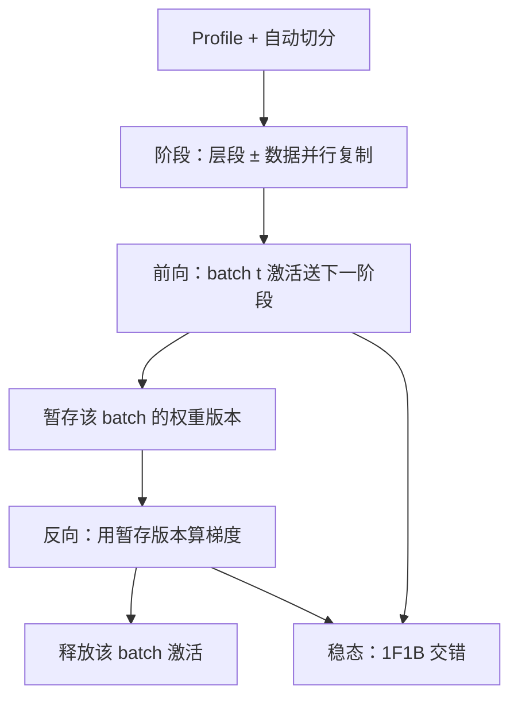

# PipeDream

    
DNN 训练的管道是双向的：前向走过的权重版本，反向还必须对得上；只抄 CPU 流水线会在梯度上算错账。

    <footer>—— Narayanan、Harlap 等，PipeDream，SOSP 2019；预印本 arXiv:1806.03377</footer>

微软研究院、CMU 与斯坦福的 **PipeDream**（Deepak Narayanan、Aaron Harlap、Amar Phanishayee 等）在数据并行（批内切开）之上加入 **批间流水线**：不同 worker 同时处理不同 mini-batch 的前向或反向，重叠计算与通信。SOSP 2019 论文标题是 *PipeDream: Generalized Pipeline Parallelism for DNN Training*；2018 年预印本 *PipeDream: Fast and Efficient Pipeline Parallel DNN Training* 同号 **1806.03377**。相对 [GPipe](/llm/gpipe)「一个 mini-batch 内微批先全部前向再全部反向」，PipeDream 允许管道里同时跑 **多个 mini-batch**，并处理由此而来的 **权重版本**。本篇写 1F1B、weight stashing 与自动切分；LLM 预训练后来常用的同步 Flush 变体在 [流水线并行](/llm/pipeline-parallel) 里对齐。

## 问题

只做批内并行（数据并行或张量切分）时，worker 数上去通信占比上升，加速比饱和。把层切到不同卡可以减每卡计算，但朴素流水线有两个 DNN 特有坑：

1. **双向**：反向需要前向的激活与「当时」的权重。CPU 指令流水线没有「还要再倒着走一遍」这一条。
2. **版本**：若阶段 1 已经用新权重开始下一个 batch 的前向，阶段 $k$ 的反向梯度却对应旧前向，梯度与参数错配，等价于带噪声的异步 SGD，大模型预训练通常不能接受未加约束的错配。

GPipe 用 flush：每个 mini-batch（切成微批）算完再更新，版本一致，但气泡大、激活按微批数堆。PipeDream 要问：能否让硬件更满，同时仍给出 **数值上可陈述** 的梯度（通过暂存权重），并且自动决定层怎么切、哪一段再做数据并行复制。

### 1F1B：稳态下一前向配一反向

调度名为 **1F1B**（one-forward-one-backward）。预热时各阶段先把管道填满；进入稳态后，每个 worker 做完一个 batch 的前向，立刻做另一个（更早的）batch 的反向，尽量不空转。通信（边界激活与梯度）与计算重叠。阶段还可以 **复制**（同一段层放在多张卡上做数据并行），形成「垂直切层 + 水平复制」的二维布局。切分器基于 profile：估每层计算与激活体积，用动态规划一类搜索平衡负载、减小跨阶段通信。

论文报相对常见批内并行最多约 **5.3×** 端到端训到目标精度的加速。这是 2019 年 CNN/NMT 等任务与当时 GPU 数下的数字，不是 2026 年千卡 LLM 的加速比。任务、精度目标与硬件一变，倍数不能照抄。

## 方法

**Weight stashing（权重暂存）**：阶段 $i$ 为每个还在管道里、尚未完成反向的 mini-batch 保留一份该 batch 前向时用的权重（或等价版本号）。反向时取出对应版本算梯度，保证「这一份梯度属于那一次前向」。内存换正确性。若不暂存而允许多版本异步更新，吞吐更高、收敛噪声更大，论文把这当成可选项而不是 LLM 预训练的默认。

与 GPipe 的对照：GPipe 在 $m$ 个微批上同步更新一次，激活峰值随 $m$；PipeDream 的 1F1B 让早期阶段更快释放已完成反向的激活，峰值更接近「管道深度」而不是「所有微批」。后来 Megatron 采用的 **PipeDream-Flush** 折中：调度像 1F1B，但每个全局 batch 仍 flush 并同步更新，去掉跨 batch 异步，激活约 $O(P)$。那是后续系统名词，SOSP 正文写的是通用 1F1B + 暂存 + 自动分区。

### 自动分区要平衡的不只是 FLOPs

切在通信体积最小的张量边界上（例如通道数已缩小的层后）能减 InfiniBand 压力。切得太碎，阶段数 $P$ 增大，预热气泡和要暂存的版本数都涨。水平复制把热段复制多份，等价于给该段加 DP，减轻负载不均，但那一段的梯度要在副本间同步。搜索目标是训练吞吐（或达到目标精度的时间），不是单纯的 pipeline 满载率——错版本若导致要多训 20% 步，满载毫无意义。

## 机制

1F1B 降低空转，是因为反向的计算量通常与前向同阶：稳态下每个阶段交替两种工作，设备不会在「等最后一个前向」时闲着。暂存的机制是把异步执行 **重新同步到每条样本自己的计算图**：全局看起来管道里有多批，局部每条样本仍是「同一权重上的前向+反向」。这与 Hogwild 式随便用最新权重不同。暂存份数在稳态下与该阶段看到的 in-flight batch 数相当，大致随流水线深度增长，这是内存税。

双向管道使「只重叠前向」的朴素方案失败：反向梯度必须沿原路返回，占用与前向相反的链路。调度若只优化前向满载，反向会堵。PipeDream 把前向优先级与反向优先级写进 1F1B，避免只灌新 batch、永不还款。自动切分依赖的 profile 在真实多卡上会漂（网络争用），生产中往往要再手工拧切点——编译器式系统如 [Alpa](/llm/alpa) 后来把这一层再自动化。

不要把 1F1B 四个字母当成已经保证同步 SGD。问清楚：有没有 flush？有没有 stashing？无 flush 无暂存就是异步。LLM 预训练日志里写 1F1B，多半是 Flush 变体。

### 和 GPipe、Megatron、Alpa

GPipe：同步、微批、激活 $\propto m$、语义最干净。PipeDream：批间重叠、暂存、自动切+复制，吞吐优先。Megatron 训练栈采用 Flush 版 1F1B，叠 [张量并行](/llm/tensor-parallel)，是生产 LLM 的主流。Alpa 在编译器里搜阶段，调度语义仍要在 GPipe 与 1F1B 之间选。推理没有反向，1F1B 不能直接搬到 decode；见推理期流水线另文。

## 边界与工程取舍

SOSP 实验以当时的 CNN、NMT 等为主，不是 530B 稠密 LM。暂存在优化器状态（Adam 的 $m,v$）上也要定义：只暂存权重、动量是否共享，会影响数值。自动切分假设层可线性排列；MoE、编码器–解码器交叉注意要额外边。5.3× 对照的是「常用批内并行」，不是对照已经调过微批的 GPipe 在同一 $m$ 下的公平比——读论文实验设置再引用倍数。

检查点必须带版本队列，否则恢复后管道里的 in-flight batch 对不上。Dropout 与 BN 在多版本下更嘈杂。不要把 Harlap 等 2018 预印本与 2019 SOSP 当成两篇无关工作；引用会议版，arXiv 号用 1806.03377。

真实编号：Narayanan、Harlap、Phanishayee 等，SOSP 2019；arXiv:1806.03377。GPipe 是 1811.06965。后续 PipeDream-2BW 等减权重备份的工作是另文，不要写进 SOSP 正文当已包含。

## 小结

- PipeDream 用批间流水线 + 1F1B 提高多卡训练吞吐，并用权重暂存对齐前向/反向版本。
- 自动把层分到阶段，阶段内可再数据并行；相对批内并行最多约 5.3×（论文任务）。
- 无暂存的异步 1F1B 与有 flush 的同步 1F1B 不是同一语义；LLM 多用后者。
- 出处：Narayanan 等，SOSP 2019，arXiv:1806.03377。
