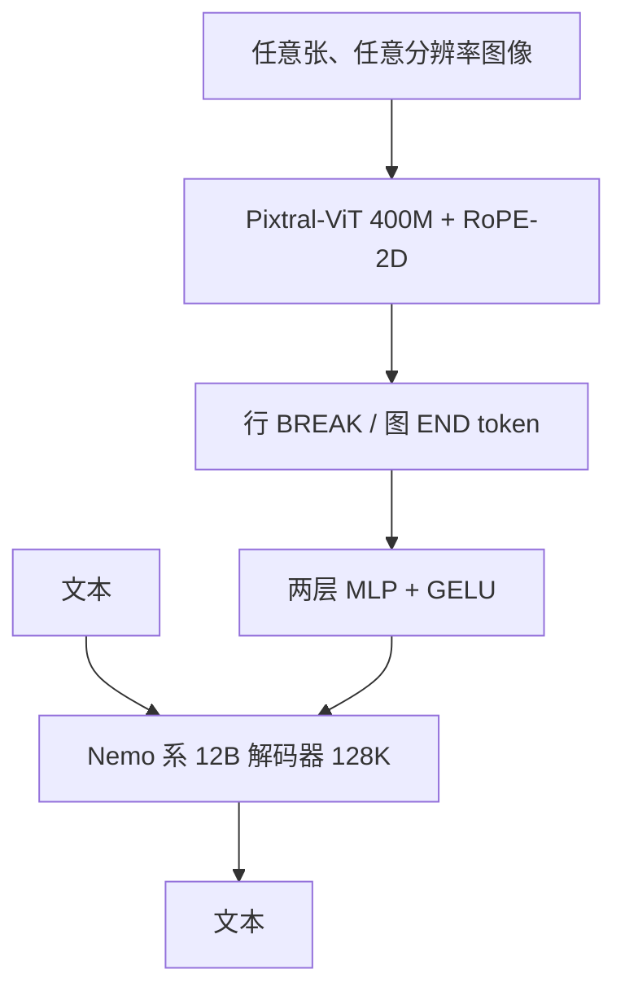

# Pixtral

Pixtral 用从零训练的视觉编码器按原生分辨率与长宽比吃图，并建在 Mistral Nemo 12B 上，使多模态推理不必牺牲同尺寸的纯文本能力。

<footer>—— Mistral AI 与 Agrawal 等，Pixtral 12B，arXiv:2410.07073</footer>

2024 年 9 月 Mistral 发布 **Pixtral 12B**（博客日期 9 月 17 日；权重标签 2409），Apache 2.0。它不是在冻结 LLM 上插一层浅适配器了事：视觉编码器 **Pixtral-ViT 约 400M 从零训**，解码器明确建在 [Mistral NeMo](/llm/mistral-nemo) 12B 上，目标是图文交错、多图、128K，并且 MATH / HumanEval 一类文本任务仍保持尺寸档竞争力。论文额外贡献评测协议讨论与 **MM-MT-Bench**。本篇按 arXiv:2410.07073 写 12B；同年 11 月的 Pixtral Large 是另一张旗舰卡，不把 124B 的层表安进来。

## 问题

开源 MLLM 常见两种塌法。一种是视觉很强、文本指令变笨，因为图文对齐把语言骨干洗偏。一种是固定 336 边长或固定切格，文档长宽比一变就畸变，OCR 与图表掉点。Pixtral 同时要：原生分辨率、任意长宽比、任意张数（只要总长 ≤ 128K），以及「当纯文本模型用时仍像 Nemo」。

评测本身也不干净。论文指出：默认提示词过弱、精确字符串匹配会把「6.0」判错。闭源数字与开源复现不在同一协议上。于是方法问题变成两个：编码器如何对可变网格做相对位置；如何用统一提示与更松的解析比较模型。

### 解码器就是 Nemo，编码器不是 CLIP 热插拔

表 1：解码器 $d=5120$，40 层，head_dim 128，n_heads 32，n_kv_heads 8，上下文 131072，词表 131072；编码器 $d=1024$，24 层，head_dim 64，16 头，FFN 4096，patch 16，编码器序列上限 4096。视觉 token 经两层全连接（中间同宽、GELU）投到解码器宽度，之后与文本 token 一视同仁，包括一维 RoPE 与因果注意力。这是早融合式的交错自注意力，不是 Llama 3.2 那种冻结 LM + 交叉注意力适配器。

博客写 Pixtral 作为 Nemo 12B 的 drop-in：无图请求应表现得像文本 12B。服务上仍要加载 ViT；是否短路视觉支路看实现。不要假设「纯文本就自动少 400M 显存」除非运行时真的没装编码器。

## 方法

Pixtral-ViT 相对常见 CLIP ViT 的四处改动：（1）**行间断 token** `[IMAGE BREAK]`，以及图末 `[IMAGE END]`，用来区分「同样 patch 数、不同长宽比」；（2）FFN 使用门控；（3）**序列打包**加块对角掩码，使一批里多图互不注意；（4）**RoPE-2D** 替代绝对可学习位置，使分辨率变化不必插值位置表。RoPE-2D 把特征的偶数 / 奇数维分别旋到高与宽上，内积只依赖相对 $\Delta h,\Delta w$。用户可按延迟选低分辨率、按细粒度选高分辨率，token 数随面积变，这是显式旋钮而不是隐藏切格。

### MM-MT-Bench 与统一协议

MM-MT-Bench：92 段对话，图类含图表、表格、PDF 页、示意图等，多轮，用 GPT-4o 当裁判打 1–10，论文称与 LMSys Vision Elo 相关约 0.91。主表在同一提示与同一度量下重评 Qwen2-VL 7B、Llama-3.2 11B 等；对部分模型另报「宽松解析」以免格式惩罚。主结果（论文表，CoT 设定）：Pixtral 12B 的 MathVista 58.3、MMMU 52.0、ChartQA 81.8、DocVQA 90.7。这些是该协议下的数，不要和各家自行报告的峰值混成一行。

## 机制

可变分辨率的机制是相对位置：绝对位置嵌入在 224 上训、到 1024 就要插值，OCR 会碎；RoPE-2D 把「左邻右舍」做成旋转，网格变大仍是同一相对结构。Break token 避免「512×512 的 32×32 patch」与「256×1024 的 16×64 patch」在序列长度相近时无法区分版面。打包 + 块对角使训练吞吐接近文本 packing，而不把两张图的 patch 混成一张。

文本能力保留的机制是：解码器从已经强的 Nemo 出发，交错图文预训练，而不是用弱视觉对齐去覆盖全部 LM 权重却没有足够的纯文本回放。即便如此，任何多模态继续训练都有洗掉文本的风险；论文用文本基准说明他们压住了这条。多图靠因果自注意力在序列里跳，128K 是上限不是免费：两张 4K 图可以把窗口打满。

论文对 Llama-3.2 11B 在严格精确匹配下分数很低、宽松解析后回升，用来说明「评测格式」能改变叙事。引用 Pixtral 对照时，应写明是否同一提示、是否 flexible parsing，否则那是两套榜。

### 和 InternVL2、MiniCPM-V、Llama 3.2 视觉

[InternVL2](/llm/internvl2) 切 448 格 + 像素重排，编码器来自 InternViT。[MiniCPM-V](/llm/minicpm) 切块后 perceiver 压缩，打端侧。Llama 3.2 视觉冻 LM、交叉注意力。Pixtral 选「自训 ViT + 满自注意力交错 + 继承 Nemo 文本」。文档 OCR 上谁赢取决于分辨率旋钮与协议；不要只抄 MMMU 一句。

## 边界与工程取舍

Apache 2.0 使 12B 视觉可进商用栈，这与 Large / Codestral 的研究许可不同。博客后来标记 12B 为 deprecated、让位给更新的视觉型号，但论文与 2409 权重仍是可引用的 2024 年开源点。编码器序列 4096 限制单张极高分辨率；超过要先缩小。MM-MT-Bench 只有 92 场，适合协议讨论，不适合当唯一上线门禁。

不要把 Pixtral Large 的层数写进 12B。不要声称「原生分辨率无损」——patch 16 仍是下采样，只是不再强制方图。评测代码在 mistral-evals，复现应走同一仓库。

分辨率旋钮要在产品里暴露给调用方：缩略图聊天用低分辨率省预填充，发票 OCR 用更高像素。默认一张「中等边长」会在两种负载上都吃亏。多图对话应在模板里固定图像顺序与 break token，否则模型分不清「第一张表」和「第二张图」。文本 drop-in 若要成立，回归集必须同时跑纯文本 IFEval / 数学与带图 VQA，防止上视觉数据之后指令变啰嗦或拒答增多。Apache 2.0 覆盖 12B 权重，训练数据与评测裁判模型（GPT-4o）并不因此可再分发。

博客与论文日期接近但不是同一天：产品博文 2024-09-17，arXiv:2410.07073。MMMU 博客写 52.5%（CoT），论文主表 52.0，引用时钉来源，不要两数混用还不加设定。

## 小结

- Pixtral 12B 是 2024 年 9 月 Apache 2.0 多模态模型：400M 自训 ViT + Nemo 12B 解码器，128K，多图交错。
- RoPE-2D、break token、序列打包支撑可变分辨率；视觉经 MLP 进入因果自注意力。
- 设计目标包括不牺牲同尺寸文本能力；评测强调统一提示与 MM-MT-Bench。
- 与切格派、perceiver 派、交叉注意力派不是同一套实现。
- 出处：Agrawal 等，*Pixtral 12B*，arXiv:2410.07073；Mistral Pixtral 12B 博客，2024-09-17。
