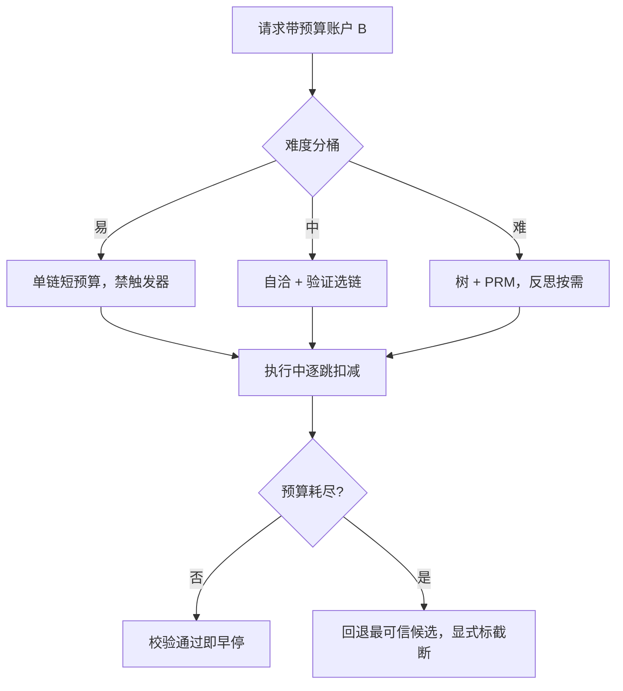

# 推理预算的分配

预算不是限速带，是分配问题：同一张 token 账单，花在宽度、深度、验证还是工具上，答案随题目难度变。

<footer>—— Snell et al., 2024；Muennighoff et al., s1, 2025</footer>

[上一课](/llm/pl-tool-planning)把工具调用写成了带预算上限的计划对象。至此本课程每个机制都是一个花钱的方向：第一课的树与回溯、第二课的逐步打分、第三课的反思轮次、第四课的分解调用、第五课的执行节点。缺口是把账合并：固定一笔推理预算，往哪花、按什么分、超了怎么办。本课写预算的记账、静态分桶与动态调整。

## 问题

宽度（$N$ 条链）、深度（树、长链）、验证器调用、分解与工具次数，最终都折成同一张推理 FLOPs 账单。错误的分配有两种对称形态：全局加大 $N$——钱摊在简单题的饱和区；无差别放长链——钱烧在[过度思考](/llm/overthinking)的复读尾部。[测试时计算](/llm/test-time-scaling)的基本结论是最优组合随题目相对难度变：没有单一策略在所有桶上同时最优，分配本身就是策略。第二个缺口是超支行为：预算耗尽时系统做什么，决定了这条链是「体面收束」还是「截断污染下游」。

## 方法

记账先行：预算单位要能跨机制相加。生成 token 分「链内思维」与「最终答案」两栏，[推理长度控制](/llm/reasoning-length-control)的结论是二者分开塑形；打分前向、工具调用、PRM 调用按固定折算率并进同一请求账户。四个闸门（深度、分支、节点数、时间）从第一课继承，全部作用在同一账户上。

静态分配按难度分桶配置：易题单链短预算，禁触发器；中题自洽加验证选链；难题开树配 PRM，反思与分解按需启用。[Test-time compute 综述](/llm/snell-test-time)给出的量级是：按桶配策略相对盲目的 BoN 可以把效率提高数倍，小模型配计算最优能匹敌参数量大一个数量级模型的朴素解码——分配的价值不在省，在把钱挪到有边际收益的桶里。动态分配叠加在静态之上：校验通过即早停；分数门控报警时加注（开新分支、触发一轮反思）；预算字段贯穿请求，每一跳扣减。

训练侧要见过预算：把多个预算档写进 RL 采样，或用 budget forcing 在到达上限时强制收束——只靠推理期截断，模型没学过「在 $B$ 内写完」，准确率会掉（s1 的预算强迫是控制手段，不是训练替代）。

## 机制

超支行为是正确性问题。预算耗尽时的默认动作是回退：从已探索候选中取当前最可信的一条，按显式的截断语义返回——`finish` 标明预算触发，调用方据此决定要不要降级重试，而不是把半截结论当完整话语写进多轮历史（停止协议的语义见[停用词与 stop sequences](/llm/stop-sequences)）。静默截断是最坏的出口：它把系统失败伪装成模型失败，评测与用户同时被误导。

## 边界

推理预算有收益上限：很难的题上搜索补不齐预训练缺失的知识，桶里持续超支的题目应该回流到训练侧，而不是继续加注。摊销逻辑要分账：训练期花的 FLOPs 摊到所有请求，推理期只摊到单请求，比较「多训练 vs 多推理」时口径不能混。延迟 SLA 与离线评测不同：树与自洽的收益按吞吐算，在线按尾延迟算，同一策略在两张榜上名次不同。最后，分配策略本身要用成本-质量曲线验收：每一档声明它停在曲线的哪一段，不许只报准确率不报账单。

## 小结

- 分配就是策略：宽度、深度、验证、工具同账核算，按难度分桶各配各的。
- 静态配桶加动态加注；早停与门控是节流的两个方向。
- 训练要见过多档预算；纯推理截断是最后闸不是控制手段。
- 超支走显式回退与截断语义；静默截断把系统失败伪装成模型失败。
- 很难题的超支回流训练侧；分配策略用成本-质量曲线验收。
- 出处：Snell et al., 2024；Muennighoff et al., *s1*, 2025；Yu et al., DAPO, 2025（长度塑形）。
