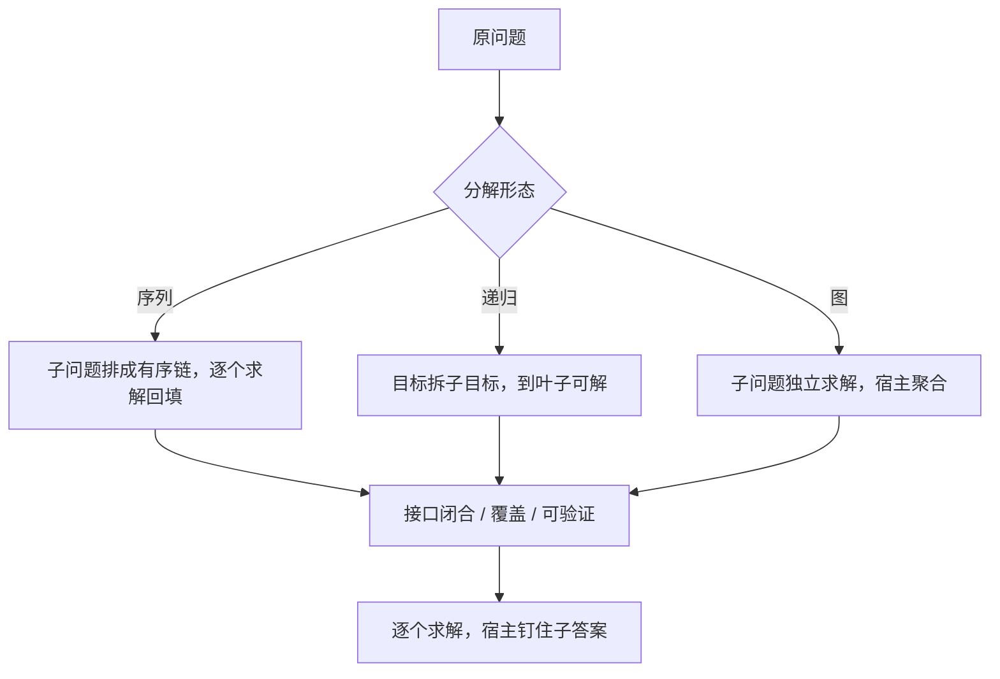
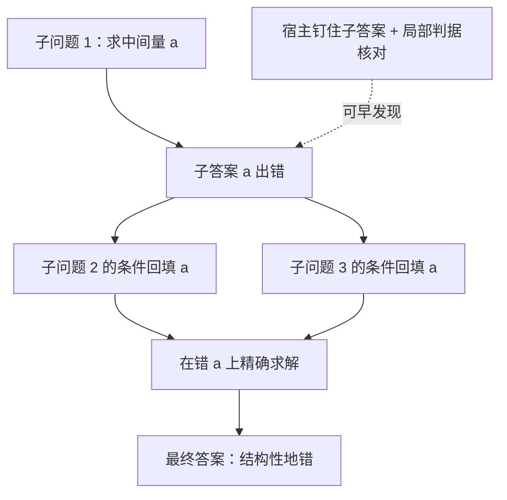

# 规划域的分解

分解不是把问题说小一点，而是造出一批各自可解、接口闭合的子问题；接口拆错，后面每一步都在精确地解一个错问题。

<footer>—— 据 Zhou et al., Least-to-Most Prompting, 2022；Wang et al., Plan-and-Solve, ACL 2023；Besta et al., Graph of Thoughts, 2023 整理</footer>

[上一课](/llm/pl-reflection-design)写的是在既有问题里修正路径：触发、内容与停止判据。但有些失败不在路径而在问题本身——多跳依赖太长、组合深度超出单链外推能力，错不是因为没想清楚，而是因为问题从来没有被拆到「一步可解」的粒度。缺口是分解：把规划域拆成子问题，让每次求解只面对一个可核对的局部。本课写分解的三种形态、接口约束与误差传播；[Least-to-Most](/llm/least-to-most) 与 [Self-Ask](/llm/self-ask) 的提示形态不重讲。

## 问题

[思维链](/llm/chain-of-thought)在组合外推上失效：训练分布里见过的步数内它步步行，超出后缺步、跳步、把未求出的中间量直接写进最终式。Plan-and-Solve 用「先写计划再求解」压缺步，但计划仍是同一条轨迹上的文本，没有独立求解与回填边界。分解走得更远：先产出子问题序列，再**多次调用**逐个求解，子答案回填进后续上下文。这引入了新的失败面——分解本身会错：子问题前置缺失（第 3 问依赖一个没人求过的量）、覆盖不全（子问题加起来不回答原问题）、粒度失衡（细到每次调用只做一次加法，粗到退化回单链）。

## 方法

三种形态按结构从弱到强。**序列分解**（Least-to-Most）：子问题排成有序链，第 $i$ 个子问题的条件里回填前 $i-1$ 个子答案；适合依赖单向、深度可数的任务。**递归分解**：目标拆成子目标，子目标再拆，直到到达可直接求解的叶子；深度可变，适合层次分明的规划域（证明的引理、路线的区段）。**图分解**（[Graph of Thoughts](/llm/graph-of-thoughts)）：子问题独立并行，部分解在宿主里聚合与精炼；适合分治后必须合流的任务。

三条约束跨形态通用。接口闭合：每个子问题的输入必须由前文或环境可满足，发现悬空引用应早失败，而不是让求解器编造。覆盖检查：子问题集合要能拼回原问题，这可以在分解产出时用一次核对调用检查。可验证：每个子问题应有局部判据——能规则核对的用规则，不能的至少核对类型与量纲。

「接口闭合」翻译成大白话：每个子问题要用的已知条件，必须已经躺在题目原文或前面子问题的答案里。如果第 3 问用到一个「没人算过的量」，这就是悬空引用——求解器多半会现编一个像模像样的数。早失败、重新拆，比让它在编造的数字上精确推理要便宜得多。

Zhou 等人在 SCAN 组合泛化拆分上报告：思维链只有约 16% 的准确率，least-to-most 达到 99.7%——分解的收益集中在「单链外推不动」的组合深度上；单链本来就会的题，分解只增加调用与出错机会。

## 机制

分解误差沿回填协议传播，且比单链更难改口：单链错一步可以[回溯](/llm/self-verification-backtrack)，分解错是结构错——第 1 问的答案错了，第 3 问在忠实求解一个错前提。所以宿主必须钉住每个子答案：子问题与子答案都写进后续上下文的是「钉住」，任由模型转述是「漂移」。成本上分解是多次调用加回填 token，收益来自重复使用的短求解；简单题上它是纯开销。与 [ToT](/llm/tree-of-thoughts) 的分工：分解默认串行不分叉，把深度问题摊平；要在同一子问题上比选多个候选，才轮到上一课的树与分数。

「结构错 vs 路径错」的直觉类比：瓦工贴歪一块砖是路径错，撬掉重贴就行；图纸把承重墙画错了是结构错，后面每个房间都照错的图纸施工，而且每间都「施工得很精确」。分解把推理从贴砖升级成看图纸，所以它出错时也更贵——错在拆题这一步，后面每次调用都在放大它。

## 边界

分解适用于结构与依赖可显式表达的任务；开放域里模型会提出幻觉子目标，覆盖检查也只剩模型自评，收益上限随之封顶。分解产出的是子问题序列，不是可调度 DAG——要把节点换成工具调用、依赖边换成执行计划，是下一课工具规划的事。粒度没有免费午餐：切得太细，调用次数与回填误差同步放大；切得太粗，分解退化成一段更长的思维链，什么也没换来。

数字实例（示意）：一道 12 步的应用题，若拆成 40 个子问题，假设每次调用连回填要 600 token，光子问题就要约 2.4 万 token，还给了 40 个出错机会；反过来只拆成 2 个子问题，每个要单链跑 6 步——基本没享受分解的好处。好的粒度通常让每个子问题落在「一次调用、三五步内、有局部判据」的区间。

## 小结

- 分解三形态：序列回填、递归到叶、图聚合；结构强度与适用域依次不同。
- 三条约束：接口闭合、覆盖、可验证；悬空引用应早失败。
- 误差沿回填传播且难改口；宿主必须钉住子答案，不许模型转述。
- 收益集中在组合外推；单链本来会的题，分解是纯开销。
- 分解产出不是可调度计划；换工具与执行器是下一课的题目。
- 出处：Zhou et al., *Least-to-Most Prompting*, 2022；Wang et al., *Plan-and-Solve*, ACL 2023；Besta et al., *Graph of Thoughts*, 2023。
