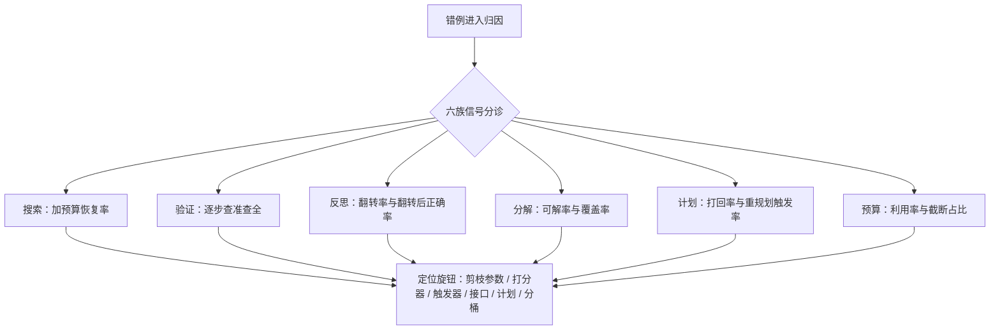

# 失败模式分类与收束

「答错了」不是数据；上线之后要回答的是坏了哪一环——归因坐标先于归因结论。

<footer>—— 据本课程七课与 Lightman et al., 2023；Snell et al., 2024 等所引文献整理</footer>

[上一课](/llm/pl-budget-allocation)把六种花钱的方向并成一张账，按难度分桶各配策略。至此零件齐了：树与回溯、逐步打分、反思、分解、工具计划、预算分配。但线上系统最终被问的不是「钱花在哪」，而是「坏了怎么归因」——只看端到端准确率，六种机制的错误全糊在一个数字里。本课把失败模式分成六族，给每族配可观测信号与诊断顺序。**本课程到此收束。**

## 问题

推理时系统的失败不是单一变量。搜索剪错、验证器误判、反思复读、分解传错、计划过期、预算烧穿，都会以「答案错了」的同一种表象落到监控里；调参的人却需要知道动哪个旋钮。缺的是一张归因坐标：每族失败有定义、有信号、有对应的修复方向。没有这张表，团队会在验证器上白调一周，而真正的问题是把聚合函数从 $\min$ 换成了均值。

## 方法

六族失败，六组信号。**搜索失败**——剪掉正确前缀、探索不足、分支与深度配错；信号是加预算恢复率：同题同采样换大预算重跑，恢复即搜索侧问题，不恢复是能力问题。**验证失败**——假阳性保护假推理、假阴性剪真链、聚合与训练口径错配；信号是逐步检测的查准查全与聚合口径审计。**反思失败**——复读空转、朝错误归因漂移、记忆污染；信号是[第三课](/llm/pl-reflection-design)的答案翻转率与翻转后正确率。**分解失败**——悬空引用、覆盖不全、误差沿回填传播；信号是子问题可解率与覆盖检查通过率。**计划失败**——引用断裂、工具改版、重规划缺失；信号是静态校验打回率与重规划触发率。**预算失败**——饱和区烧钱、截断污染下游；信号是分桶的预算利用率与显式截断占比。

加预算恢复率是六族里最便宜的一个判据：抽样若干错题，翻倍预算重跑即可执行。恢复的题记在搜索与预算头上，不恢复的记在模型头上——这张分账表直接决定下一笔钱投推理侧还是训练侧。

## 机制

诊断有顺序，因为失败会伪装。验证器先查：它同时喂搜索（第二课的剪枝）与反思（第三课的门控），校准一坏，两处一起坏，且表现为搜索侧的「探索不足」。搜索参数次查：换聚合、换 $c$、换闸门配比，都是配置级改动。预算最后查：分桶利用率会暴露「把难题桶的钱匀给了易题桶」的错配。评测必须双拆：按难度桶拆，按失败族拆；只报平均准确率的推理系统，等于把六族失败混装进一个未知数。上线的顺序随之固定：先钉真值通道（可核对域的终局校验），再配预算分桶，再开搜索与反思的触发器，最后挂六族信号的面板——顺序倒了，前面每一步的收益都无法归因。

## 边界

失败常复合：一个错例可以同时是「PRM 假阳性」加「难题桶预算不足」，分类是归因坐标，不是互斥判决，抽样深查永远需要。开放域没有可靠真值通道时，六族里只有计划与预算两族能硬观测，其余只能代理指标。最后重申全课程的地基：评估器与校验器的校准决定搜索与反思的上限，[验证器瓶颈](/llm/verifier-bottleneck)不会因为搜索更花哨而消失；预算的收益封顶于基座能力，持续超支的桶该回流训练。**本课程到此收束。**

## 小结

- 六族失败各有定义与信号：搜索、验证、反思、分解、计划、预算；「答错」必须落到族上。
- 加预算恢复率是最便宜的判据：恢复记推理侧，不恢复记训练侧。
- 诊断顺序：先验证器校准，再搜索参数，再预算分桶；顺序倒了一切无法归因。
- 评测双拆：按难度桶、按失败族；平均准确率不是运维接口。
- 真值通道、预算分桶、触发器、监控面板按此顺序上线。
- 出处：据本课程七课整理；核心文献 Lightman et al., *Let's Verify Step by Step*, 2023；Yao et al., *Tree of Thoughts*, NeurIPS 2023；Shinn et al., *Reflexion*, NeurIPS 2023；Snell et al., 2024。
