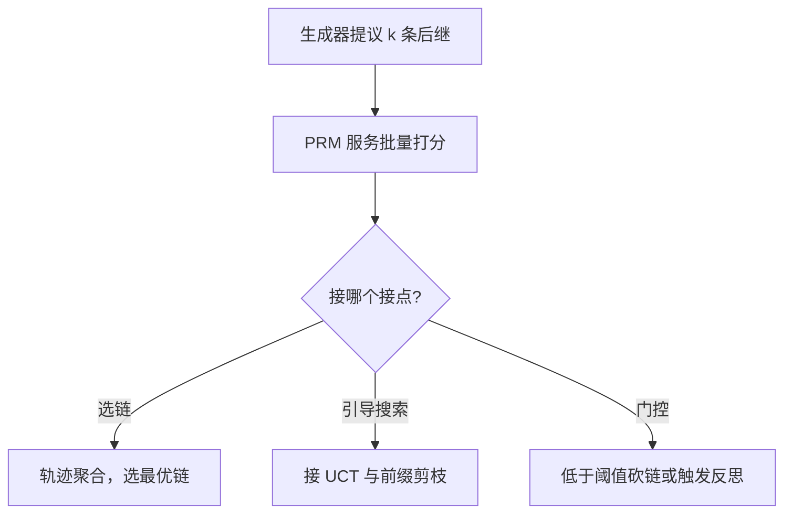

# 过程监督在推理时的应用

终局 0/1 告诉你链死没死，不告诉你死在哪一步；把分数贴到每一步上，搜索与剪枝才有地方下手。

<footer>—— Lightman et al., Let's Verify Step by Step, 2023；Uesato et al., Solving math word problems with process- and outcome-based feedback, 2022</footer>

[上一课](/llm/pl-tot-mcts-engineering)把 ToT 与 MCTS 搬进服务，四步循环里唯一没定的是评估器的分数从哪来：模型自评朝流畅假推理剪，终局 0/1 要等链跑完才知道死活，长链上一错整条扔。缺口是过程监督：PRM 给每步一个「这一步是否正确」的分数，剪枝发生在前缀上而不是终点上。本课写 PRM 在推理时的三种用法与服务形态。逐步分数的定义与标签协议见[过程监督 / PRM](/llm/process-supervision)，训练侧工序见[过程奖励模型训练](/llm/process-reward-training)，这里只补差。

## 问题

结果监督的信息在终点才到。[Best-of-N](/llm/best-of-n) 在长链上方差很大：一百步里一步算错，$R=0$，选链者不知道错在哪，只能整条扔；树搜索没有逐步分数就只能靠似然或自评，前者是[束搜索](/llm/beam-vs-sample)的目标——似然不等于正确性，后者剪向流畅。PRM 把树的每条边变成可比较的 $Q$，剪枝、配额、早停才有了统一量纲。但接进推理立刻引出三件事：聚合规则怎么定，打错了怎么办，钱怎么记。

## 方法

三种用法对应三个接点。其一，独立验证器：并行采 $N$ 条链，PRM 对每条算轨迹分选优。聚合函数定义轨迹目标：取 $\min$ 是「任何一步小错即否决」，适合证明类任务；取均值容忍小瑕疵，适合开放任务；只取末步等价于只信结论。其二，搜索启发式：上一课四步循环里的评估接 PRM，UCT 配额与剪枝在逐步分数上工作，lookahead 只在分数分不出高下时再花前向。其三，门控与节流：链上分数跌破阈值即砍，或分数停滞即触发反思——PRM 从选链器变成节流阀。

服务形态上，PRM 是被搜索并发调用的打分服务：扩展 $k$ 个后继就要 $k$ 次打分，节点数即调用量；同一前缀的逐步分数可缓存复用，兄弟分支只补增量步。打分请求应批量化——单条往返的延迟在树搜索里乘上节点数，会成为新的长尾。

Lightman 等人发布的 PRM800K 含约 80 万条步级标注，量级比结果标签贵一个数量级；推理时用更便宜的代理打分器时，先测它的逐步查准查全，再谈用它省了多少钱。

## 机制

两类错误不对称。假阴性——好前缀被判低分——剪掉正确分支，表现为覆盖不足，多花预算可以部分挽回；假阳性——错前缀被判高分——会被搜索放大：束持续保护「写得像证明、中间已错」的链，预算花得越多离真值越远。所以上线顺序是先报逐步检测指标再报端到端准确率；校准差的 PRM 上加大搜索是有害的。聚合规则必须与训练口径一致：训练用末步监督、推理取 $\min$，等于换了任务定义。

账要记全：PRM 前向计入测试时 FLOPs。[Snell 等 2024 的综述](/llm/snell-test-time)里计算最优的对比已扣掉这部分——只报生成 token 不报评估开销，成本-质量曲线会整个画歪；上一课的节点闸门应把打分前向与生成前分开计数。

## 边界

开放域没有可靠的逐步真值：PRM 在训练分布外的步骤上会自信地错，只能当弱先验，不能当裁判。可核对域里 PRM 也不能当唯一真值：终局应再过独立解析或执行，见[数学验证器与等价](/llm/math-verifier-equivalence)与[代码验证器：单元测试](/llm/code-verifier-unittests)。分数还要防过优化——生成器学会专门写「打分器喜欢的步骤」，就是[验证器瓶颈](/llm/verifier-bottleneck)在推理时的形态，此时换分数比加预算有效。

## 小结

- PRM 在推理时三种用法：选链验证器、搜索启发式、门控节流；接点不同，成本与风险不同。
- 聚合（min / 积 / 均值 / 末步）定义轨迹目标，必须与训练口径一致，换聚合等于换任务。
- 假阴性可挽回，假阳性被搜索放大；先报逐步检测指标，再报端到端准确率。
- PRM 前向计入推理 FLOPs；调用量随节点数线性涨，打分要批量与缓存。
- 可核对域终局仍要独立解析或执行；开放域 PRM 只是弱先验。
- 出处：Lightman et al., *Let's Verify Step by Step*, 2023；Uesato et al., 2022；Snell et al., 2024。
