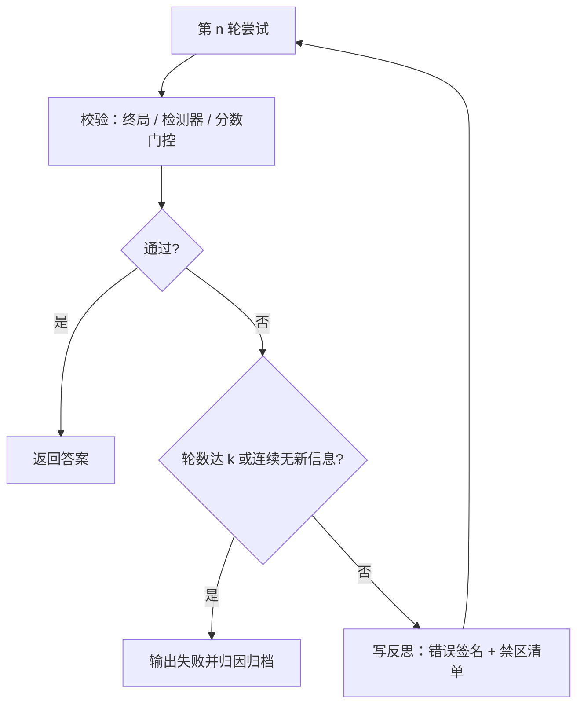

# 反思机制的设计

「再想想」若不改变答案，就是把同一句话再说一遍；反思的设计问题不是要不要想，而是何时触发、写什么、何时停。

<footer>—— 据 Shinn et al., Reflexion, NeurIPS 2023；Madaan et al., Self-Refine, 2023；DeepSeek-AI, DeepSeek-R1, 2025 整理</footer>

[上一课](/llm/pl-process-supervision-inference)把树上的剪枝交给外部 PRM：分数硬，但要多养一个打分模型，且开放域没有可靠的逐步真值。没有 PRM、预算也买不起一棵树时，唯一剩下的是链内的自我修正。本课写反思机制的设计——触发条件、反思内容、轮数预算与停止判据，覆盖回合内的[自我验证与回溯](/llm/self-verification-backtrack)与跨回合的 [Reflexion](/llm/reflexion) 两种形态；它们的机制基础不重讲。

## 问题

链写错后让模型「再想想」，最常见的结局是复读：同样的假设、同样的算式、同样的死路，只是换了措辞。原因是反思被当成一句咒语，而不是一次有输入的计算。设计要回答四件事：**何时触发**——无条件反思既浪费也是[过度思考](/llm/overthinking)的来源；**写什么**——「我应该更认真」没有可执行约束，下一回合条件于它只会再错一遍；**花多少**——反思本身是 token，没有上限就可能在错误方向上无限深挖；**怎么停**——没有判据，「再想一次」永远成立。

## 方法

触发器按成本排序：终局校验失败（答案解析不出、单测挂、格式不符）最便宜最硬；外部检测器报警次之；上一课 PRM 的门控接点是第三种——分数跌破阈值或停滞即触发；预算过半仍无候选解是兜底。四条都过而未触发，就不该反思，直接返回。

反思内容必须是结构化的三条：错误签名（哪一步、什么类型的错）、禁区清单（已试路径的否定式列表）、待检步骤（下一轮先核对什么）。Reflexion 的跨回合形态再加一条管线：评估器判定成败，生成口头反思写入记忆，下一回合条件于这段话重试；观察是环境即时返回，反思是跨尝试的元文本，两槽必须分开，且记忆是文本就可能被环境内容污染，要当不可信输入对待。

判别有用回溯与空转的唯一口径是答案翻转率：翻转后正确率上升才是修正，翻转后仍错是换了姿势的错，不翻转是复读。监控按翻转率分桶，不要只看反思字数。

轮数预算：反思最多 $k$ 轮（经验上小常数），连续两轮答案不变且禁区不变即停——那是在复读。每轮的产物必须改变下一轮的条件：新禁区、新假设或新校验通过，三者皆无则终止并归档失败原因。

## 机制

反思是上下文内的条件化，不改权重；Reflexion 的「学习」随记忆的生命周期结束，清空记忆即清空进步。它能起作用的前提是触发信号携带真实信息：校验器说「挂了哪条测试」，反思才能归因到具体步骤；信号只有 0/1 时，归因多半是编故事——把系统锁进一条漂亮的错误叙事，比不反思更糟。这与上一课的结论同构：硬信号（校验器、单测）优先于软信号（自评、口头检查），反思只是消费信号的那一环，不能替代信号本身。

## 边界

易题上触发反思就是过度思考：按难度分桶看翻转率，简单桶直接关触发器。蒸馏可以模仿反思用语（「等等，再算一遍」），不复制纠错行为，别把语气当能力。评测必须用同等重试次数的无反思基线——多跑一轮本身就能涨点，增益只有超出这份基线才归给反思。开放域没有校验信号时，反思只能当格式整理器，别指望它纠正事实。

## 小结

- 反思四件套：触发条件、结构化内容（签名/禁区/待检）、轮数上限、停止判据，缺一就是复读或空转。
- 无条件触发是浪费；校验失败与门控报警才值得想。
- 答案翻转率是唯一硬口径；不翻转是复读，翻转仍错要归因而不是续想。
- 回合内自检与跨回合记忆分槽；记忆是不可信文本，要防注入。
- 评测用同等重试的无反思基线；蒸馏学得会语气，学不会纠错。
- 出处：Shinn et al., *Reflexion*, NeurIPS 2023；Madaan et al., *Self-Refine*, 2023；DeepSeek-AI, *DeepSeek-R1*, 2025。
