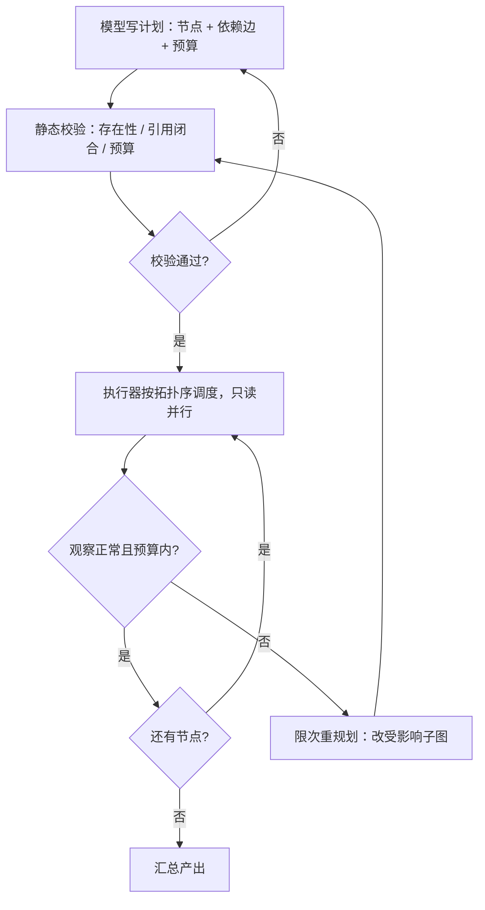

# 工具规划

计划是把依赖、并行与预算写成显式对象；反应式循环里，这些约束只存在于「如果一切顺利」的祈祷中。

<footer>—— 据 Yao et al., ReAct, ICLR 2023；Xu et al., ReWOO, 2023 的计划—执行对照整理</footer>

[上一课](/llm/pl-domain-decomposition)把问题拆成接口闭合的子问题，但子问题的解常常不在模型参数里，而在环境里：查库、算数、调 API。规划的对象随之从推理步骤换成工具调用。[多步 ReAct](/llm/react) 的反应式循环每看一次观察再决策，能改口；代价是每步一次模型调用、轨迹在工具噪声里晃，依赖与并行这类全局约束守不住。本课写工具规划：把调用序列做成显式的计划对象，交给执行器调度，并处理计划过期。[规划 vs 反应式循环](/llm/plan-vs-react)已对照两种控制流的取舍，本课补工程细节。

## 问题

反应式的目标函数是局部的：当前一步只对「下一个动作」负责。多跳且调用昂贵时，局部最优表现为重复检索近重复查询、互不依赖的只读调用被迫串行、预算在还没碰到关键步骤时就烧完。这些问题不是「更长的思考」能解决的——上下文里装的是最近观察，不是一张全局依赖图。需要显式对象：计划。

计划也有对称的失败面。环境会说话：检索为空、API 改版、参数对不上 schema。$t=0$ 写死的十条计划到第 3 条就可能前提作废；不设重规划，执行器会把错误前提执行完；每步都重规划，则退回反应式，还多付了写计划的钱。

## 方法

计划对象的最小 schema：节点 $=$（工具名，参数模板，依赖边），整图带预算上限。静态校验在执行前完成：工具名存在于注册表；参数引用闭合——每个引用了观察的参数都有生产者节点，没有悬空占位；权限与成本在预算内。校验不过的计划不进执行器，打回重写，而不是带病上线。

并行判定是计划直接换钱的点：互不依赖的只读节点并发执行，总延迟从串行的 $O(k)$ 次往返降到关键路径深度 $O(d)$。参数的前向引用处理剩余的不确定：执行到生产者节点后把观察回填进消费者参数，回填失败走[上一课](/llm/pl-reflection-design)的触发器或限次重规划——重规划谓词要显式：观察为空、调用报错、预算过半，三条之外不许改口。

并行的账：$10$ 个互不依赖的检索节点，反应式串行要约 $20$ 次模型调用与 $10$ 次工具往返；计划式是 $1$ 次规划调用，执行器并发打完 $10$ 个请求，延迟只取决于最慢的一个。收益的前提是依赖边真的不存在——错判一条边就把并行收回串行。

## 机制

执行器无法挽回坏计划：计划错误是上游错误，执行得越忠实，结果越离谱。所以质量的闸口在静态校验与依赖图本身，不在执行期的「尽力理解」。token 账是计划式的第二笔收益：ReAct 每步把全史带进下一次调用，观察越滚越大；ReWOO 一类的方案把中间观察从逐步推理上下文里拆出，规划一次写完，观察只在回填参数时注入——省的是「每步都读一遍全部历史」的钱。反应式没有白给的优势也在此看清：它的适应力来自随时改口，而改口的价值集中在少数几个真正的意外观察上，把全部步骤都改成反应式，是为 5% 的意外付 100% 的串行。

## 边界

环境不确定性强、探索本身就是任务（不知道该查什么）时，反应式更稳：计划的前提信息还不存在，写计划是猜。循环与数据相关的分支计划难以表达，超出 DAG 的控制流要么模板化、要么退回反应式。散文里的「打算」不是计划：计划必须能被 schema 校验，否则静态检查全部失效。本课只写控制流；工具协议、参数编码与沙箱隔离是 Agent 工程的题目，不在本课展开。

## 小结

- 计划对象 $=$（工具、参数模板、依赖边）加预算；静态校验不过不进执行器。
- 并行把 $O(k)$ 次往返压成关键路径 $O(d)$；前提是依赖边判得准。
- 参数前向引用靠回填；重规划谓词显式且限次，否则退回反应式。
- 执行器无法挽回坏计划；token 账上计划式省的是全史重复读取。
- 探索型任务先反应；能校验才算计划，散文不算。
- 出处：Yao et al., *ReAct*, ICLR 2023；Xu et al., *ReWOO*, 2023；对照见本站[规划 vs 反应式循环](/llm/plan-vs-react)。
