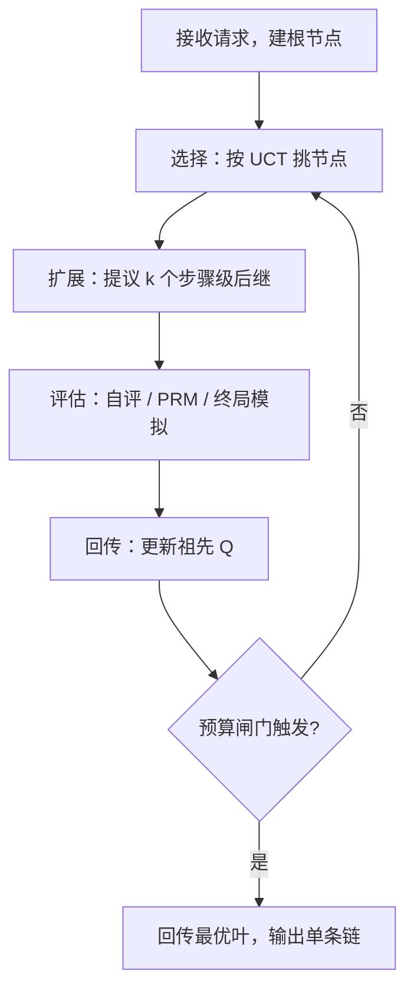

# ToT 与 MCTS 的工程化

论文里的搜索伪代码搬进服务，最先撞上的不是算法，而是显存、延迟与账单：树长得越漂亮，每次前向烧得越快。

<footer>—— 据 Yao et al., Tree of Thoughts, NeurIPS 2023；Kocsis &amp; Szepesvári, UCT, 2006；Hao et al., RAP, 2023 整理</footer>

[上一课](/llm/rag-map)把 RAG 系统收进「症状到三角角度、角度到层、层到旋钮」的排查协议，检索增强的深钻交了卷。回到单次生成，best-of-n 是成本-质量曲线末端的最后一档：同一提示开 $N$ 条完整链，在终点挑一条。缺口在于 $N$ 条链彼此独立、每条都走到底，钱花在注定要扔的完整前缀上；要回溯、要在中间状态上比较与剪枝，就得把搜索树搬进服务。本课写 [ToT](/llm/tree-of-thoughts) 与 [MCTS](/llm/mcts-llm) 从论文 demo 到线上服务的工程化：节点怎么表示、树由谁持有、KV 怎么复用、每次前向的钱怎么记账。后课的过程监督、反思与预算分配默认以本课的树形服务为底座。

## 问题

ToT 论文里的 Game of 24 与填字是单机脚本：一棵树、几十次模型调用、跑完即弃。同一算法放进服务，问题换成另一组三件套。第一，节点是什么：一个节点对应一段部分解答，动作若切到 token 级，分支因子就是词表大小，树在第二层就爆炸；切到步骤级才有可剪枝的分叉，而步骤怎么切是任务定义，换切分等于换一棵树。第二，树由谁持有：模型只看到当前节点的上下文，树本身必须由编排层持有——节点表、父子边、分数、终态标记；模型不给树，宿主不给上下文，搜索退化成普通对话。第三，账单单位是节点数不是请求数：扩展一个节点要一次生成前向（提议 $k$ 个后继），打分要一次评估前向或一次 PRM 调用。

MCTS 的四步循环在语言模型上每一步都有工程语义：选择按 $\mathrm{UCT}=\bar Q+c\sqrt{\ln N_p/N_c}$ 在节点间配额；扩展用模型提议步骤级后继；评估给出节点价值；回传更新祖先的 $\bar Q$。注意这是冻结策略加外部价值的测试时搜索，不是 AlphaZero 式的自我对弈；搜索轨迹要改进权重，必须另走蒸馏或 RL。

## 方法

树的持有与 KV 复用决定系统能否成立。兄弟节点共享同一前缀，若每个节点都完整重算 prefill，树搜索比独立采样还贵；按[前缀缓存](/llm/prefix-caching)组织 KV，新节点只为增量段算一次，扩展才便宜。深 $d$、分支 $b$ 的完全树有 $O(b^d)$ 个节点，预算必须写成显式闸门：最大深度、最大分支、节点总数、墙钟时间，四个同时生效，任一触发就回传当前最优叶。

分支 $b=5$、深度 $d=6$ 的完全树约 $1.9$ 万个节点；按每节点两次前向计，一个请求就是近 4 万次前向。工程上从不长完全树：UCT 配额与终态剪枝把实际节点数压进预算，超出即降级。

服务侧由此把「一个请求」变成「一片异步负载」：分支节点扇出、叶节点终止，有的请求三个节点出解，有的烧满预算。批处理要按节点入队而不是按请求串行，否则先到的树堵住后面的请求；返回给用户的仍是完整的一条链——树是内擎，外交还是普通文本流。

## 机制

树搜索改变的是预算的形状，不是模型的概率。同一批推理 FLOPs，花在宽度（$N$ 条独立链）上覆盖不同假设，花在深度（树上回溯）上修正同一假设的中途错误；二者不可互相替代，这正是[测试时计算](/llm/test-time-scaling)里按难度配策略的物理基础。评估器决定剪枝方向：自评最便宜也最弱，搜索会朝流畅的假推理走；PRM 与 lookahead 终局模拟更硬，但每次评估都要前向，[过程奖励引导的搜索](/llm/prm-guided-search)的校准问题在服务里被放大成账单问题——评估器不准，钱烧得越急，错得越整齐。

## 边界

延迟敏感的在线请求大多付不起一棵树，应退回 [Best-of-N](/llm/best-of-n) 或[自洽](/llm/self-consistency)，把树留给离线与高价值场景。探索常数 $c$ 不能直接抄棋类：过大即是昂贵的随机采样，过小则整棵树长在第一条被采样的分支上。开放域没有可靠终局核对时，收益上限被评估器钉死。树搜索也不自动等于更强：很难的题目上搜索补不齐预训练缺失的知识，烧满预算只是烧满，不是答对。

## 小结

- 账单单位是节点：扩展一次生成前向、评估一次打分前向；深度、分支、节点数、时间四个闸门必须显式设。
- 动作切到步骤级才有可搜索的分支因子；宿主持有树，模型只见当前节点的上下文。
- KV 前缀复用让兄弟节点只算增量；批处理按节点入队，对外仍交付单条链。
- 冻结策略加外部价值不是自我对弈；搜索轨迹要进权重需另做蒸馏或 RL。
- 评估器校准决定搜索上限；延迟敏感场景退回 BoN 或自洽。
- 出处：Yao et al., *Tree of Thoughts*, NeurIPS 2023；Kocsis &amp; Szepesvári, UCT, 2006；Hao et al., RAP, 2023；Snell et al., 2024。
