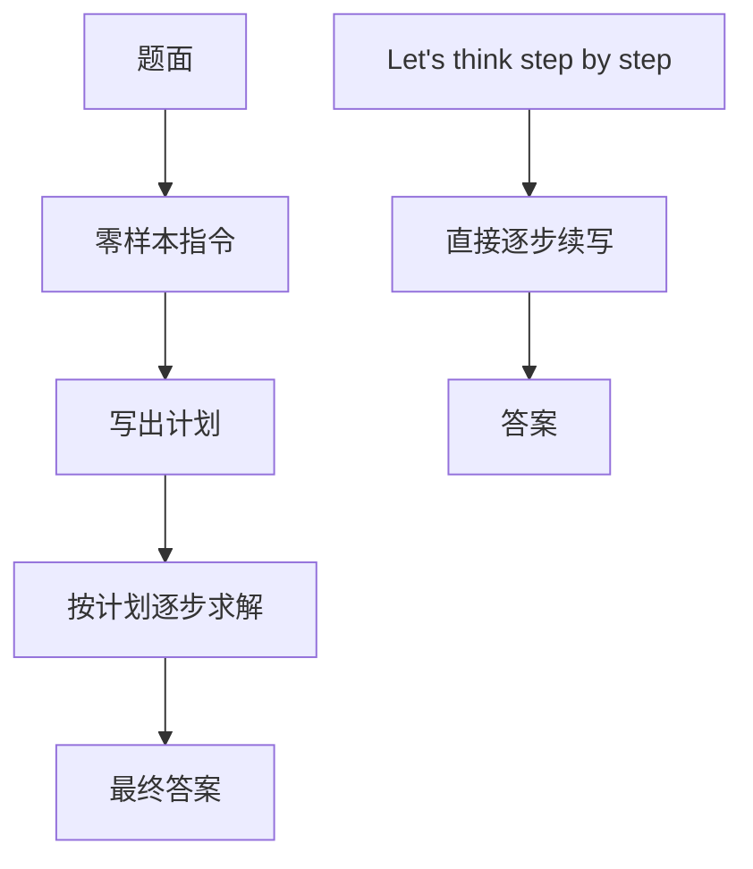

# Plan-and-Solve

让我们先理解问题并制定计划，再按计划一步步求解；缺的不是更长的「逐步思考」，而是把步骤清单从推理过程里抽出来。

<footer>—— Wang et al., Plan-and-Solve Prompting, ACL 2023</footer>

零样本思维链用一句「Let's think step by step」就能让足够大的模型写出中间步骤。Wang、Lei、Li、Liu、Wang、Chen 与 Deng 在 2023 年指出：这条链经常在算术题上漏步——变量还没提取、中间量还没算，就已经跳到答案。Plan-and-Solve（PS）把提示改成两段程序：先写计划，再执行计划。它不引入工具，也不改权重，只改零样本指令的结构。后续把计划做成可调度 DAG 的智能体，见 [规划 vs 反应式循环](/llm/plan-vs-react)；本篇只写这条提示本身，以及它相对零样本 CoT 补了哪一类错。

## 问题

Wei 等人的少样本 CoT 靠人工示范把「步骤粒度」写进上下文；零样本 CoT 把粒度交给模型自己决定。粒度一自由，最常见的失败就不是算错加减，而是**缺步**：把多跳题当成一跳，跳过单位换算，或把尚未求出的中间量直接写进最终式。Wang 等人把错误分成计算错误、缺步错误和语义误解三类，并观察到零样本 CoT 在 GSM8K、SVAMP、AQuA 上，缺步占了相当一部分。再把「逐步」三个字说得更重，并不能强制模型先列出要算哪些量。

需要一种仍然零样本、仍然纯文本的约束：在开始代入数字之前，先出现一份步骤清单。这份清单不是环境里的工具图，只是同一条生成轨迹上的前缀，用来把后续 token 条件化到「按单执行」而不是「边想边跳」。

### 零样本 CoT 的缺步

「Let's think step by step」诱导的是局部续写：每一步看起来都像推理，但没有对象去核对「是否覆盖了题面里的所有条件」。模型可以在第一步就把答案写出来，后面用文字合理化。缺步因此是格式问题，也是搜索问题：零样本没有示范告诉它「先列未知数再列方程」。少样本 CoT 能补粒度，代价是要为每个任务准备例题，而且例题分布一旦和测试题错开，示范会把计划带偏。

缺步和算错不要混着改提示。算错需要验算、工具或更高的采样预算；缺步需要在生成顺序上插入一个「还没开始算」的阶段。PS 主要打缺步。若评测只报最终数字准确率，两种错误会糊成同一个分数。

## 方法

PS 的最小指令是两句话：先理解问题并制定计划，再执行计划逐步求解。完整提示把任务说明、这两句程序、以及「给出答案」的收尾拼在题面之前。模型被期望产出两段可见文本：一段编号或分句的计划，一段对照计划写下的推导。没有第二次调用，也没有外部执行器——计划和求解在同一次解码里完成。

PS+ 在计划阶段加更具体的子指令：提取相关变量及其取值、写出计算中间结果的步骤、并强调逐步仔细计算。这些句子把「计划」从散文意图收成一份检查清单。Wang 等人在加减乘除与小学应用题上用 PS+，在常识与符号推理上多用较简的 PS，因为后者并不以「提取变量」为自然分解。

### 先计划再执行的提示词

实现上应把计划与求解的边界写进指令（例如先输出 `Plan:` 再输出 `Solution:`），便于事后分析是计划错了还是执行错了。不要在计划阶段要求得出数字：计划里一旦出现「答案是 42」，后续求解只是复述。温度与零样本 CoT 保持同一设定才能比较；换模型、换解码参数再报「PS 更好」没有对照。答案抽取仍用原任务的正则或「The answer is」一类槽，计划文本必须允许被解析器忽略。

### PS+ 把计划写细

更细的指令是在用计算复杂度换缺步率。清单越长，模型越可能把提示里的条目当成必须填写的表格，从而真的列出变量；也可能在常识题上编造并不存在的「变量」。Wang 等人的主表在算术推理上显示 PS+ 相对零样本 CoT 有稳定增益，并在若干数据集上逼近甚至超过部分少样本 CoT，但增益幅度随模型与数据集变化，不能当成固定百分点。消融指出：只说「制定计划」而不说「提取变量、算中间量」，缺步下降得少一些——细指令不是修辞，是在指定计划的类型。

## 机制

计划前缀改变的是条件分布，不是搜索算法。一旦 $p(\text{求解}\mid\text{题面},\text{计划})$ 替代 $p(\text{求解}\mid\text{题面})$，后续步骤更可能引用计划里点名的中间量。这与 [自我批判与修订](/llm/self-critique-revise) 类似：都是用一段中间文本当脚手架。差别是 PS 的中间文本出现在答案之前，修订出现在初稿之后；PS 预防漏步，修订试图修已写出的错。

它仍然是单次自回归。计划写错，求解会忠实执行错计划；没有观察通道去否定前提。这与 [ReAct](/llm/react) 的交错不同：ReAct 用环境返回值打断错误 Thought，PS 全程封闭。因此 PS 适合步骤结构稳定、不需要检索的应用题，不适合事实会过期的工具任务。把 PS 的「计划」接到工具执行器上，已经离开本篇，变成另一套系统。

计划写得对、数字算错，看起来像「方法失败」，其实是计算器问题。评测时应分开统计：计划是否覆盖条件、中间量是否出现、最终答案是否对。只看最终答案，会把 PS+ 在长提示下多出来的计算错误算到计划头上。

### 计划文本不是可调度图

编号列表没有依赖边，也不能并行，更不能在第 3 步失败时只重跑子图。工程上若把 PS 的输出当工作流，必须再做一次结构化解析与校验；解析失败率本身应进报表。论文主张的是提示层面的分解，不是工作流引擎。Least-to-Most 把大问题拆成子问题并逐个解答，顺序由提示规定；PS 把「先列步骤再执行」压缩进一次生成。两者都在打缺步，粒度不同：一个多次调用，一个一次调用里分段。

## 边界与工程取舍

PS 不提供新的推理能力上限，只重新分配零样本条件下的生成顺序。模型若在该任务上本来就不会列步骤，计划段会变成套话（「第一步理解题意，第二步计算」），求解段仍缺步。这时应回到少样本示范或工具，而不是继续加长 PS+ 的英文嘱咐。封闭式算术与小学应用题是原文主场；开放域写作、多文档问答、需要引用的事实题，计划无法替代检索。

与智能体规划的名字碰撞是故意要划清的。产品里说「Plan-and-Solve」时，应注明是 Wang 等人的零样本提示，还是先生成 JSON 计划再调 MCP。前者几乎零工程，延迟等于一次更长的完成；后者有执行器、重规划与费用模型。不要用本篇的数字去论证智能体架构，也不要用智能体论文的 DAG 图来解释 ACL 2023 的提示。

多语言部署时不要只翻译「step by step」。计划指令里的「提取变量」「中间结果」需要按目标语言重写，并在该语言的应用题上重测缺步率。英指令配汉题，计划段会混语，解析器先坏。

## 小结

- Plan-and-Solve 把零样本 CoT 改成「先写计划，再按计划求解」，主要针对缺步而不是针对计算精度。
- PS+ 用提取变量、计算中间量等细指令把计划收成检查清单，算术任务上增益更明显。
- 计划与求解通常在同一次解码中完成，没有工具观察，错计划会被忠实执行。
- 计划文本不是可调度 DAG；接到执行器已经是另一类系统。
- 评测应拆开计划覆盖率、中间量是否出现、最终答案，避免与算错混报。
- 模型若不会分解，计划会退化成套话，应改示范或工具而不是无限加指令。
- 出处：Wang et al., *Plan-and-Solve Prompting: Improving Zero-Shot Chain-of-Thought Reasoning by Large Language Models*, ACL 2023。
