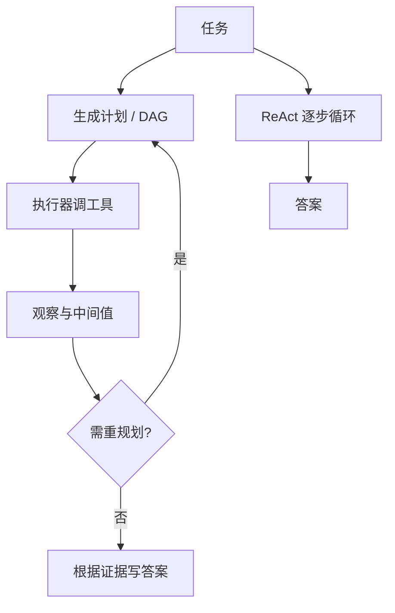

# 规划 vs 反应式循环

    
反应式循环每看一次观察再决定下一步；先规划再执行把搜索从逐步试错里抽出来，但计划在第一处意外观察上就会过期。

    <footer>—— 对照 Yao 等人的 ReAct 交错循环，以及后续把计划与执行分离的系统（如 ReWOO、HuggingGPT 一类控制器）</footer>

[ReAct](/llm/react) 把智能体做成闭环：Thought 看观察，Action 换新观察。优点是能改口；缺点是每步都要请一次大模型，轨迹在工具噪声里晃，全局约束（预算、依赖、并行）很难在逐步贪心里守住。另一条路是先写一份计划——有序列表或计算图——再交给执行器按节点调工具，执行器可以是规则、小模型或同一模型的另一次调用。HuggingGPT 用对话模型当控制器去调度专家模型；ReWOO 把证据获取从逐步推理里拆出，以减少对观察的 token 开销。本篇对照两种控制流：何时该反应，何时该先规划，以及计划过期之后怎么修，而不把某一家产品的编排 DSL 写成通用算法。

## 问题

逐步反应的目标函数是局部的：当前 Thought 只对「下一步动作」负责。多跳且动作昂贵时，局部最优表现为：重复检索近重复查询、过早 Finish、或从不并行互不依赖的只读调用。把这些问题交给更长的 Thought 往往无效——窗口里塞的是最近观察，不是全局甘特图。需要一种显式对象来表达依赖与预算：计划。

计划的问题对称。环境会说话：检索为空、API 改版、用户中途改需求。一份在 $t=0$ 写死的十条计划，到第 3 条就可能前提作废。若不设重规划，执行器会把错误前提执行完；若每步都重规划，则退回反应式，还多付了「写计划」的 token。对照的核心不是口号上的「Agent」，而是 **决策频率**：每观察一次就重新决策，还是按计划走直到触发再规划条件。

### 反应式：每步看观察再决策

ReAct 风格的决策频率是每步一次。信息新鲜，适合观察熵高的环境（网页、未知 API 错误、需要根据检索片段决定下一跳关键词）。费用上，大模型调用次数的下界约是动作次数；Thought 还额外占输出 token。并行性差：模型通常一次只吐一个 Action，除非协议支持并行 [function calling](/llm/function-calling) 且提示鼓励打包独立调用。调试友好：日志就是轨迹本身。

反应式不等于没有计划。Thought 里可以出现「我打算先确认实体再比价格」，只是这份计划不作为可执行的数据结构约束后续步骤，下一步仍可完全改主意。工程上的「规划」指有独立的计划对象与执行器，不是指散文里出现了将来时。

## 方法

先规划再执行的最小实现：一次（或少数几次）模型调用产出计划，节点上写工具名、参数槽与依赖；执行器按拓扑序调用，把结果填进槽；最后一次模型调用根据填好的证据写答案。ReWOO 一类做法强调：推理不必看见每一条原始观察，只要看见按计划取回的证据包，从而少付中间 Thought 的税。HuggingGPT 一类做法强调：计划里的节点是不同专家模型（视觉、语音、表格），控制器负责拆任务而不是自己做感知。

计划表示可以是编号列表、JSON 数组、或带边的 DAG。列表不能表达并行；DAG 能，但生成与校验更难，适合配 [JSON schema](/llm/json-schema-decode)。参数槽不要在规划时就填死外部世界的值（「用昨天的汇率」），应填变量，执行时绑定。规划所用的工具清单必须与执行器白名单一致，否则计划里会出现无法调度的节点——这与 ReAct 少样本动作空间不一致是同一类事故。

### 先规划再执行

执行器应把节点级失败标出来，而不是让整张图静默成功。只读节点可并行；有写入依赖的节点必须等。计划阶段可以用较便宜的模型，执行阶段的参数生成（把槽填成合法 JSON）可以用约束解码。这是计算上的分层，不是地位上的「小模型不重要」：计划错了，执行再准时也是错任务。控制器与专家分离时，还要规定中间模态（文件路径、图像 URI），否则计划里的「把图传给分割模型」没有可执行句柄。

## 机制

反应式把搜索放在时间轴上：用真实观察剪枝。规划把搜索放在符号结构上：先在工具图里选一条路径，再付行动成本。当工具可靠、依赖已知（ETL、固定报表、多文件转换流水线），符号结构更省：少轮大模型、可并行、可估计费用。当工具不可靠或状态空间在观察后才展开（故障排查、开放网页），过早符号结构会锁死错误路径。

重规划是两者的混合物：默认沿 DAG 走，观察满足谓词（空结果、校验失败、用户打断）时回到规划器，只重写受影响的子图。全量重写简单但浪费已经成功的节点；增量修补需要计划是结构化的，散文列表很难做依赖分析。ADaPT 一类「做不下去再拆」的策略，本质上是在反应式触发下局部加深规划，而不是每步 ReAct。

不要把经典符号规划（STRIPS、PDDL 求解器）和 LLM 写的自然语言计划当成同一个对象。后者没有可靠的可满足性保证，执行器必须假设计划不合法并做 schema 校验。前者很少直接吃自然语言观察。

### 何时改计划

触发器要写死：工具返回空且重试次数用尽、参数校验连续失败、累计费用超预算、用户新指令与当前图冲突。不要用「模型觉得不顺利」当唯一触发——那会变成每步都重规划。改计划时应把已发生的观察摘要进规划器上下文，否则新计划会重复失败节点。对用户可见的产品，重规划要有次数上限，避免在同一障碍上振荡。

## 边界与工程取舍

没有普适赢家。内部工作流、MCP 工具稳定、参数从用户输入可填全：规划（甚至规则工作流）更合适。开放域问答、检索质量不稳、需要根据片段决定下一跳：ReAct 更合适。很多生产系统是浅规划加局部反应：先列出要查的实体，每个实体内部 ReAct。评测应分开报：计划合法率、执行成功率、重规划次数、端到端准确率。只报准确率会让「多付了三倍工具费」的反应式看起来和一次规划打平。

不要用更长的 CoT 冒充规划：没有可执行图，调度器无法并行，也无法跳过已完成节点。不要在计划里写「必要时自由发挥」却不给执行器反应式权限——那是把决策权藏在散文里，出了事故无法审计。出处上，ReAct 是 ICLR 2023 论文；计划—执行分离是一类系统形态，引用具体系统时用其论文或技术报告，不要编造统一的「PlanAct」经典论文。

MCP 与 function calling 对两种控制流都适用：它们提供动作接口，不决定决策频率。把协议层和控制流层画在一张架构图的同一框里，会在排障时找错层。

## 小结

- 反应式每步基于最新观察决策，适应力强、调用次数与空转风险高。
- 先规划再执行把依赖与并行写成显式对象，适合工具稳定、图结构已知的任务。
- 计划会过期；要有基于观察谓词的重规划，并限制次数。
- 散文里的「打算」不是可调度计划；计划应能 schema 校验。
- 分层可以用不同模型写计划与填参数，但计划错误无法靠执行器挽回。
- 接口层（tools / MCP）与控制流层必须分开设计和评测。
- 出处：Yao et al., ReAct, ICLR 2023；计划—执行对照 HuggingGPT（Shen et al.）、ReWOO（Xu et al.）等系统，按需引用原文。
