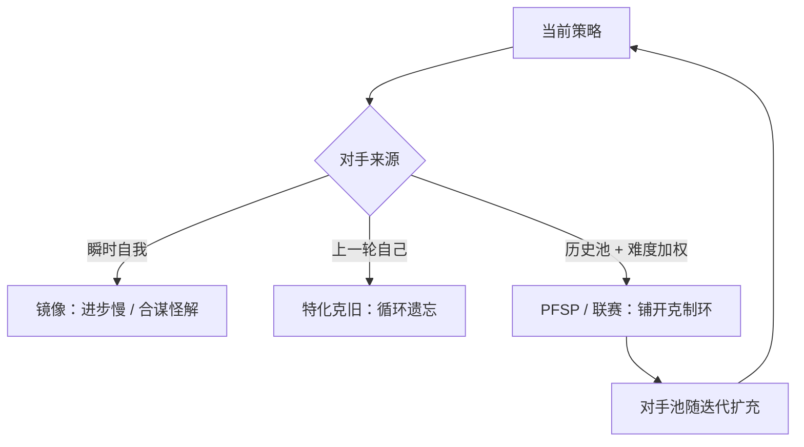
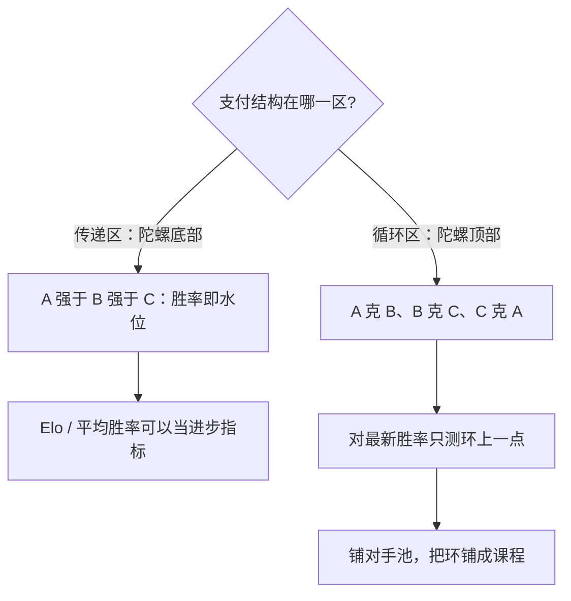

# 自博弈的对手选择

跟谁下棋决定你变强还是变怪：只赢昨天的自己，策略会走进循环克制的窄巷；对手分布就是你的课程表。

<footer>—— Heinrich 与 Silver 2016（PFSP）；Vinyals 等 AlphaStar（2019）；Czarnecki 等 Real World Games Look Like Spinning Tops（2020）</footer>

[上一课](/llm/distill-vs-explore)把探索的上限交给验证器，但自博弈里还藏着一个自由度：对手。探索不是对着真空，而是对着某个对手分布进行；选谁、何时换、换多快，决定策略往哪里长。[自博弈](/llm/self-play-lm)课已给结论：对手池防止循环克制与遗忘。本课把对手选择当成课程设计来写——它与上一课程的难度分布是同一件事的两面，只是课程表由对手集合隐式给出。

## 问题

三种选法三种病。瞬时自我（AlphaZero 式：永远和当前副本下）在纯对称博弈里干净，但语言任务里两侧梯度对称、互相镜像，进步慢；只要支付稍有非传递性，双方还会合谋走向彼此都顺手的怪解。固定滞后一档的旧检查点（SPIN 用上一轮的自己当对手）便宜，但只赢昨天的自己会让策略特化成「克上一版」：对上一版胜率涨，对更早的版本可能输——非传递游戏里这是常态。对手一动不动（同一个旧检查点永不替换）则对抗压力耗尽：策略一旦学会克制它，梯度趋零，增益停止。不这么做会错在哪：用「对最新检查点的胜率」当进步指标，读到的只是克制环上的一小段弧。

术语翻译：「非传递性」就是「A 赢 B、B 赢 C，推不出 A 赢 C」——石头剪刀布是教科书例子。只要这种环存在，「打赢最新的自己」就不再代表整体变强，只代表又练出了一个新克制。

## 方法

对手池给出修正：保留历史检查点，按优先级采样。PFSP 的权重是利用难度——对还没被打败的对手多采样；AlphaStar 把它扩成联赛：主代理互相打，专职剥削者盯防单个主代理，胜率与近期暴露度共同决定训练配额。语言模型上可验证域的简化版：当前策略与随机抽的旧检查点各采样，按真值比胜负。手性问题在非对称任务里出现：出题人与答题人、攻击与防守，两侧动作空间与目标不同，「自己打自己」没有定义——自我对弈的镜像关系（手性）只在对称零和里成立。此时要把角色分开设池：出题人池与解题人池分别迭代，进度不同步就产生课程错位——题太难则无解可学，题太易则梯度为零。

## 机制

病根是非传递性。Czarnecki 等人的测量：真实博弈的支付结构像陀螺，底部大块是传递的（强对几乎谁都赢），顶部是循环克制的环。对最新检查点的胜率只测环上一点，不测整体水位；对手池的意义是把环铺开成课程——每个旧策略是一节「不要输给这种打法」的课。过拟合到特定对手在梯度上看得清：策略最大化的是 $V(\pi,\pi_{\mathrm{opp}})$，不是对手分布下的期望 $V(\pi,\cdot)$；对手分布越窄，$\pi$ 在克制环上的移动越随意，水位不升。Elo 类评分给出水位读数，但环内区间的评分噪声大，要配胜率矩阵直接看。

数字实例：只跟上一版打的策略，可能对 $v_9$ 胜率 $90\%$、对 $v_5$ 只有 $40\%$——「克上一版」的特化在胜率矩阵里一列亮、一列暗。诊断办法就是定期对所有历史检查点各打一排对局，看整列而不是看一格。

这张图回答「为什么赢最新检查点不可靠」：指标在传递区成立，在循环区失效，失效就要换测量工具。

AlphaStar 的联赛把课程写进对手选择：主代理、主探索者、联盟探索者三类，按对每个对手的胜率与近期暴露度动态配训练对局。语言模型上的对应物很少被认真做，多数实现只有 SPIN 式的一格滞后。

## 边界

对手池吃内存与调度：检查点存多少、采样权重多久更新，都是真成本；联赛式复杂度在开放域没人付得起。更大的边界回到裁判：非对称自博弈里胜负可以由验证器判定，可出题质量、论证说服力这些维度的裁判若也是模型，对手选择的精巧立刻被裁判偏差吞掉——课程表设计得再好，批卷人偏了全部作废。开放域自博弈的诚实顺序是先修可验证支付，再谈对手工程。

为什么重要：如果判胜负的裁判本身有偏（比如偏爱长答案），对手池会把策略训练成「专哄这个裁判」——课程越精巧，跑偏越高效。先确认支付可验证，对手工程才不白做。

## 小结

- 瞬时自我镜像慢，固定滞后特化克旧，对手池把克制环铺成课程。
- 非传递性使「赢最新」不等于变强，要看胜率矩阵与水位。
- 非对称任务先分角色建池；手性不匹配时自我对弈没有定义。
- 对手选择的一切精巧，都被裁判质量封顶。
- 出处：Heinrich 与 Silver 2016；Vinyals 等 2019；Czarnecki 等 2020；SPIN 见 Chen 等 2024。
