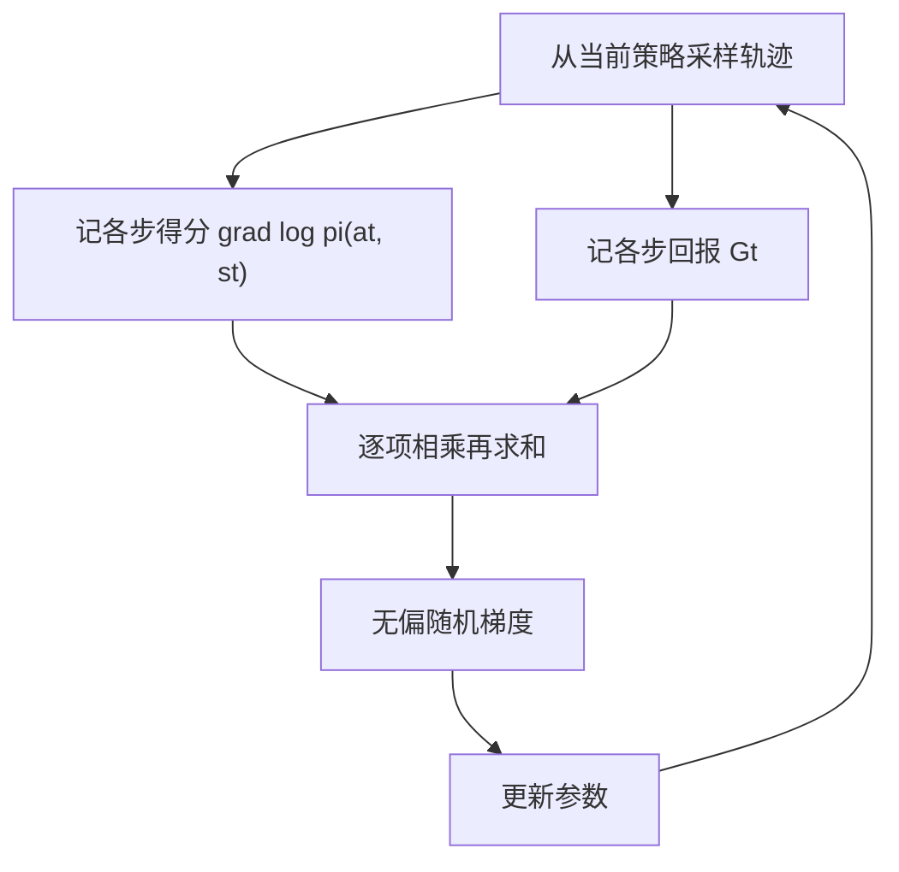
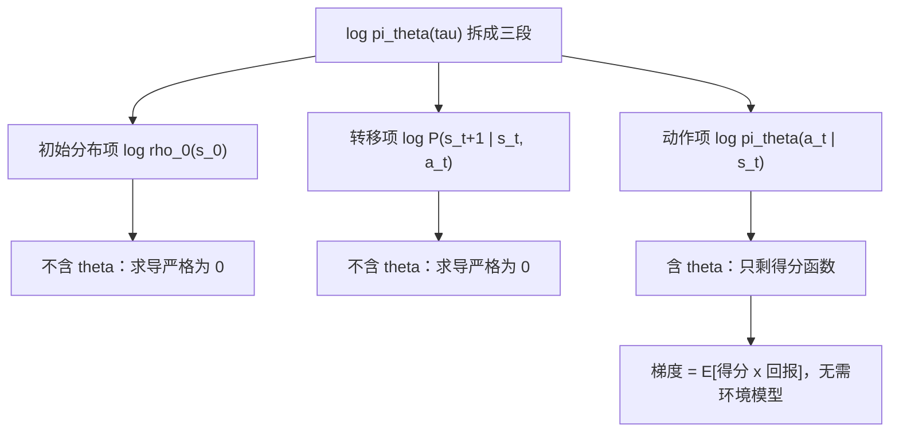

# 策略梯度定理

值方法先学「局面值多少」再挑动作；策略梯度把方向倒过来——直接对「动作怎么挑」求导，让环境的好报指出该抬高谁的概率。

<footer>—— 据 Sutton, McAllester, Singh &amp; Mansour, 2000；Sutton &amp; Barto, Reinforcement Learning, 2018 第 13 章整理</footer>

[上一课](/llm/gridworld-lab-lesson)在网格世界上跑完了 MC、TD 与 Q-learning：收敛快慢、步长敏感、探索率的作用都成了能复现的曲线。它们共享一个前提——先估值，再由 $\arg\max_a Q(s,a)$ 间接读出策略。语言生成把这个前提压塌：状态是 prompt 加前缀，动作是十几万个 token 之一，每步做词表上的 argmax 既贵又不可导；而语言模型本身就是 $\pi_\theta(y_t\mid x,y_{\lt t})$ 这台现成的随机策略。本课写策略梯度定理：$\nabla_\theta J$ 的得分函数形式，它对值函数方法的对照，以及为什么整条推导不需要对状态转移求导。本单元后课默认已读完本课。

## 问题

把轨迹 $\tau=(s_0,a_0,r_1,\ldots,s_T)$ 的期望回报 $J(\theta)=\mathbb{E}_{\tau\sim\pi_\theta}[R(\tau)]$ 当目标，想直接求 $\nabla_\theta J$。麻烦在轨迹分布的每一项都被 $\theta$ 牵着：策略改了，动作分布变；动作变了，访问哪些状态也变。按复合函数直接链式展开，会撞上 $\nabla_\theta P(s'\mid s,a)$——无模型设定下没有转移模型，这条路走不通。值方法绕开它的方式是换成贝尔曼方程逐点估计；策略梯度要的是另一条路：只用「环境会发分、策略能采样」这两个事实，给出无偏梯度。

值方法的间接性还有两处硬伤。其一，$\arg\max$ 是映射不是光滑函数，对函数逼近误差极敏感；其二，最优策略若需要随机化——或者你手里本来就有一台随机策略模型——$\arg\max$ 根本给不出它。

## 方法

绕开的核心是 likelihood-ratio 恒等式：$\nabla_\theta\pi_\theta(\tau)=\pi_\theta(\tau)\,\nabla_\theta\log\pi_\theta(\tau)$。轨迹对数概率拆成三段——初始分布、各步转移、各步动作；前两段不含 $\theta$，求导后严格为零，只剩

这个恒等式就是「先取对数再求导」：$\log$ 把乘积变连加，求导时 $\nabla\pi$ 归约成 $\pi\,\nabla\log\pi$。它不引入任何近似——所以本课之后的所有结论都是严格等式，不是「大概成立」。

$$
\nabla_\theta J(\theta)=\mathbb{E}_{\tau\sim\pi_\theta}\Bigl[\sum_{t}\nabla_\theta\log\pi_\theta(a_t\mid s_t)\,G_t\Bigr],
$$

其中 $\nabla_\theta\log\pi_\theta(a\mid s)$ 叫得分函数（score function），$G_t$ 是从 $t$ 起的折扣回报。这就是策略梯度定理：梯度只是得分与回报乘积的期望，转移核一次也没出现。不是被近似掉，而是恒等式里根本轮不到它。这一下把「需要环境模型」降成「需要能从环境采样」：跑回合、记对数概率、记回报，梯度就能逐项累积。

得分函数可以读成「往哪个方向调参数，会让动作 $a$ 在状态 $s$ 下更常被抽到」；乘上 $G_t$ 就是按这一回合的收益成比例地抬高（或压低）这个动作的概率——赚得多多抬高，亏了反向压低。

## 机制

定理为什么成立值得再看一眼：对任意状态，$\sum_a\nabla_\theta\pi_\theta(a\mid s)=\nabla_\theta 1=0$，得分函数在策略自身分布下期望为零。这个零均值是整族方法的支点——任何只依赖状态的量乘上得分，期望都不变，下一课的基线定理就是它。与值方法对照：值路线把全部难度压在估计 $Q$ 上，策略是免费的副产品；策略梯度把难度压在方差上，策略本身可导。LLM 选后者有具体理由：token 采样是离散动作，重参数化的 pathwise 导数不存在，得分函数形式是唯一通路；softmax 策略的得分还有闭式 $\nabla_\theta\log\pi_\theta(a\mid s)=\phi(s,a)-\mathbb{E}_{a'\sim\pi_\theta}[\phi(s,a')]$，动作特征减去其在策略下的均值。

「避免状态导数」的准确含义：$\nabla\log\pi_\theta(\tau)$ 里初始分布与转移项严格为零，期望的支撑怎么随 $\theta$ 移动都不用管——这是恒等式，不是近似。若推导里出现了对 $P(s'\mid s,a)$ 的导数，那已经不是这条定理。

「转移核为什么一次也没出现」逐段看轨迹对数概率的拆解：

## 边界

定理给的是**当前** $\theta$ 处的无偏梯度：每更新一步，采样分布就变，旧轨迹的梯度不再对准新策略——复用旧数据必须加重要性权重，那是本课程后面专课处理比率方差的题目。它也不回答步长：参数空间一小步可以是分布上的一大步，本单元最后一课才处理。最直接的麻烦是方差：$G_t$ 的波动原样乘进得分，长回合下估计量吵得没法用——这正是下一课 REINFORCE 要面对的现实。

初学者容易以为「无偏」就等于「稳」；无偏只保证平均方向对，单次估计仍可能大起大落。方差大时每步更新都像掷骰子——这正是后来要加基线、控比率、做信任域的动因。

## 小结

- 策略梯度定理：$\nabla_\theta J=\mathbb{E}_{\tau}[\sum_t\nabla_\theta\log\pi_\theta(a_t\mid s_t)G_t]$，得分函数形式。
- 转移核不出现在梯度里：likelihood-ratio 恒等式使状态导数严格为零，无模型也能算。
- 对照值方法：不用 $\arg\max$、支持随机策略；离散动作下得分函数是唯一可导通路。
- 期望在当前策略下取，数据必须 on-policy；步长问题留给信任域。
- 出处：Sutton, McAllester, Singh &amp; Mansour, 2000；Williams, 1992；Sutton &amp; Barto, *Reinforcement Learning*, 2018，第 13 章。
